# Bricks4Agent Engineer Guide

> This guide is intended for junior engineers, covering installation, usage, theme system, page generator, and backend integration of Bricks4Agent.

---

## Table of Contents

1. [Getting Started](#1-getting-started)
2. [Component Overview](#2-component-overview)
3. [Theme & Styling System](#3-theme--styling-system)
4. [Form Components](#4-form-components)
5. [Common Components](#5-common-components)
6. [Layout Components](#6-layout-components)
7. [Advanced Input Components](#7-advanced-input-components)
8. [Social Components](#8-social-components)
9. [Visualization Components](#9-visualization-components)
10. [Behavior Modules & Utilities](#10-behavior-modules--utilities)
11. [Page Generator](#11-page-generator)
12. [SPA Generator](#12-spa-generator)
13. [C# Backend Packages](#13-c-backend-packages)
14. [Security Guidelines](#14-security-guidelines)

---

## 1. Getting Started

### 1.1 Prerequisites

- Node.js 18+
- .NET 8 SDK
- Git

### 1.2 Installation & Startup

```bash
# 1. Clone the project
git clone <repo-url> Bricks4Agent
cd Bricks4Agent

# 2. Install dev tool dependencies (Playwright/Puppeteer for screenshots & UI testing)
npm install

# 3. Start the SPA Generator (Web UI)
npm run serve
# Open http://localhost:3080 in your browser
```

### 1.3 Project Structure

```
Bricks4Agent/
├── packages/                            # Reusable packages
│   ├── javascript/
│   │   └── browser/
│   │       ├── ui_components/           # Bricks4Agent UI component library
│   │       │   ├── form/                # Form components (12)
│   │       │   ├── common/              # Common components (23)
│   │       │   ├── layout/              # Layout components (10)
│   │       │   ├── input/               # Advanced input components (10)
│   │       │   ├── viz/                 # Visualization (18 directly usable components + BaseChart)
│   │       │   ├── social/              # Social components (5)
│   │       │   ├── editor/              # Editor component (1)
│   │       │   ├── data/                # Data-display component (1)
│   │       │   ├── binding/             # Binding modules (2)
│   │       │   └── utils/               # Utilities & services (4)
│   │       └── page-generator/          # Page generator
│   └── csharp/
│       ├── api/                         # API and controller modules
│       ├── database/                    # Database / ORM modules
│       ├── security/                    # Security and auth modules
│       ├── logging/                     # Logging module
│       └── utils/                       # Backend utility modules
├── templates/
│   └── spa/                             # SPA project template
│       ├── frontend/                    # Frontend template
│       ├── backend/                     # .NET 8 backend template
│       └── scripts/                     # Template CLI (spa-cli.js)
└── tools/
    ├── spa-generator/                   # SPA Generator Web UI
    └── page-gen.js                      # PageDefinition CLI
```

### 1.4 Creating Your First Project

The SPA toolchain is split into two parts:

- `tools/spa-generator/`: Web UI
- `templates/spa/scripts/`: template CLI

```bash
# Start the Web UI
npm run serve

# Create a project with the template CLI (interactive)
node templates/spa/scripts/spa-cli.js new

# Create a project with the template CLI (non-interactive)
node templates/spa/scripts/spa-cli.js new --name my-app --output ./projects

# Generate a full feature (page + API)
node templates/spa/scripts/spa-cli.js feature User --fields "Name:string,Email:string"
```

---

## 2. Component Overview

### 2.1 Component Categories

| Category | Directory | Count | Description |
|----------|-----------|-------|-------------|
| Form | `form/` | 12 | Text, number, date, dropdown and other form inputs |
| Common | `common/` | 23 | Buttons, badges, tags, tooltips, progress bars, dividers, dialogs, notifications, pagination and other general UI |
| Layout | `layout/` | 10 | Panels, tables, side menus, tabs and other layout elements |
| Advanced Input | `input/` | 10 | Address, phone, organization and other composite inputs |
| Visualization | `viz/` | 18 | Charts, maps, drawing boards and data visualization (excluding the `BaseChart` base class) |
| Social | `social/` | 5 | Avatar, feed, connection, stat card, and timeline |
| Editor | `editor/` | 1 | Rich text editor |
| Data | `data/` | 1 | Region map and geo visualization |
| Binding | `binding/` | 2 | Component factory and binder |
| Utils/Services | `utils/` | 4 | Security, compression, geolocation, weather |

> Import path note: code snippets below use shortened paths for readability. If you validate them directly from this repo root, treat `./ui_components/...` as `./packages/javascript/browser/ui_components/...` and `./page-generator/...` as `./packages/javascript/browser/page-generator/...`.

### 2.2 Unified API Convention
All components follow a consistent API pattern to reduce the learning curve:

```javascript
import { TextInput } from './ui_components/form/TextInput/TextInput.js';

// 1. Create the component
const input = new TextInput({
  label: 'Name',
  placeholder: 'Enter your name',
  required: true
});

// 2. Mount to DOM
input.mount(document.getElementById('container'));

// 3. Get / Set value
const value = input.getValue();
input.setValue('John Doe');

// 4. Clear value (form components)
input.clear();

// 5. Destroy and cleanup
input.destroy();
```

**API Method Quick Reference:**

| Method | Description | Applies To |
|--------|-------------|------------|
| `new Component(options)` | Create component instance | All components |
| `.mount(container)` | Mount to a DOM container | All components |
| `.getValue()` | Get current value | Form/Input components |
| `.setValue(value)` | Set value | Form/Input components |
| `.clear()` | Clear value | Form/Input components |
| `.destroy()` | Destroy component, remove event listeners | All components |

---

## 3. Theme & Styling System

### 3.1 theme.css Overview

Bricks4Agent uses CSS Custom Properties for its theme system. All variables use the `--cl-` prefix.

### 3.2 Variable Categories

```css
:root {
  /* Brand colors */
  --cl-primary: #2196F3;
  --cl-primary-dark: #1976D2;
  --cl-primary-light: #e3f2fd;
  --cl-primary-rgb: 33, 150, 243;      /* For rgba() usage */

  /* Semantic colors */
  --cl-success: #4CAF50;
  --cl-success-light: #e8f5e9;
  --cl-success-rgb: 76, 175, 80;
  --cl-warning: #FF9800;
  --cl-warning-light: #fff3e0;
  --cl-warning-rgb: 255, 152, 0;
  --cl-danger: #F44336;
  --cl-danger-light: #fdecea;
  --cl-danger-rgb: 244, 67, 54;
  --cl-info: #2196F3;
  --cl-info-light: #e3f2fd;

  /* Text */
  --cl-text: #333333;
  --cl-text-secondary: #666666;
  --cl-text-muted: #888888;
  --cl-text-placeholder: #999999;
  --cl-text-light: #aaaaaa;
  --cl-text-inverse: #ffffff;
  --cl-text-dark: #000000;

  /* Backgrounds */
  --cl-bg: #ffffff;
  --cl-bg-secondary: #f5f5f5;
  --cl-bg-tertiary: #f8f9fa;
  --cl-bg-hover: #f0f2f5;
  --cl-bg-active: #e3f2fd;
  --cl-bg-disabled: #f9f9f9;
  --cl-bg-overlay: rgba(0, 0, 0, 0.5);
  --cl-bg-dark: #2b2b2b;

  /* Borders */
  --cl-border: #dddddd;
  --cl-border-light: #eeeeee;
  --cl-border-dark: #cccccc;
  --cl-border-focus: var(--cl-primary);

  /* Shadows */
  --cl-shadow-sm: 0 1px 3px rgba(0,0,0,0.1);
  --cl-shadow-md: 0 4px 12px rgba(0,0,0,0.15);
  --cl-shadow-lg: 0 8px 24px rgba(0,0,0,0.2);
  --cl-shadow-xl: 0 12px 48px rgba(0,0,0,0.25);

  /* Border radius */
  --cl-radius-sm: 4px;
  --cl-radius-md: 6px;
  --cl-radius-lg: 8px;
  --cl-radius-xl: 12px;
  --cl-radius-round: 50%;

  /* Typography */
  --cl-font-family: -apple-system, BlinkMacSystemFont, 'Segoe UI', Roboto, sans-serif;
  --cl-font-size-xs: 11px;
  --cl-font-size-sm: 12px;
  --cl-font-size-md: 13px;
  --cl-font-size-lg: 14px;
  --cl-font-size-xl: 16px;
  --cl-font-size-2xl: 18px;
  --cl-font-size-3xl: 24px;

  /* Material palette — button variants / icon colors */
  --cl-purple: #9C27B0;
  --cl-teal: #009688;
  --cl-pink: #E91E63;
  --cl-light-green: #8BC34A;
  --cl-amber: #FFC107;
  /* ...15+ more extended colors (see theme.css for full definitions) */

  /* Transitions */
  --cl-transition-fast: 0.15s ease;
  --cl-transition: 0.2s ease;
  --cl-transition-slow: 0.3s ease;
}
```

> For the complete variable definitions, refer to `packages/javascript/browser/ui_components/theme.css`, which contains 140+ CSS variables.

### 3.3 Custom Themes

Override `:root` variables to customize your brand theme:

```css
/* my-theme.css — Override brand colors to customize the theme */
:root {
  --cl-primary: #E74C3C;
  --cl-primary-dark: #C0392B;
  --cl-radius-md: 8px;
  --cl-font-family: 'Noto Sans TC', sans-serif;
}
```

### 3.4 Dark Theme

theme.css includes a built-in `[data-theme="dark"]` selector that overrides all `--cl-` variables:

```css
[data-theme="dark"] {
  --cl-primary: #64B5F6;
  --cl-primary-dark: #42A5F5;
  --cl-primary-light: #1a2a4a;
  --cl-primary-rgb: 100, 181, 246;

  --cl-text: #e4e4e7;
  --cl-text-secondary: #a1a1aa;
  --cl-text-muted: #71717a;
  --cl-text-inverse: #1a1a2e;

  --cl-bg: #1a1a2e;
  --cl-bg-secondary: #252542;
  --cl-bg-tertiary: #2d2d4a;
  --cl-bg-hover: #2d2d4a;

  --cl-border: #3f3f5a;
  --cl-border-light: #2d2d4a;
  --cl-border-dark: #52527a;

  --cl-shadow-sm: 0 1px 3px rgba(0,0,0,0.3);
  --cl-shadow-md: 0 4px 12px rgba(0,0,0,0.4);
  /* ...etc (see theme.css for full definitions) */
}
```

Toggle theme with JavaScript:

```javascript
// Switch to dark theme
document.documentElement.setAttribute('data-theme', 'dark');

// Switch back to light theme
document.documentElement.removeAttribute('data-theme');
```

### 3.5 Demo Theme Toggle Utility

Bricks4Agent provides `demo-utils.js` for quickly adding a theme toggle button to demo pages:

```javascript
import { createThemeToggle } from '../../demo-utils.js';

// Add a dark/light theme toggle button to the demo page
createThemeToggle();
```

### 3.6 Style Migration Tools

The library provides two automation scripts for batch-replacing hardcoded color values with CSS variables:

```bash
# Preview hex color replacements (dry run)
node tools/migrate-styles.js

# Apply replacements
node tools/migrate-styles.js --apply

# Preview named color / rgba() replacements
node tools/fix-named-colors.js

# Apply replacements
node tools/fix-named-colors.js --apply
```

---

## 4. Form Components

Form components are located in `packages/javascript/browser/ui_components/form/`, with 12 components total.

### 4.1 TextInput — Text Input

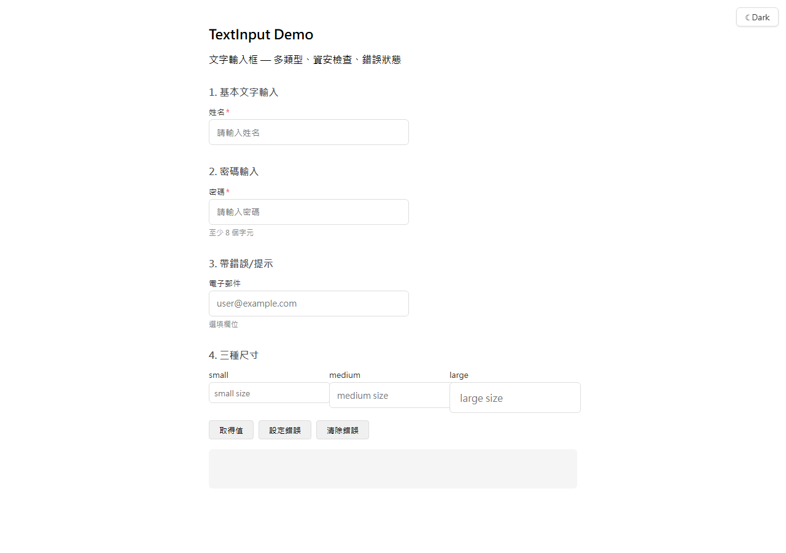

```javascript
import { TextInput } from './ui_components/form/TextInput/TextInput.js';

const nameInput = new TextInput({
  label: 'Name',
  placeholder: 'Enter your name',
  required: true,
  maxLength: 50,
  onChange: (value) => console.log('Value changed:', value)
});

nameInput.mount(document.getElementById('name-field'));

// Get value
const name = nameInput.getValue();

// Set value
nameInput.setValue('John Doe');
```

### 4.2 NumberInput — Number Input

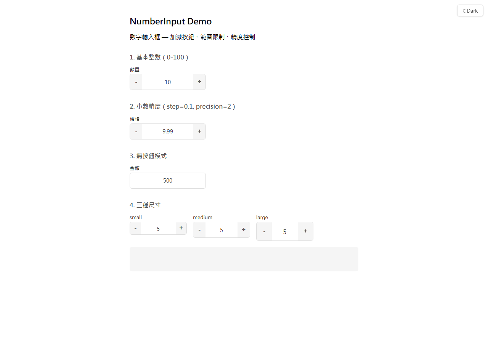

```javascript
import { NumberInput } from './ui_components/form/NumberInput/NumberInput.js';

const ageInput = new NumberInput({
  label: 'Age',
  min: 0,
  max: 150,
  step: 1,
  required: true
});

ageInput.mount(document.getElementById('age-field'));
```

### 4.3 DatePicker — Date Picker

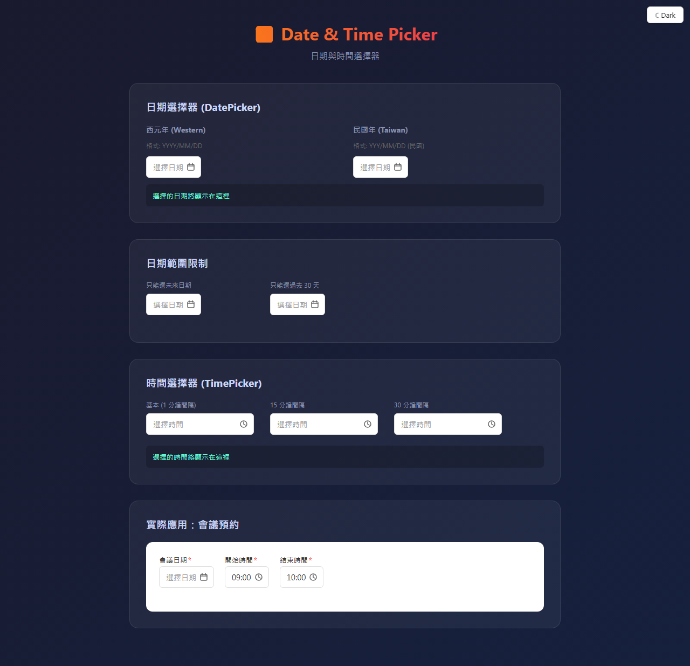

```javascript
import { DatePicker } from './ui_components/form/DatePicker/DatePicker.js';

const datePicker = new DatePicker({
  label: 'Birthday',
  format: 'western',      // 'western' (Gregorian) or 'taiwan' (ROC calendar)
  min: '1900-01-01',
  max: '2026-12-31',
  onChange: (date) => console.log('Date selected:', date)
});

datePicker.mount(document.getElementById('date-field'));
```

### 4.4 TimePicker — Time Picker

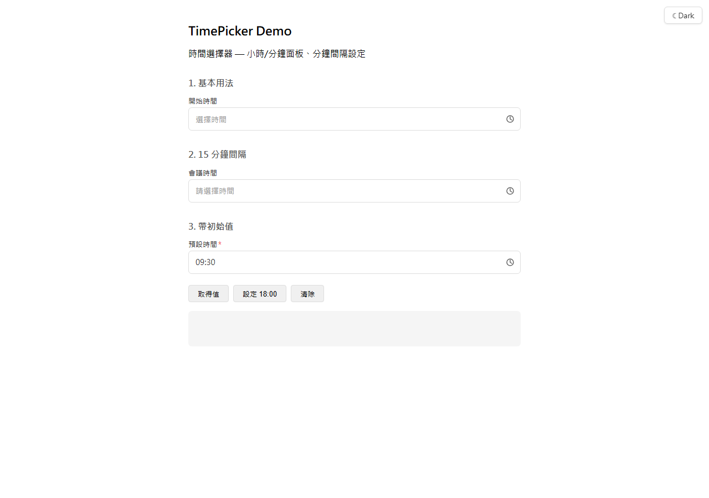

```javascript
import { TimePicker } from './ui_components/form/TimePicker/TimePicker.js';

const timePicker = new TimePicker({
  label: 'Meeting Time',
  minuteStep: 15           // Minute interval (1, 5, 10, 15, 30)
});

timePicker.mount(document.getElementById('time-field'));
```

### 4.5 Dropdown — Dropdown Select

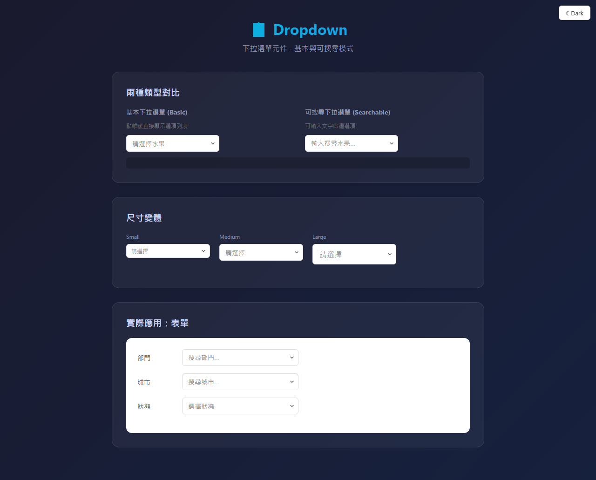

```javascript
import { Dropdown } from './ui_components/form/Dropdown/Dropdown.js';

const cityDropdown = new Dropdown({
  variant: 'searchable',   // 'basic' or 'searchable'
  placeholder: 'Select a city',
  items: [
    { value: 'NYC', label: 'New York' },
    { value: 'LAX', label: 'Los Angeles' },
    { value: 'CHI', label: 'Chicago' }
  ],
  clearable: true,
  onChange: (value) => console.log('Selected:', value)
});

cityDropdown.mount(document.getElementById('city-field'));
```

### 4.6 MultiSelectDropdown — Multi-Select Dropdown

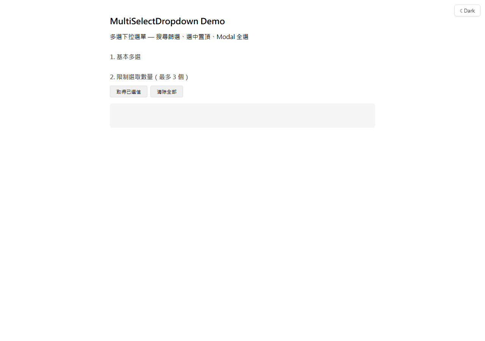

```javascript
import { MultiSelectDropdown } from './ui_components/form/MultiSelectDropdown/MultiSelectDropdown.js';

const tagSelect = new MultiSelectDropdown({
  placeholder: 'Select tags',
  items: [
    { value: 'js', label: 'JavaScript' },
    { value: 'css', label: 'CSS' },
    { value: 'html', label: 'HTML' }
  ],
  maxCount: 5,             // Maximum selectable items
  modalTitle: 'Select Tags'
});

tagSelect.mount(document.getElementById('tag-field'));

// Get selected values (array)
const selected = tagSelect.getValues(); // ['js', 'css']
```

### 4.7 Checkbox — Checkbox

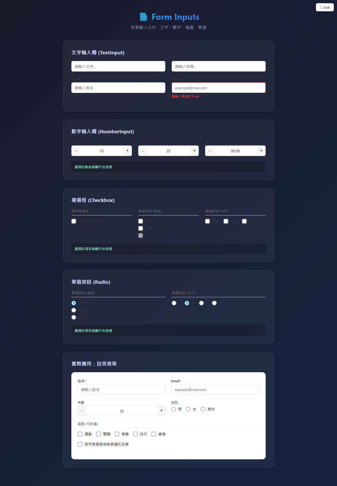

```javascript
import { Checkbox } from './ui_components/form/Checkbox/Checkbox.js';

const agreeCheckbox = new Checkbox({
  label: 'I agree to the terms of service',
  checked: false,
  onChange: (checked) => console.log('Checked:', checked)
});

agreeCheckbox.mount(document.getElementById('agree-field'));
```

### 4.8 Radio — Radio Button

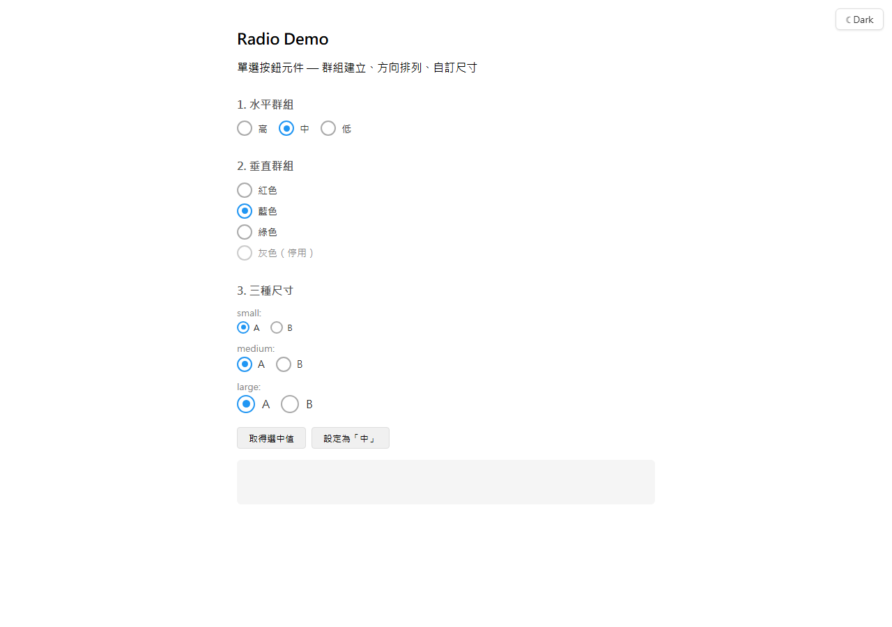

```javascript
import { Radio } from './ui_components/form/Radio/Radio.js';

// Single Radio button
const radio = new Radio({
  name: 'gender',
  label: 'Male',
  value: 'male',
  onChange: (checked) => console.log('Checked:', checked)
});

radio.mount(document.getElementById('radio-field'));

// Create a Radio group (recommended usage)
const genderGroup = Radio.createGroup({
  name: 'gender',
  items: [
    { value: 'male', label: 'Male' },
    { value: 'female', label: 'Female' },
    { value: 'other', label: 'Other' }
  ],
  value: 'male',            // Default selected value
  direction: 'horizontal',  // 'vertical' or 'horizontal'
  onChange: (value) => console.log('Selected:', value)
});

// createGroup returns a group object with getValue/setValue/mount methods
genderGroup.mount(document.getElementById('gender-field'));

// Get current selected value
const selectedGender = genderGroup.getValue();

// Programmatically set selected value
genderGroup.setValue('female');
```

### 4.9 ToggleSwitch — Toggle Switch

```javascript
import { ToggleSwitch } from './ui_components/form/ToggleSwitch/ToggleSwitch.js';

const toggle = new ToggleSwitch({
  label: 'Enable Notifications',
  checked: true,
  onChange: (enabled) => console.log('Notifications:', enabled ? 'On' : 'Off')
});

toggle.mount(document.getElementById('toggle-field'));
```

### 4.10 FormField — Form Field Wrapper

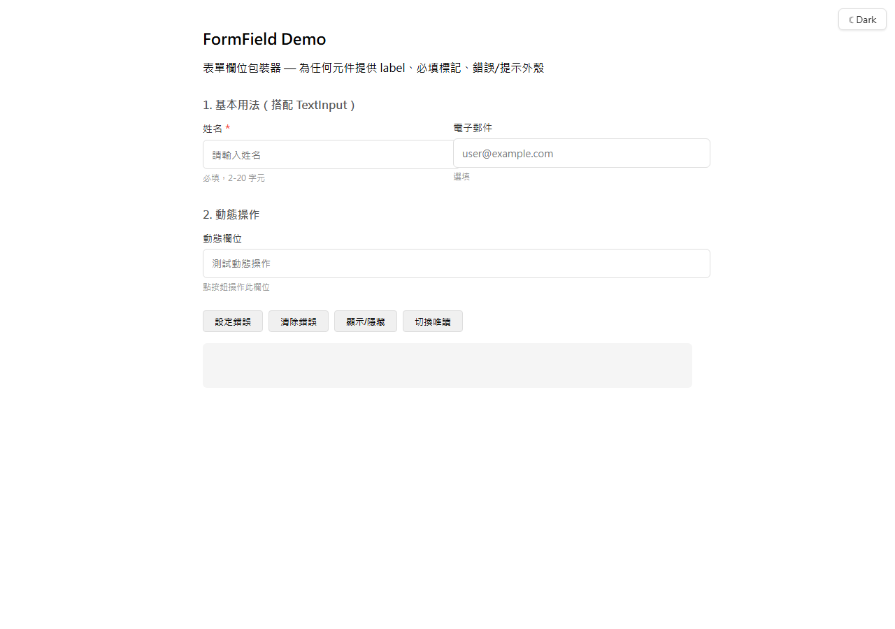

```javascript
import { FormField } from './ui_components/form/FormField/FormField.js';

const field = new FormField({
  label: 'Email',
  required: true,
  hint: 'We will not share your email',
  component: new TextInput({ placeholder: 'user@example.com' })
});

field.mount(document.getElementById('email-field'));
```

### 4.11 SearchForm — Search Form

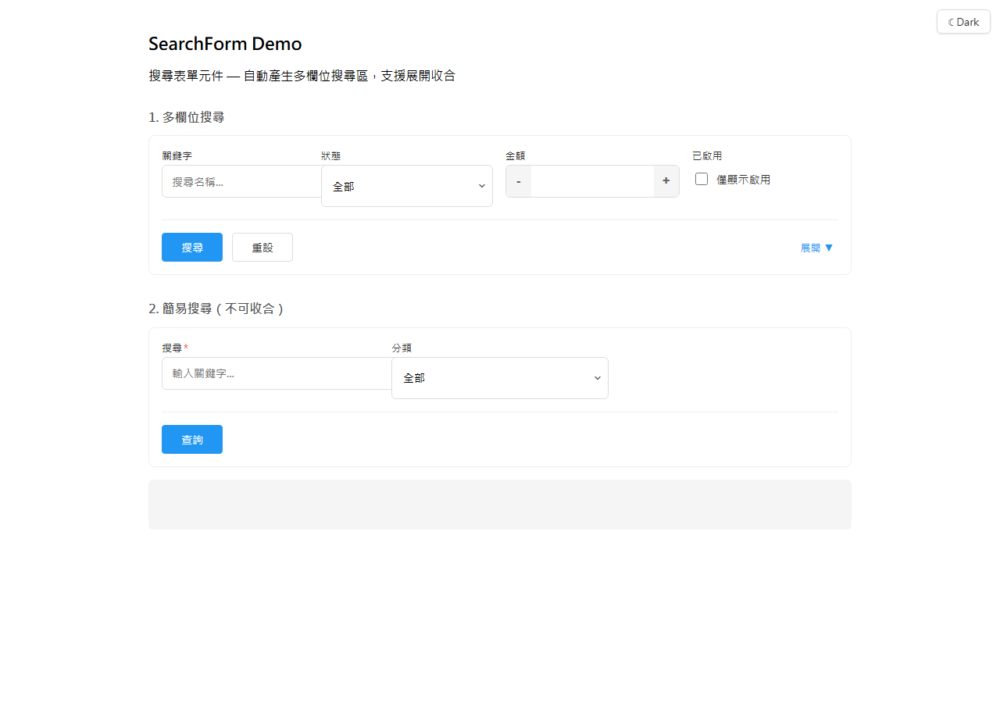

```javascript
import { SearchForm } from './ui_components/form/SearchForm/SearchForm.js';

const searchForm = new SearchForm({
  fields: [
    { name: 'keyword', type: 'text', label: 'Keyword' },
    { name: 'category', type: 'select', label: 'Category', options: [
      { value: 'all', label: 'All' },
      { value: 'news', label: 'News' }
    ]},
    { name: 'dateRange', type: 'date', label: 'Date Range' }
  ],
  onSearch: (criteria) => console.log('Search criteria:', criteria),
  onReset: () => console.log('Reset')
});

searchForm.mount(document.getElementById('search-area'));
```

### 4.12 BatchUploader — Batch Uploader

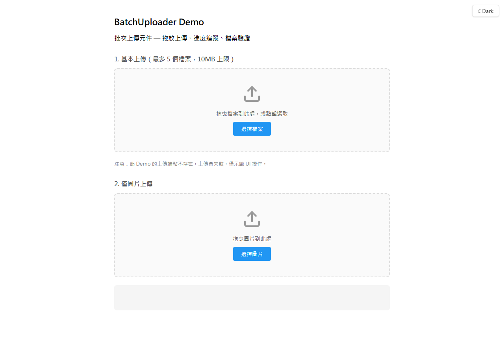

```javascript
import { BatchUploader } from './ui_components/form/BatchUploader/BatchUploader.js';

const uploader = new BatchUploader({
  container: document.getElementById('upload-area'),
  apiEndpoint: '/api/files/upload',
  allowedExtensions: ['.pdf', '.jpg', '.png'],
  maxFileSize: 10 * 1024 * 1024, // 10MB
  maxFiles: 5,
  autoUpload: false,
  uploadMode: 'sequential',  // 'sequential' or 'parallel'
  onComplete: (files) => console.log('Upload complete:', files),
  onError: (err) => console.error('Upload failed:', err)
});
```

---

## 5. Common Components

Common components are located in `packages/javascript/browser/ui_components/common/`, with 23 components total.

### 5.1 Button Series

#### BasicButton — Basic Button

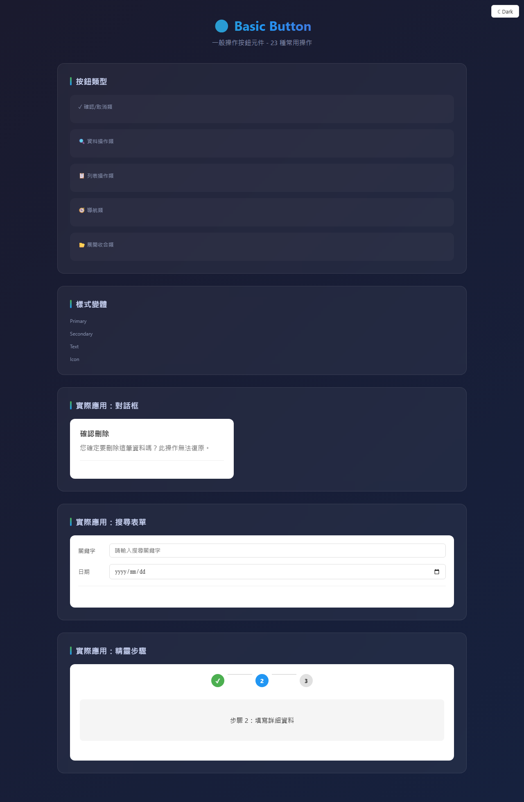

```javascript
import { BasicButton } from './ui_components/common/BasicButton/BasicButton.js';

const btn = new BasicButton({
  text: 'Submit',
  variant: 'primary', // primary | secondary | outline | danger
  onClick: () => console.log('Button clicked')
});

btn.mount(document.getElementById('btn-container'));
```

#### ActionButton — Action Button

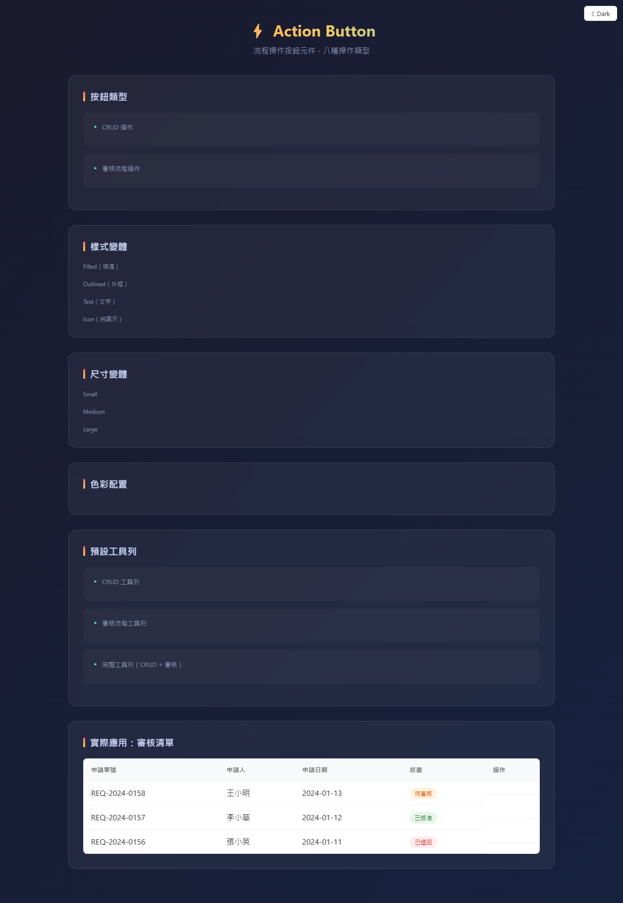

```javascript
import { ActionButton } from './ui_components/common/ActionButton/ActionButton.js';

const actionBtn = new ActionButton({
  text: 'Edit',
  icon: 'edit',
  onClick: () => openEditor()
});

actionBtn.mount(document.getElementById('action-area'));
```

#### AuthButton — Permission-based Button

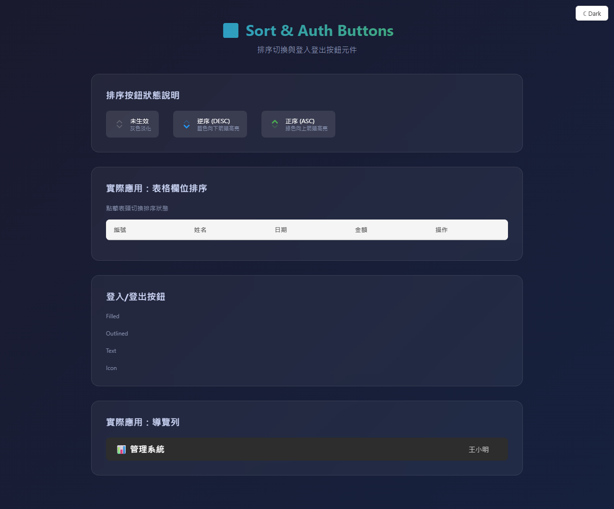

```javascript
import { AuthButton } from './ui_components/common/AuthButton/AuthButton.js';

// Automatically shows/hides based on user permissions
const deleteBtn = new AuthButton({
  text: 'Delete',
  permission: 'admin.delete',
  variant: 'danger',
  onClick: () => deleteItem()
});

deleteBtn.mount(document.getElementById('auth-area'));
```

#### DownloadButton / UploadButton

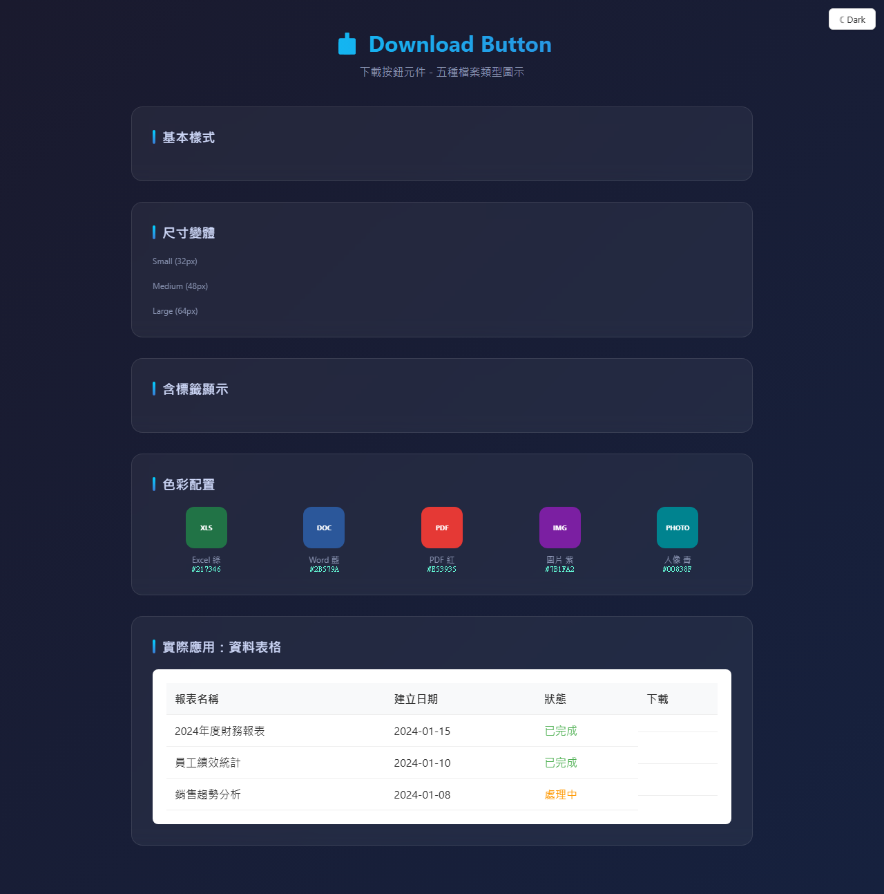

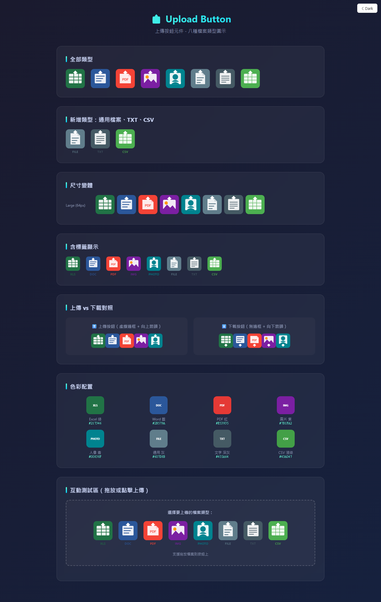

```javascript
import { DownloadButton } from './ui_components/common/DownloadButton/DownloadButton.js';
import { UploadButton } from './ui_components/common/UploadButton/UploadButton.js';

const downloadBtn = new DownloadButton({
  text: 'Download Report',
  url: '/api/reports/export',
  filename: 'report.xlsx'
});

const uploadBtn = new UploadButton({
  text: 'Upload File',
  accept: '.csv,.xlsx',
  onUpload: (file) => processFile(file)
});
```

#### ButtonGroup — Button Group

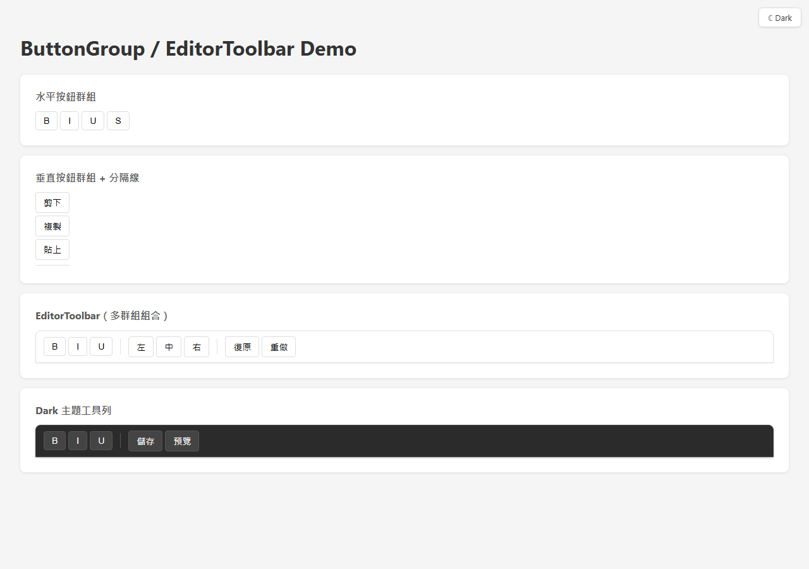

```javascript
import { ButtonGroup } from './ui_components/common/ButtonGroup/ButtonGroup.js';

const group = new ButtonGroup({
  buttons: [saveBtn, cancelBtn, deleteBtn],  // Array of BasicButton instances
  direction: 'horizontal',  // 'horizontal' | 'vertical'
  gap: '8px',
  showSeparator: false,
  theme: 'light'            // 'light' | 'dark' | 'gradient'
});

group.mount(document.getElementById('button-area'));
```

### 5.2 ColorPicker — Color Picker

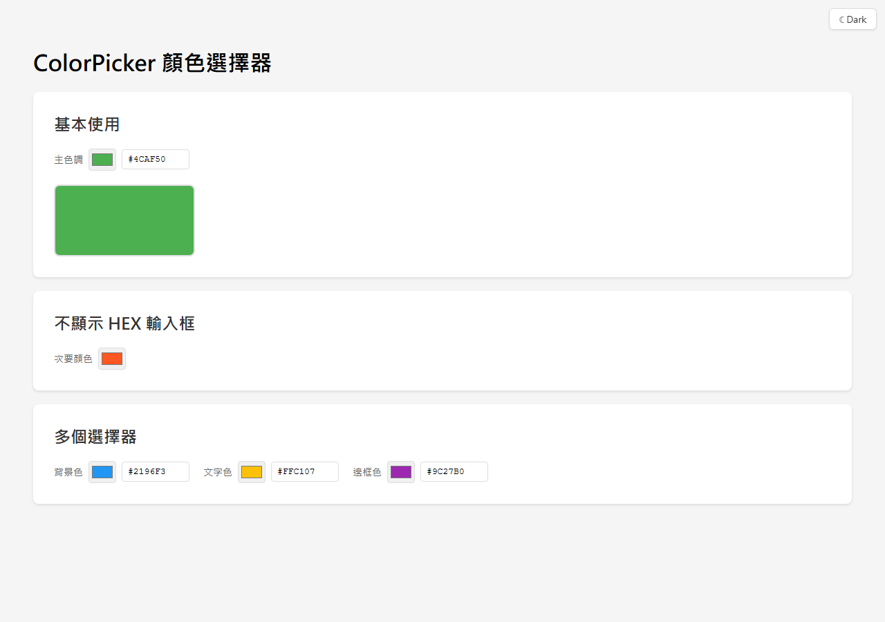

```javascript
import { ColorPicker } from './ui_components/common/ColorPicker/ColorPicker.js';

const colorPicker = new ColorPicker({
  label: 'Theme Color',
  value: '#4A90D9',
  onChange: (color) => applyColor(color)
});

colorPicker.mount(document.getElementById('color-field'));
```

### 5.3 Dialog / SimpleDialog — Dialog

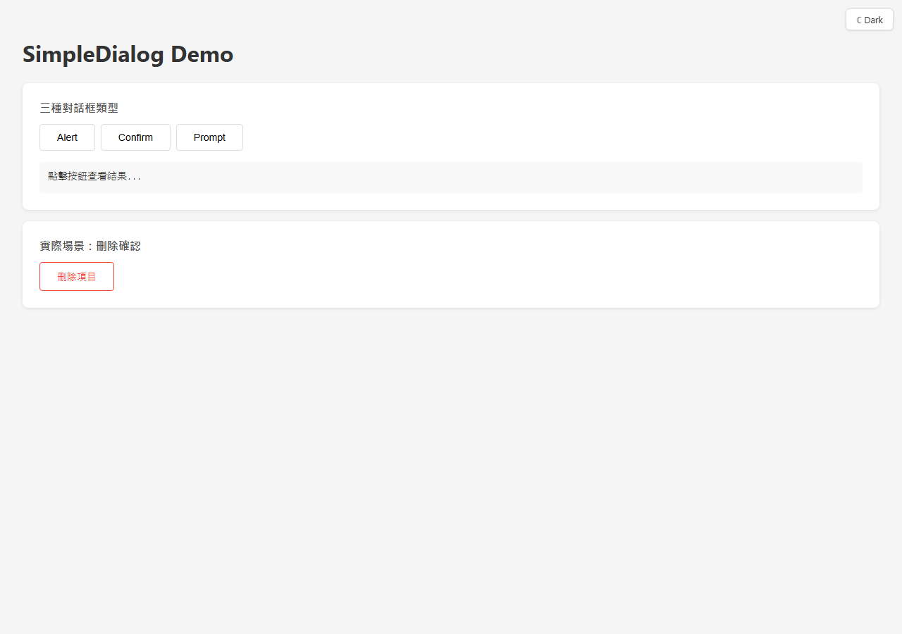

```javascript
import { SimpleDialog } from './ui_components/common/Dialog/SimpleDialog.js';

// Confirmation dialog (returns Promise<boolean>)
const confirmed = await SimpleDialog.confirm('Are you sure you want to delete this item? This action cannot be undone.');
if (confirmed) {
  deleteItem();
}

// Alert dialog (returns Promise<true>)
await SimpleDialog.alert('Data saved successfully.');

// Prompt dialog (returns Promise<string|null>)
const name = await SimpleDialog.prompt('Enter a name', 'default value');
```

### 5.4 Notification — Notification

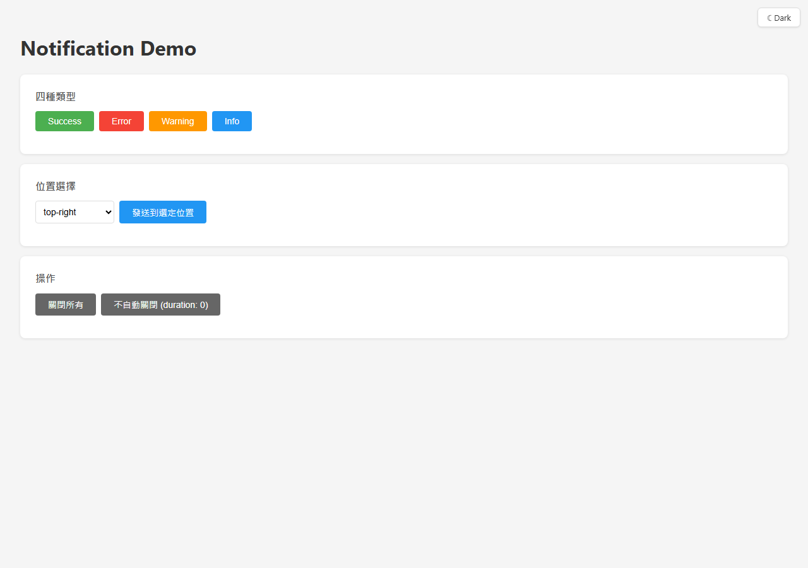

```javascript
import { Notification } from './ui_components/common/Notification/Notification.js';

// Success notification
Notification.success('Saved successfully!');

// Error notification
Notification.error('An error occurred. Please try again.');

// Warning notification
Notification.warning('Please fill in the required fields.');

// Info notification
Notification.info('A new version has been released.');

// Custom options
Notification.show({
  type: 'success',
  message: 'Operation complete',
  duration: 5000,    // Display for 5 seconds
  position: 'top-right'
});
```

### 5.5 LoadingSpinner — Loading Spinner

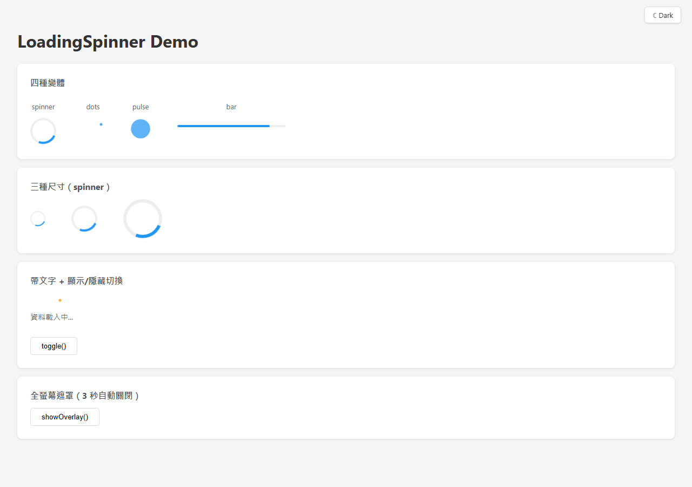

```javascript
import { LoadingSpinner } from './ui_components/common/LoadingSpinner/LoadingSpinner.js';

const spinner = new LoadingSpinner({
  text: 'Loading data...',
  size: 'medium' // small | medium | large
});

// Show loading
spinner.mount(document.getElementById('content-area'));

// Remove when done
spinner.destroy();
```

### 5.6 Pagination — Pagination

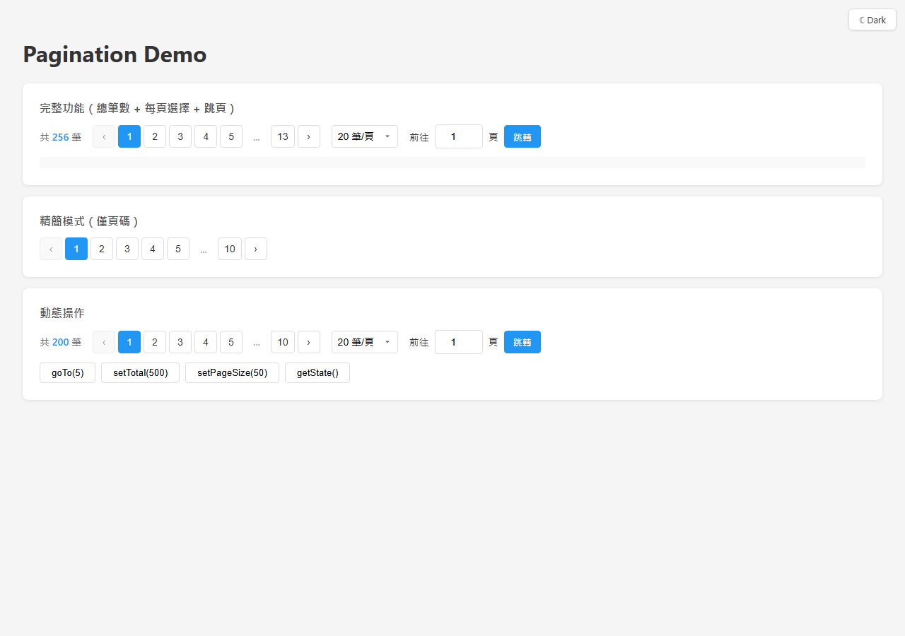

```javascript
import { Pagination } from './ui_components/common/Pagination/Pagination.js';

const pagination = new Pagination({
  total: 200,
  pageSize: 20,
  page: 1,
  onChange: (page, pageSize) => loadData(page)
});

pagination.mount(document.getElementById('pagination-area'));
```

### 5.7 Breadcrumb — Breadcrumb Navigation

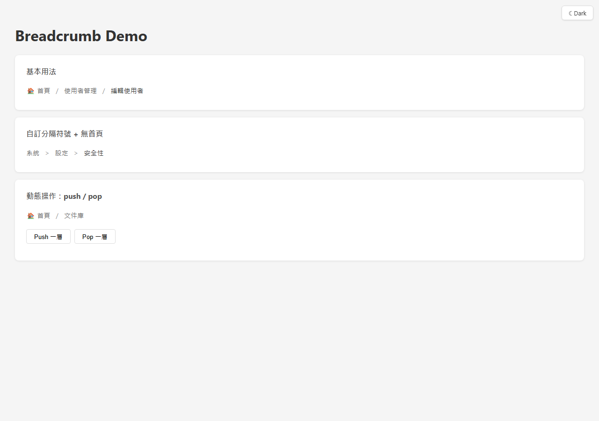

```javascript
import { Breadcrumb } from './ui_components/common/Breadcrumb/Breadcrumb.js';

const breadcrumb = new Breadcrumb({
  items: [
    { text: 'Home', href: '#/' },
    { text: 'User Management', href: '#/users' },
    { text: 'Edit User' }  // Last item doesn't need href
  ]
});

breadcrumb.mount(document.getElementById('breadcrumb-area'));
```

### 5.8 TreeList — Tree List

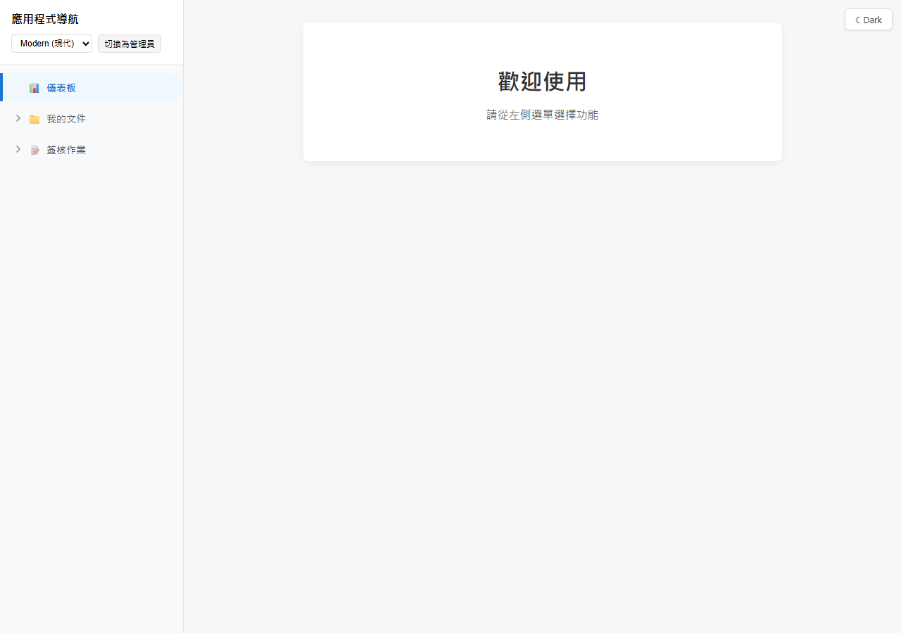

```javascript
import { TreeList } from './ui_components/common/TreeList/TreeList.js';

const tree = new TreeList({
  data: [
    {
      id: 1, label: 'Headquarters', children: [
        { id: 2, label: 'Engineering', children: [
          { id: 3, label: 'Frontend Team' },
          { id: 4, label: 'Backend Team' }
        ]},
        { id: 5, label: 'Sales' }
      ]
    }
  ],
  onSelect: (node) => console.log('Selected:', node)
});

tree.mount(document.getElementById('tree-area'));
```

### 5.9 PhotoCard / FeatureCard — Card Components

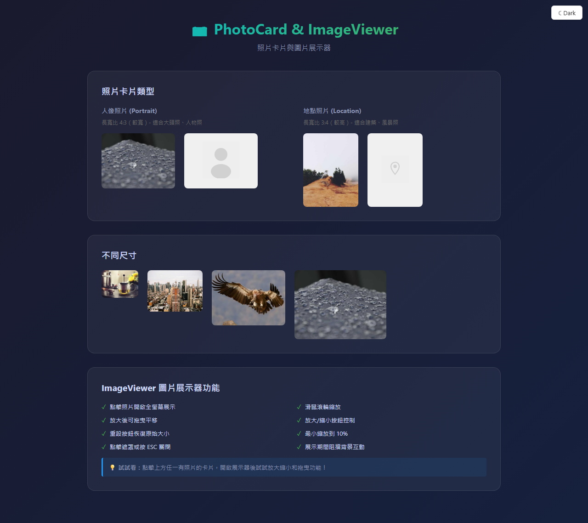

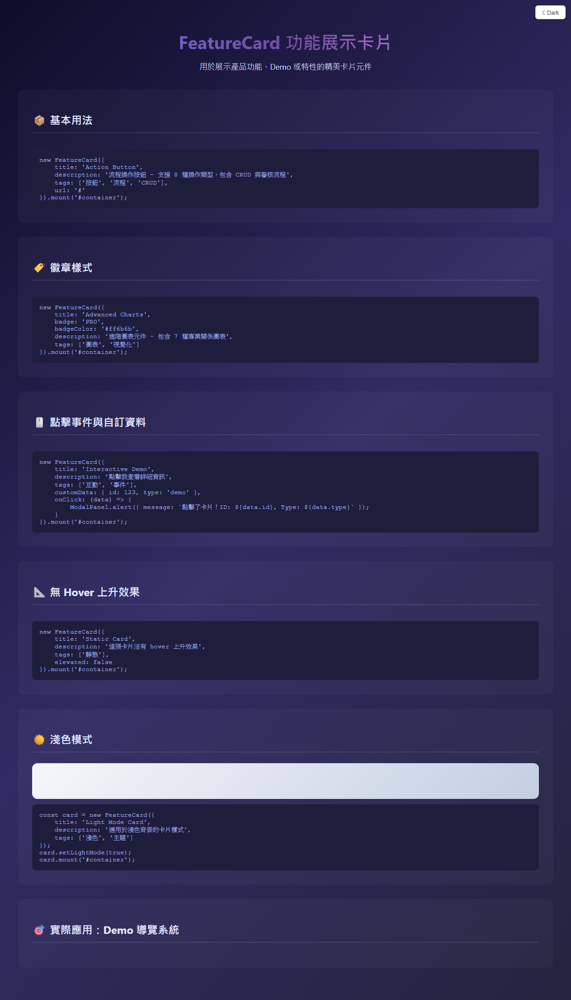

```javascript
import { PhotoCard } from './ui_components/common/PhotoCard/PhotoCard.js';
import { FeatureCard } from './ui_components/common/FeatureCard/FeatureCard.js';

const photoCard = new PhotoCard({
  imageUrl: '/images/landscape.jpg',
  title: 'National Park',
  description: 'A scenic nature area near the city',
  onClick: () => openDetail()
});

const featureCard = new FeatureCard({
  icon: 'chart',
  title: 'Data Analytics',
  description: 'Real-time data statistics and visual reports'
});
```

### 5.10 ImageViewer — Image Viewer

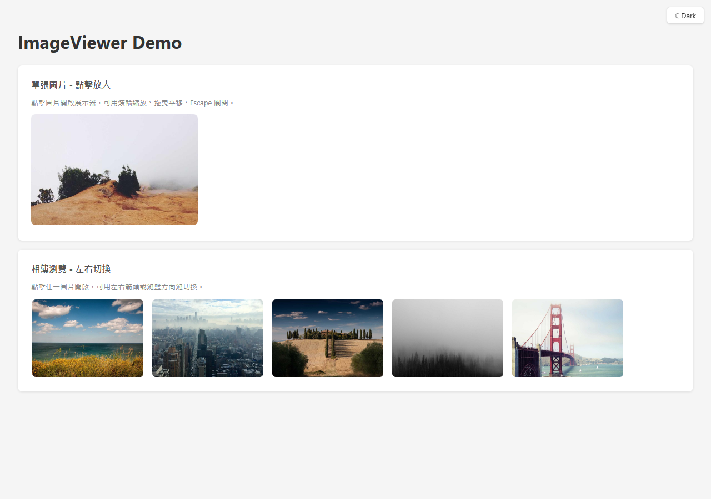

```javascript
import { ImageViewer } from './ui_components/common/ImageViewer/ImageViewer.js';

const viewer = new ImageViewer({
  images: [
    { src: '/photos/1.jpg', caption: 'Photo 1' },
    { src: '/photos/2.jpg', caption: 'Photo 2' },
    { src: '/photos/3.jpg', caption: 'Photo 3' }
  ],
  enableZoom: true,
  enableFullscreen: true
});

viewer.mount(document.getElementById('viewer-area'));
```

### 5.11 SortButton — Sort Button

Used for table column sorting, cycling through none → desc → asc states.

```javascript
import { SortButton } from './ui_components/common/SortButton/SortButton.js';

const sortBtn = new SortButton({
  field: 'name',
  state: 'none',        // 'none'|'desc'|'asc'
  size: 'small',         // 'small'|'medium'
  onSort: (field, state) => {
    console.log(`Sort ${field}: ${state}`);
    loadData({ sortBy: field, order: state });
  }
});

sortBtn.mount(headerCell);
sortBtn.setState('asc');  // Programmatic control
sortBtn.reset();          // Reset to none
```

### 5.12 EditorButton — Editor Toolbar Button

Provides 50+ predefined button types (bold, italic, link, image, etc.) for rich text editor toolbars.

```javascript
import { EditorButton } from './ui_components/common/EditorButton/EditorButton.js';

const boldBtn = new EditorButton({
  type: 'bold',           // 50+ predefined types
  onClick: () => document.execCommand('bold'),
  size: 'medium',         // 'small'|'medium'|'large'
  variant: 'default',     // 'default'|'primary'|'ghost'|'outline'
  tooltip: 'Bold (Ctrl+B)'
});

boldBtn.mount(toolbar);
boldBtn.active = true;    // Set active state
boldBtn.setDisabled(true); // Disable
```

---

## 6. Layout Components

Layout components are located in `packages/javascript/browser/ui_components/layout/`, with 10 components total.

### 6.1 Panel Series

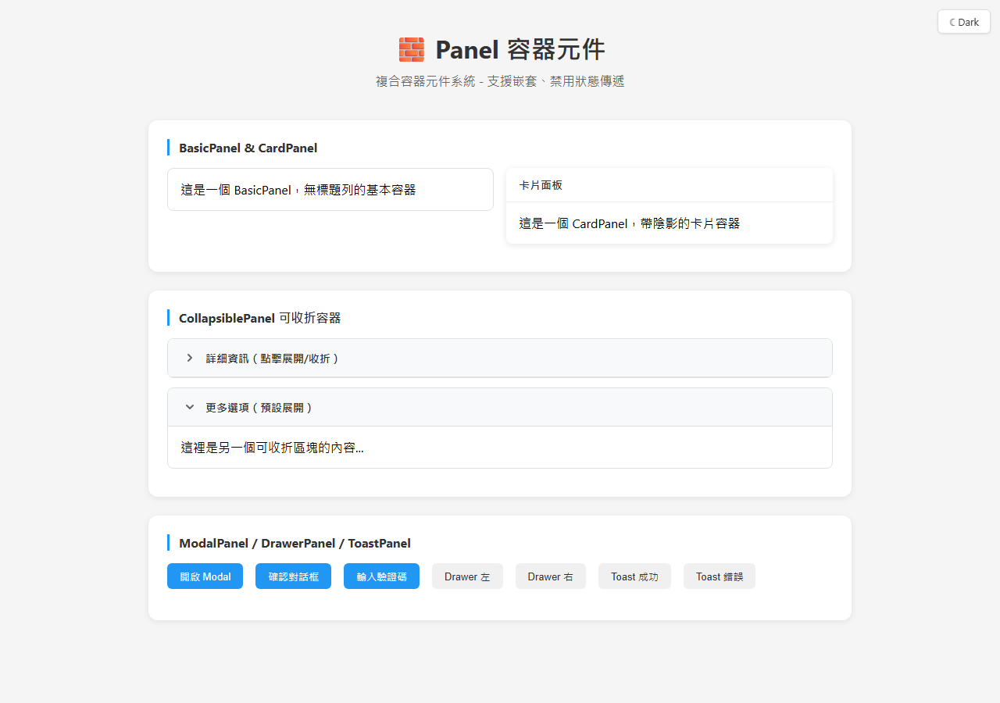

The Panel series provides multiple panel types: BasePanel, BasicPanel, CardPanel, CollapsiblePanel, ModalPanel, DrawerPanel, FocusPanel, ToastPanel, and the unified PanelManager.

```javascript
import { ModalPanel } from './ui_components/layout/Panel/ModalPanel.js';
import { ToastPanel } from './ui_components/layout/Panel/ToastPanel.js';
import { PanelManager } from './ui_components/layout/Panel/PanelManager.js';

// Modal panel
const modal = new ModalPanel({
  title: 'Edit User',
  width: '600px',
  onClose: () => console.log('Closed')
});

modal.setContent('<form>...</form>');
modal.mount(document.body);
modal.open();

// Toast notification panel
const toast = new ToastPanel({
  message: 'Operation successful',
  type: 'success',
  duration: 3000
});

toast.mount(document.body);
toast.show();

// PanelManager — Unified panel management
const panelManager = new PanelManager();
panelManager.register('editUser', modal);
panelManager.open('editUser');
panelManager.close('editUser');
```

### 6.2 DataTable — Data Table

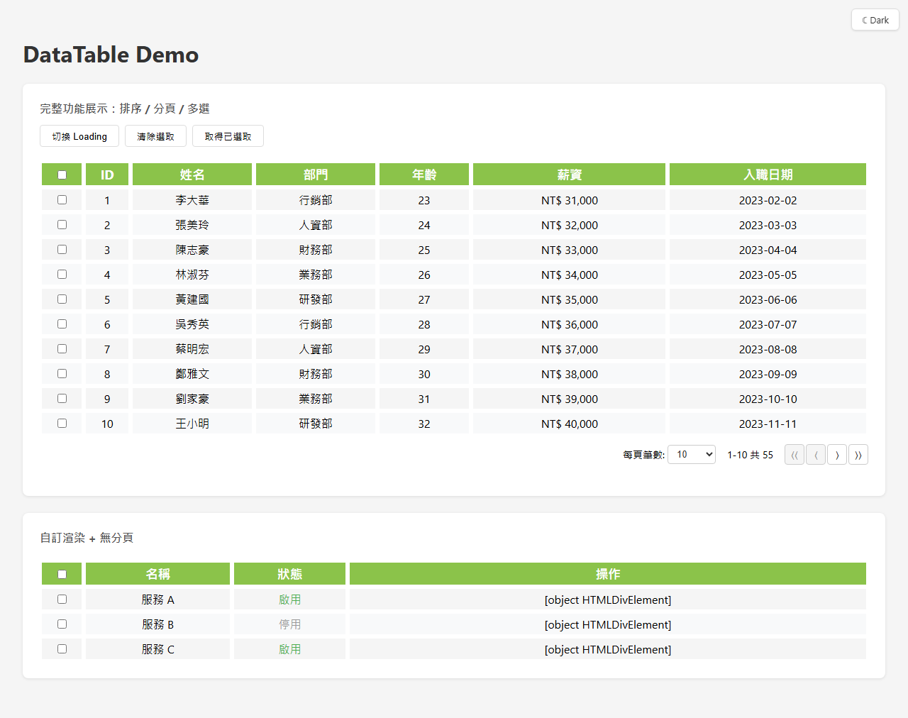

```javascript
import { DataTable } from './ui_components/layout/DataTable/DataTable.js';

const table = new DataTable({
  container: document.getElementById('table-area'),
  title: 'User Management',
  variant: 'default',       // 'default' or 'search'
  columns: [
    { name: 'name', label: 'Name', options: { sort: true } },
    { name: 'email', label: 'Email' },
    { name: 'role', label: 'Role', options: { sort: true } },
    {
      name: 'actions',
      label: 'Actions',
      options: {
        customBodyRender: (value, tableMeta) =>
          `<button onclick="edit(${tableMeta.rowData[0]})">Edit</button>`
      }
    }
  ],
  data: [
    ['John Doe', 'john@example.com', 'Admin', ''],
    ['Jane Smith', 'jane@example.com', 'Editor', '']
  ],
  pageSize: 20
});

// Alternative format — Object array + key/title columns (audit mode)
const auditTable = new DataTable({
  container: document.getElementById('audit-area'),
  columns: [
    { key: 'name', title: 'Name', sortable: true },
    { key: 'email', title: 'Email' },
    { key: 'role', title: 'Role', render: (row) => `<b>${row.role}</b>` }
  ],
  data: [
    { name: 'John Doe', email: 'john@example.com', role: 'Admin' },
    { name: 'Jane Smith', email: 'jane@example.com', role: 'Editor' }
  ]
});
```

### 6.3 SideMenu — Side Menu

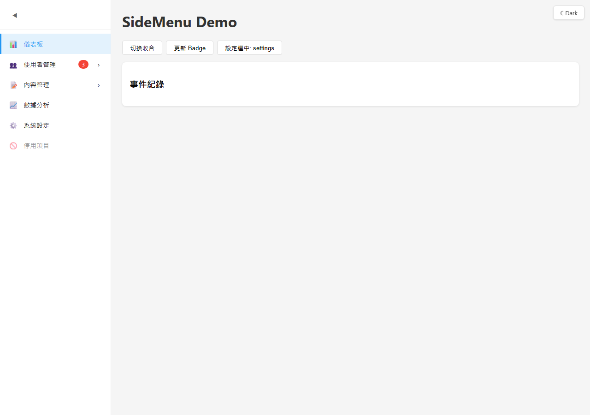

```javascript
import { SideMenu } from './ui_components/layout/SideMenu/SideMenu.js';

const menu = new SideMenu({
  items: [
    { id: 'dashboard', icon: 'home', text: 'Dashboard', href: '#/' },
    {
      id: 'users', icon: 'users', text: 'User Management',
      children: [
        { id: 'user-list', text: 'User List', href: '#/users' },
        { id: 'user-add', text: 'Add User', href: '#/users/add' }
      ]
    },
    { id: 'settings', icon: 'settings', text: 'Settings', href: '#/settings' }
  ],
  activeId: 'dashboard',
  collapsed: false,          // Whether the side menu is collapsed
  accordion: true,           // Accordion mode (only one submenu expanded at a time)
  onSelect: (item) => console.log('Selected:', item)
});

menu.mount(document.getElementById('sidebar'));
```

### 6.4 TabContainer — Tab Container

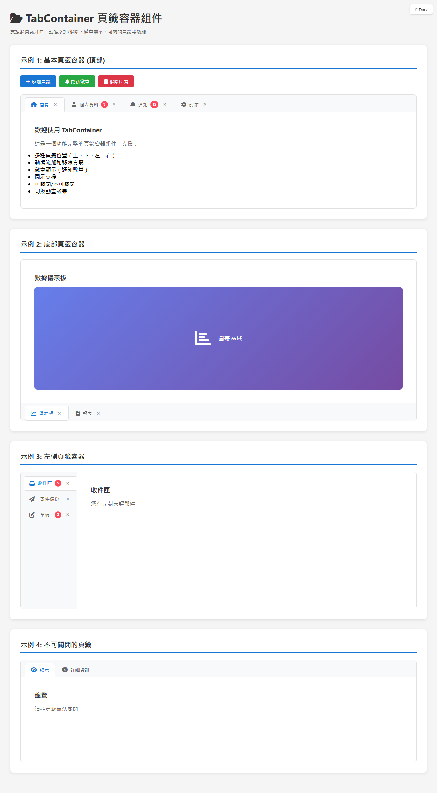

```javascript
import { TabContainer } from './ui_components/layout/TabContainer/TabContainer.js';

const tabs = new TabContainer({
  containerId: 'tab-area',  // DOM id of the mount container
  tabs: [
    { id: 'basic', title: 'Basic Info', content: '<div>...</div>' },
    { id: 'contact', title: 'Contact', content: '<div>...</div>' },
    { id: 'permissions', title: 'Permissions', content: '<div>...</div>', closable: false }
  ],
  position: 'top',          // 'top' | 'bottom' | 'left' | 'right'
  closable: true,           // Whether tabs can be closed
  animated: true,
  onTabChange: (tabId) => console.log('Switched to:', tabId),
  onTabClose: (tabId) => console.log('Closed:', tabId)
});
```

### 6.5 FormRow — Form Row

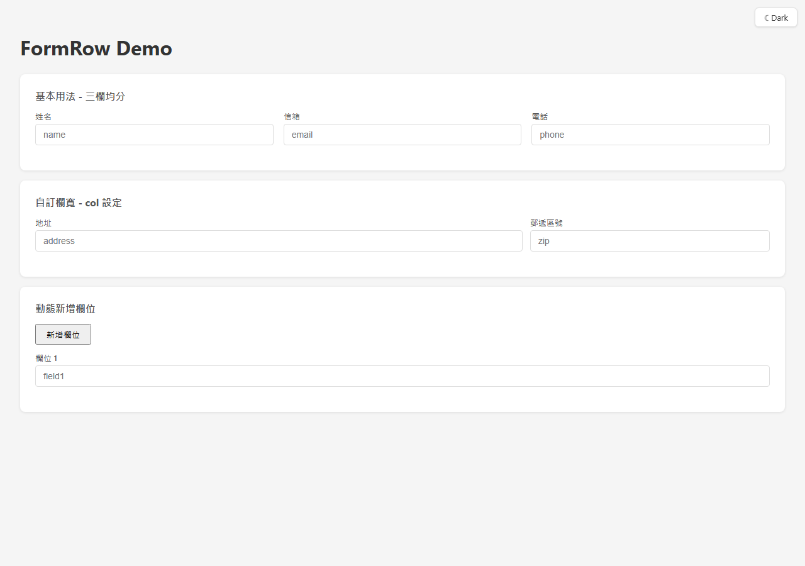

```javascript
import { FormRow } from './ui_components/layout/FormRow/FormRow.js';

const row = new FormRow({
  columns: 3,  // Display 3 fields per row
  gap: '16px',
  fields: [nameInput, emailInput, phoneInput]
});

row.mount(document.getElementById('form-area'));
```

### 6.6 InfoPanel — Info Panel

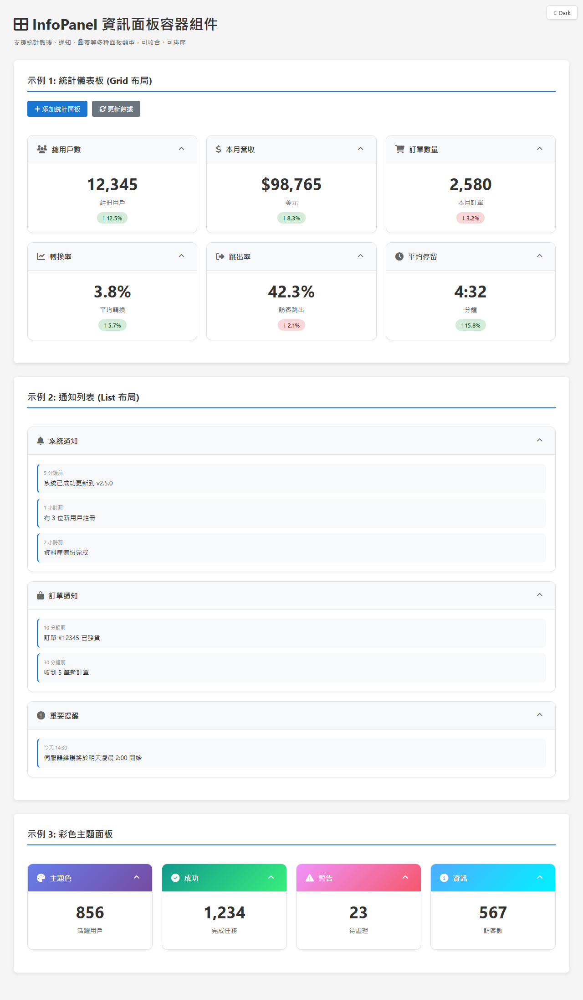

```javascript
import { InfoPanel } from './ui_components/layout/InfoPanel/InfoPanel.js';

const infoPanel = new InfoPanel({
  containerId: 'info-area',  // DOM id of the mount container
  panels: [
    { title: 'Basic Info', fields: [
      { label: 'Name', value: 'John Doe' },
      { label: 'Phone', value: '0912-345-678' }
    ]},
    { title: 'System Info', fields: [
      { label: 'Created', value: '2025-01-15' }
    ]}
  ],
  layout: 'grid',        // 'grid' | 'list' | 'masonry'
  columns: 3,
  collapsible: true
});
```

### 6.7 Other Layout Components

#### FunctionMenu — Function Menu

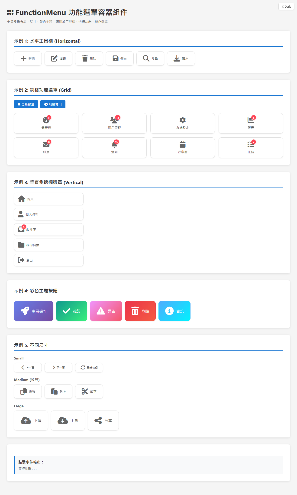

```javascript
import { FunctionMenu } from './ui_components/layout/FunctionMenu/FunctionMenu.js';

const funcMenu = new FunctionMenu({
  containerId: 'func-menu',  // DOM id of the mount container
  items: [
    { id: 'add', icon: 'add', label: 'Add' },
    { id: 'export', icon: 'export', label: 'Export' },
    { id: 'print', icon: 'print', label: 'Print' }
  ],
  layout: 'horizontal',      // 'horizontal' | 'vertical' | 'grid'
  columns: 4,
  size: 'medium',            // 'small' | 'medium' | 'large'
  onItemClick: (item) => console.log('Clicked:', item.id)
});
```

#### WorkflowPanel — Workflow Panel

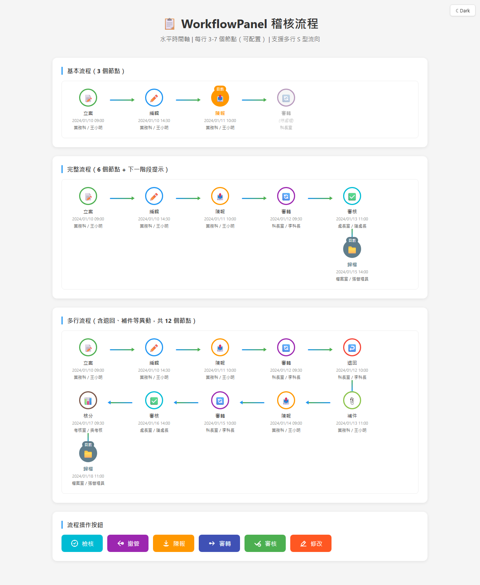

```javascript
import { WorkflowPanel } from './ui_components/layout/WorkflowPanel/WorkflowPanel.js';

const workflow = new WorkflowPanel({
  data: [
    { StageName: 'Created', DateTime: '2026-03-01 10:00', UnitName: 'IT Dept', UserName: 'John' },
    { StageName: 'Submitted', DateTime: '2026-03-02 14:00', UnitName: 'IT Dept', UserName: 'John' },
    { StageName: 'Reviewed', DateTime: '2026-03-03 09:00', UnitName: 'Admin', UserName: 'Jane' },
    { StageName: 'Approved', DateTime: '2026-03-03 16:00', UnitName: 'Admin', UserName: 'Manager' }
  ],
  itemsPerRow: 5,            // Nodes per row (3~7)
  nextStage: { StageName: 'Closed', NextUnit: 'IT Dept' },
  showDetails: true,
  onNodeClick: (node) => console.log('Node:', node)
});

workflow.mount(document.getElementById('workflow-area'));
```

### 6.8 DocumentWall — Document Wall

Displays documents in a card grid, supports multi-select, batch ZIP download, description editing, and deletion.

```javascript
import { DocumentWall } from './ui_components/layout/DocumentWall/DocumentWall.js';

const wall = new DocumentWall({
  documents: [
    { id: 1, title: 'report.pdf', type: 'pdf', src: '/files/report.pdf', description: 'Annual report' }
  ],
  readOnly: false,
  onDownload: (doc) => {},
  onDescription: (doc, text) => {},
  onEdit: (doc) => {},
  onDelete: (doc) => {}
});

wall.mount(document.getElementById('doc-area'));
wall.removeDocument(0);
```

### 6.9 PhotoWall — Photo Wall

Image gallery component, supports preview browsing, multi-select, and batch ZIP download.

```javascript
import { PhotoWall } from './ui_components/layout/PhotoWall/PhotoWall.js';

const photos = new PhotoWall({
  photos: [
    { id: 1, src: '/images/photo1.jpg', alt: 'Photo 1' }
  ],
  readOnly: false,
  onAdd: (photo) => {},
  onDelete: (photo) => {},
  onChange: (photos) => {}
});

photos.mount(document.getElementById('gallery'));
photos.addPhoto({ id: 2, src: '/images/photo2.jpg', alt: 'Photo 2' });
const allPhotos = photos.getPhotos();
```

---

## 7. Advanced Input Components

Advanced input components are located in `packages/javascript/browser/ui_components/input/`, with 10 components total. These components handle complex input scenarios such as addresses, phone lists, organization info, etc.

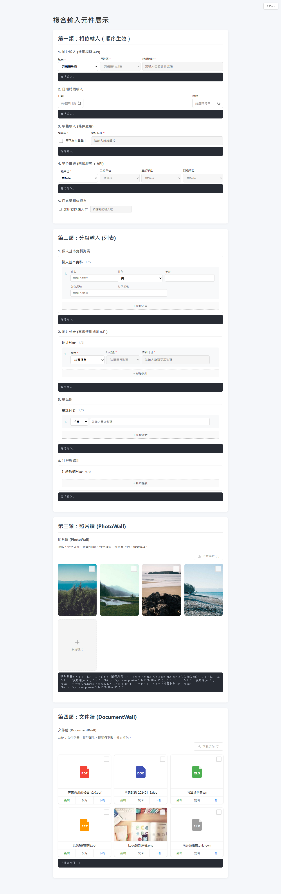

### 7.1 ChainedInput — Chained Input

Multi-level cascading dropdown selects, suitable for hierarchical data like country/state/city.

```javascript
import { ChainedInput } from './ui_components/input/ChainedInput/ChainedInput.js';

const regionInput = new ChainedInput({
  label: 'Region',
  levels: [
    { name: 'city', label: 'City', options: citiesData },
    { name: 'district', label: 'District', dependsOn: 'city' },
    { name: 'village', label: 'Village', dependsOn: 'district' }
  ],
  onLoadOptions: async (level, parentValue) => {
    return await fetch(`/api/regions?parent=${parentValue}`).then(r => r.json());
  }
});

regionInput.mount(document.getElementById('region-field'));
```

### 7.2 AddressInput — Address Input

Composite component integrating region cascading and detailed address.

```javascript
import { AddressInput } from './ui_components/input/AddressInput/AddressInput.js';

const addressInput = new AddressInput({
  label: 'Mailing Address',
  required: true
});

addressInput.mount(document.getElementById('address-field'));

// Get full address
const address = addressInput.getValue();
// { city: 'Taipei', district: 'Zhongzheng', detail: '122 Chongqing South Rd.' }
```

### 7.3 AddressListInput — Multiple Address Input

Add/remove multiple addresses, suitable for scenarios with multiple mailing addresses.

```javascript
import { AddressListInput } from './ui_components/input/AddressListInput/AddressListInput.js';

const addressList = new AddressListInput({
  label: 'Address List',
  maxItems: 3
});

addressList.mount(document.getElementById('address-list-field'));
```

### 7.4 PersonInfoList — Person Info List

```javascript
import { PersonInfoList } from './ui_components/input/PersonInfoList/PersonInfoList.js';

const personList = new PersonInfoList({
  label: 'Family Members',
  fields: ['name', 'relationship', 'phone', 'birthDate'],
  maxItems: 10
});

personList.mount(document.getElementById('person-list'));
```

### 7.5 PhoneListInput — Phone List

```javascript
import { PhoneListInput } from './ui_components/input/PhoneListInput/PhoneListInput.js';

const phoneList = new PhoneListInput({
  label: 'Contact Phones',
  maxItems: 5,
  types: ['Mobile', 'Home', 'Work']
});

phoneList.mount(document.getElementById('phone-list'));
```

### 7.6 OrganizationInput — Organization Input

```javascript
import { OrganizationInput } from './ui_components/input/OrganizationInput/OrganizationInput.js';

const orgInput = new OrganizationInput({
  label: 'Employer',
  fields: ['name', 'department', 'title', 'phone']
});

orgInput.mount(document.getElementById('org-field'));
```

### 7.7 Other Advanced Inputs

- **DateTimeInput** — DateTime composite input
- **ListInput** — Generic list input (add/remove/reorder items)
- **SocialMediaList** — Social media account list
- **StudentInput** — Student information input

All these components follow the unified API (`mount`, `getValue`, `setValue`, `destroy`).

---

## 8. Social Components

Social components (`social/`) provide UI elements for social networking features including profiles, feeds, and network graphs.

### 8.1 Avatar — Avatar

```javascript
import { Avatar } from './ui_components/social/Avatar/Avatar.js';

const avatar = new Avatar({
  src: '/images/user.jpg',
  alt: 'John Doe',
  size: 'lg',         // 'xs'|'sm'|'md'|'lg'|'xl' (24px ~ 96px)
  badge: 3,           // Notification count
  onClick: () => {}
});

avatar.mount(document.getElementById('avatar-container'));
avatar.update({ badge: 5 });
```

### 8.2 FeedCard — Feed Card

```javascript
import { FeedCard } from './ui_components/social/FeedCard/FeedCard.js';

const feed = new FeedCard({
  avatar: '/images/user.jpg',
  author: 'John Doe',
  authorSub: 'Senior Engineer',
  timestamp: '2026-03-01T10:30:00',
  type: 'Announcement',
  typeColor: 'var(--cl-primary)',
  title: 'System Update Notice',
  content: 'This update includes performance improvements...',
  images: ['/images/screenshot.png'],
  tags: ['System', 'Update'],
  onClickDetail: () => {},
  onClickAuthor: () => {}
});

feed.mount(document.getElementById('feed'));

// Batch generate feed list
const listHTML = FeedCard.listHTML(feedItems);
```

### 8.3 ConnectionCard — Connection Card

```javascript
import { ConnectionCard } from './ui_components/social/ConnectionCard/ConnectionCard.js';

const card = new ConnectionCard({
  avatar: '/images/user.jpg',
  name: 'Jane Smith',
  subtitle: 'Product Manager',
  tags: ['Design', 'UX'],
  onClick: () => {}
});

card.mount(container);

// Batch generate connection grid
const gridHTML = ConnectionCard.gridHTML(contacts);
```

### 8.4 StatCard — Stat Card

```javascript
import { StatCard } from './ui_components/social/StatCard/StatCard.js';

const stat = new StatCard({
  icon: '📊',
  label: 'Monthly Revenue',
  value: '$120,000',
  trend: 'up',           // 'up'|'down'|null
  trendValue: '+12%',
  color: 'var(--cl-success)',
  onClick: () => {}
});

stat.mount(container);
```

### 8.5 Timeline — Timeline

```javascript
import { Timeline } from './ui_components/social/Timeline/Timeline.js';

const timeline = new Timeline({
  items: [
    {
      timestamp: '2026-03-01T10:00:00',
      type: 'Created',
      color: 'var(--cl-success)',
      icon: '✅',
      title: 'Account Created',
      description: 'Account automatically created by the system',
      onClick: () => {}
    }
  ],
  grouped: true,       // Group by month
  emptyText: 'No events yet'
});

timeline.mount(container);
```

---

## 9. Visualization Components

Visualization components are located in `packages/javascript/browser/ui_components/viz/`, with 20 components total. All built with pure SVG + native DOM, zero external dependencies.

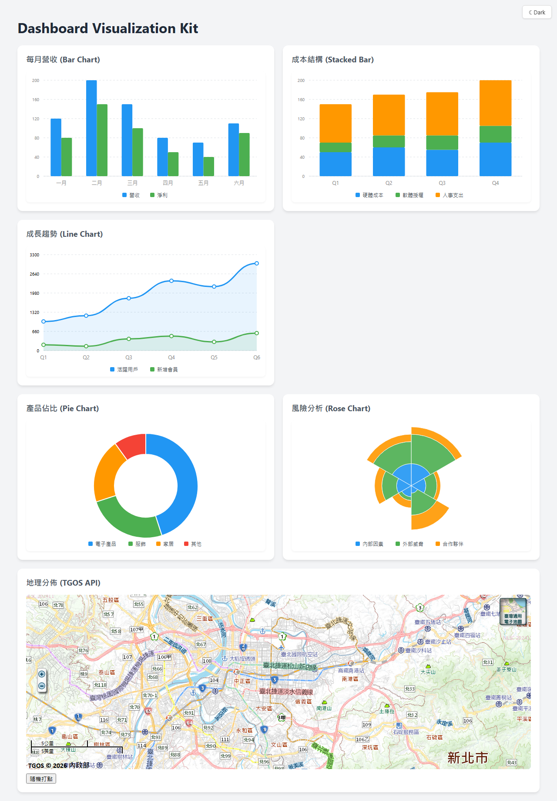

### 9.1 Chart Series

All charts inherit from `BaseChart` with a shared unified interface.

```javascript
import { BarChart } from './ui_components/viz/BarChart.js';
import { LineChart } from './ui_components/viz/LineChart.js';
import { PieChart } from './ui_components/viz/PieChart.js';
import { RoseChart } from './ui_components/viz/RoseChart.js';

// Bar chart
const barChart = new BarChart({
  title: 'Monthly Revenue',
  data: [
    { label: 'Jan', value: 120000 },
    { label: 'Feb', value: 98000 },
    { label: 'Mar', value: 150000 }
  ],
  width: 600,
  height: 400
});

barChart.mount(document.getElementById('bar-chart'));

// Line chart
const lineChart = new LineChart({
  title: 'User Trends',
  series: [
    { name: 'New Users', data: [100, 120, 115, 140, 160] },
    { name: 'Active Users', data: [500, 520, 530, 550, 580] }
  ],
  labels: ['Jan', 'Feb', 'Mar', 'Apr', 'May'],
  width: 600,
  height: 400
});

lineChart.mount(document.getElementById('line-chart'));

// Pie chart
const pieChart = new PieChart({
  title: 'Browser Market Share',
  data: [
    { label: 'Chrome', value: 65, color: '#4285F4' },
    { label: 'Safari', value: 19, color: '#FF9500' },
    { label: 'Firefox', value: 10, color: '#FF6611' },
    { label: 'Other', value: 6, color: '#999' }
  ]
});

pieChart.mount(document.getElementById('pie-chart'));
```

### 9.2 Hierarchy & Relation Charts

```javascript
import { OrgChart } from './ui_components/viz/OrgChart.js';
import { RelationChart } from './ui_components/viz/RelationChart.js';

// Org chart — supports flat data auto-conversion to tree (flatToHierarchy)
const orgChart = new OrgChart({
  data: [
    { id: 1, name: 'CEO', parentId: null },
    { id: 2, name: 'CTO', parentId: 1 },
    { id: 3, name: 'VP Sales', parentId: 1 },
    { id: 4, name: 'Frontend Engineer', parentId: 2 }
  ],
  width: 800,
  height: 600
});

orgChart.mount(document.getElementById('org-chart'));

// Relation chart
const relationChart = new RelationChart({
  nodes: [
    { id: 'a', label: 'User' },
    { id: 'b', label: 'Order' },
    { id: 'c', label: 'Product' }
  ],
  edges: [
    { source: 'a', target: 'b', label: 'Creates' },
    { source: 'b', target: 'c', label: 'Contains' }
  ]
});

relationChart.mount(document.getElementById('relation-chart'));
```

### 9.3 Other Visualization Components

- **TimelineChart** — Timeline chart
- **SankeyChart** — Sankey diagram (flow visualization)
- **SunburstChart** — Sunburst chart (hierarchical proportions)
- **FlameChart** — Flame chart (performance analysis)
- **HierarchyChart** — Hierarchy structure chart

### 9.4 Map Components

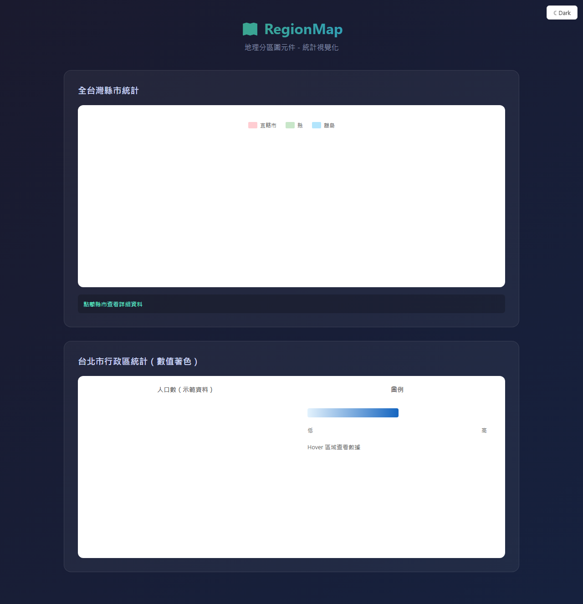

```javascript
import { LeafletMap } from './ui_components/viz/LeafletMap.js';

const map = new LeafletMap({
  center: [25.0330, 121.5654], // Taipei 101
  zoom: 13,
  markers: [
    { lat: 25.0330, lng: 121.5654, popup: 'Taipei 101' }
  ]
});

map.mount(document.getElementById('map-area'));
```

Other map components: MapEditor, MapEditorV2, CanvasMap.

#### OSMMapEditor — OSM Map Editor

A map editor extending WebPainter, using OpenStreetMap tiles with integrated drawing tools and geographic features.

```javascript
import { OSMMapEditor } from './ui_components/viz/OSMMapEditor/OSMMapEditor.js';

const editor = new OSMMapEditor({
    container: '#map-editor',
    width: 1000,
    height: 700,
    center: { lat: 25.033, lng: 121.565 },
    zoom: 13,
    tileLayer: 'osm',        // 'osm' | 'osmHot' | 'cartoDB'
    showCompass: true,
    showScale: true,
    showCoords: true
});

// Map operations
editor.setCenter(48.8566, 2.3522);  // Move to Paris
editor.setZoom(15);

// GeoJSON import/export
await editor.importGeoJSON(file);
const geojson = editor.exportGeoJSON();
```

**Features**: OSM base map (3 tile sources), distance/area measurement, coordinate panel (DD/DMS), scale bar, compass, GeoJSON import/export, map capture, inherits all WebPainter drawing/layer/export features.

### 9.5 Drawing Tools

```javascript
import { DrawingBoard } from './ui_components/viz/DrawingBoard/DrawingBoard.js';

const board = new DrawingBoard({
  width: 800,
  height: 600,
  tools: ['pen', 'line', 'rect', 'circle', 'eraser'],
  strokeColor: '#000',
  strokeWidth: 2
});

board.mount(document.getElementById('drawing-area'));

// Export image
const imageData = board.toDataURL('image/png');
```

### 9.6 WebTextEditor — Rich Text Editor

Located in `editor/WebTextEditor/`, a full WYSIWYG editor.

```javascript
import { WebTextEditor } from './ui_components/editor/WebTextEditor/WebTextEditor.js';

const editor = new WebTextEditor({
  container: '#editor-area',
  placeholder: 'Enter content...',
  height: '400px',
  content: '<p>Initial content</p>',
  readOnly: false,
  onChange: (html) => console.log('Content changed')
});

// Get/Set content
const html = editor.getContent();
editor.setContent('<p>New content</p>');
```

**Features**: Toolbar, Find/Replace (Ctrl+F/H), Export (PDF/Word/Markdown), Auto-save, History (Undo/Redo), Table editing, Image resize, Fullscreen, Word count.

### 9.7 RegionMap — Taiwan Administrative Region Map

SVG map component supporting data visualization and interaction for 22 administrative regions.

```javascript
import { RegionMap } from './ui_components/data/RegionMap/RegionMap.js';

const map = new RegionMap({
  data: {
    'TPE': { value: 2700000, label: 'Taipei', color: '#FF5722' },
    'NWT': { value: 4000000, label: 'New Taipei', color: '#4CAF50' }
  },
  width: '600px',
  height: '400px',
  showLabels: true,
  showValues: true,
  colorScale: RegionMap.createColorScale(0, 5000000, ['#e3f2fd', '#1565c0']),
  onClick: (regionCode, data) => console.log(regionCode, data)
});

map.mount(document.getElementById('map-area'));
map.highlightRegion('TPE');
map.setData(updatedData);
```

---

## 10. Behavior Modules & Utilities

### 10.1 TriggerEngine — Trigger Engine

TriggerEngine provides 8 built-in atomic behaviors for field-to-field cascading logic.

```javascript
import { TriggerEngine } from './page-generator/TriggerEngine.js';

const engine = new TriggerEngine();

// Built-in behaviors: clear, setValue, show, hide, setReadonly, setRequired, reload, reloadOptions

// Define trigger rules
engine.addRule({
  source: 'userType',           // Source field
  condition: (value) => value === 'admin',  // Trigger condition
  actions: [
    { type: 'show', target: 'adminPanel' },
    { type: 'setRequired', target: 'adminCode', params: { required: true } }
  ]
});

// Trigger when source field value changes
engine.trigger('userType', 'admin');

// Custom behavior
engine.registerAction('highlight', (target, params) => {
  const el = document.getElementById(target);
  el.style.backgroundColor = params.color || '#FFFFCC';
});
```

**Built-in Behaviors:**

| Behavior | Description | Example |
|----------|-------------|---------|
| `clear` | Clear target field value | `{ type: 'clear', target: 'email' }` |
| `setValue` | Set target field value | `{ type: 'setValue', target: 'status', params: { value: 'active' } }` |
| `show` | Show target element | `{ type: 'show', target: 'detailSection' }` |
| `hide` | Hide target element | `{ type: 'hide', target: 'detailSection' }` |
| `setReadonly` | Set as read-only | `{ type: 'setReadonly', target: 'name', params: { readonly: true } }` |
| `setRequired` | Set as required | `{ type: 'setRequired', target: 'phone', params: { required: true } }` |
| `reload` | Reload component data | `{ type: 'reload', target: 'dataTable' }` |
| `reloadOptions` | Reload options | `{ type: 'reloadOptions', target: 'cityDropdown' }` |

### 10.2 BehaviorDef — Behavior Definition

BehaviorDef defines page-level behavior patterns:

```javascript
const behaviorDef = {
  // Execute on page init
  onInit: (page) => {
    page.loadData();
    page.setFieldReadonly('createdDate', true);
  },

  // Execute after save
  onSave: (page, result) => {
    Notification.success('Saved successfully');
    page.navigateTo('/list');
  },

  // Execute after delete
  onDelete: (page, result) => {
    Notification.success('Deleted successfully');
    page.navigateTo('/list');
  },

  // Field change cascading
  fieldTriggers: {
    'category': [
      {
        condition: (value) => value === 'urgent',
        actions: [
          { type: 'show', target: 'priorityPanel' },
          { type: 'setRequired', target: 'deadline' }
        ]
      }
    ],
    'country': [
      {
        condition: () => true,
        actions: [
          { type: 'reloadOptions', target: 'cityDropdown' }
        ]
      }
    ]
  }
};
```

### 10.3 SPA Core Framework

The SPA core is located in `templates/spa/frontend/core/`, providing a complete single-page application framework.

#### Router — Hash Router

```javascript
import { Router } from './core/Router.js';

const router = new Router();

// Register routes
router.addRoute('/', HomePage);
router.addRoute('/users', UserListPage);
router.addRoute('/users/:id', UserDetailPage);
router.addRoute('/users/:id/edit', UserEditPage);

// Nested routes
router.addRoute('/admin', AdminPage, [
  { path: '/admin/settings', page: AdminSettingsPage },
  { path: '/admin/logs', page: AdminLogsPage }
]);

// Start router
router.start();

// Programmatic navigation
router.navigate('/users/123');
```

#### Store — State Management

```javascript
import { Store } from './core/Store.js';

const store = new Store({
  user: null,
  theme: 'light',
  notifications: []
});

// Subscribe to state changes
store.subscribe('user', (newUser, oldUser) => {
  console.log('User changed:', newUser);
});

// Update state
store.set('user', { id: 1, name: 'John Doe' });

// Get state
const user = store.get('user');
```

#### ApiService — RESTful API Service

```javascript
import { ApiService } from './core/ApiService.js';

const api = new ApiService({
  baseUrl: '/api',
  // JWT is attached via the Authorization: Bearer header (tokens are stored in localStorage by default)
});

// CRUD operations
const users = await api.get('/users');
const user = await api.get('/users/123');
const newUser = await api.post('/users', { name: 'Jane Smith', email: 'jane@example.com' });
await api.put('/users/123', { name: 'Jane Smith (Updated)' });
await api.delete('/users/123');

// Paginated query
const result = await api.get('/users', { page: 1, pageSize: 20, keyword: 'John' });
// { data: [...], total: 100, page: 1, pageSize: 20 }
```

#### BasePage — Page Lifecycle

```javascript
import { BasePage } from './core/BasePage.js';

class UserListPage extends BasePage {
  constructor() {
    super();
    this.title = 'User Management';
  }

  // Page lifecycle
  async onInit() {
    // Initialize components
    this.table = new DataTable({ ... });
  }

  async onLoad(params) {
    // Load data (triggered each time entering the page)
    const data = await this.api.get('/users');
    this.table.setData(data);
  }

  onRender(container) {
    // Render UI
    this.table.mount(container);
  }

  onDestroy() {
    // Cleanup resources
    this.table.destroy();
  }
}
```

### 10.4 ComponentBinder / ComponentFactory

#### ComponentBinder — Component Data Binding

```javascript
import { ComponentBinder } from './ui_components/binding/ComponentBinder.js';

const binder = new ComponentBinder();

// Bind components to data model
binder.bind(nameInput, 'user.name');
binder.bind(emailInput, 'user.email');
binder.bind(roleDropdown, 'user.role');

// Set data model (auto-updates component values)
binder.setModel({
  user: { name: 'John Doe', email: 'john@example.com', role: 'admin' }
});

// Get all bound component values
const formData = binder.getValues();
```

#### ComponentFactory — Component Factory

```javascript
import { ComponentFactory } from './ui_components/binding/ComponentFactory.js';

// Dynamically create components from field definitions
const component = ComponentFactory.create({
  type: 'text',
  name: 'username',
  label: 'Username',
  required: true,
  maxLength: 50
});

component.mount(container);
```

### 10.5 Utilities & Services (utils/)

#### security.js — XSS Protection

```javascript
import { escapeHtml, sanitizeUrl, sanitizeHTML } from './utils/security.js';

// HTML content escaping
const safeHtml = escapeHtml(userInput);
element.innerHTML = `<p>${escapeHtml(userInput)}</p>`;

// URL sanitization (blocks javascript: / vbscript: protocols)
element.innerHTML = `<a href="${sanitizeUrl(userUrl)}">Link</a>`;

// HTML tag whitelist filtering
const cleanHtml = sanitizeHTML(dirtyHtml);
```

> **Important**: All user input must be escaped using `escapeHtml()` when rendered to HTML, and URLs must be sanitized with `sanitizeUrl()` to prevent XSS attacks.

#### GeolocationService — Geolocation Service

```javascript
import { GeolocationService } from './utils/GeolocationService.js';

const geo = new GeolocationService();

// Get current position
const position = await geo.getCurrentPosition();
console.log('Lat:', position.latitude, 'Lng:', position.longitude);
```

#### WeatherService — Weather Service

```javascript
import { WeatherService } from './utils/WeatherService.js';

const weather = new WeatherService({ apiKey: 'YOUR_API_KEY' });
const forecast = await weather.getForecast(25.033, 121.565);
```

---

## 11. Page Generator

The page generator is located in `packages/javascript/browser/page-generator/`, capable of auto-generating complete pages from field definitions.

### 11.1 Supported 30 Field Types

| Category | Field Type | Description |
|----------|-----------|-------------|
| Basic Text | `text` | Single-line text |
| | `email` | Email |
| | `password` | Password |
| | `textarea` | Multi-line text |
| | `richtext` | Rich text editor |
| Number | `number` | Number input |
| Date/Time | `date` | Date |
| | `time` | Time |
| | `datetime` | DateTime |
| Selection | `select` | Single-select dropdown |
| | `multiselect` | Multi-select dropdown |
| | `checkbox` | Checkbox |
| | `toggle` | Toggle switch |
| | `radio` | Radio button |
| | `color` | Color picker |
| Media | `image` | Image upload |
| | `file` | File upload |
| | `canvas` | Drawing canvas |
| Advanced | `geolocation` | Geolocation |
| | `weather` | Weather info |
| | `address` | Address input |
| | `addresslist` | Multiple address input |
| | `chained` | Cascading dropdown |
| | `list` | List input |
| | `personinfo` | Person info |
| | `phonelist` | Phone list |
| | `socialmedia` | Social media accounts |
| | `organization` | Organization info |
| | `student` | Student info |
| Other | `hidden` | Hidden field |

### 11.2 Page Definition Format

```javascript
import { PageDefinitionAdapter } from './page-generator/PageDefinitionAdapter.js';

const pageDefinition = {
  page: {
    pageName: 'User Management',
    entity: 'user',
    view: 'adminList'
  },
  fields: [
    {
      fieldName: 'name',
      label: 'Name',
      fieldType: 'text',
      formRow: 1,
      formCol: 6,
      listOrder: 1,
      isRequired: true,
      isSearchable: true
    },
    {
      fieldName: 'role',
      label: 'Role',
      fieldType: 'select',
      formRow: 1,
      formCol: 6,
      listOrder: 2,
      optionsSource: {
        type: 'static',
        items: [
          { value: 'admin', label: 'Admin' },
          { value: 'editor', label: 'Editor' },
          { value: 'viewer', label: 'Viewer' }
        ]
      }
    }
  ]
};

// Convert to the legacy format before passing into PageGenerator
const staticDefinition = PageDefinitionAdapter.toOldFormat(pageDefinition);
```

### 11.3 Static Generation (PageGenerator)

```javascript
import {
  PageDefinitionAdapter,
  PageGenerator
} from './page-generator/index.js';

const generator = new PageGenerator();
const staticDefinition = PageDefinitionAdapter.toOldFormat(pageDefinition);
const result = generator.generate(staticDefinition);

if (result.errors.length > 0) {
  console.error(result.errors);
} else {
  console.log(result.code);
}
```

> `generate()` returns `{ code, errors }`. If the definition does not provide a complete API contract or custom behaviors, the generated file keeps `_save()` / behavior stubs for follow-up implementation.

### 11.4 Dynamic Rendering (DynamicPageRenderer)

DynamicPageRenderer supports three rendering modes, creating pages dynamically without generating static files.

```javascript
import { DynamicPageRenderer } from './page-generator/DynamicPageRenderer.js';

const formPage = new DynamicPageRenderer({
  definition: pageDefinition,
  mode: 'form',
  data: existingData,
  onSave: async (values) => api.post('/users', values),
  onCancel: () => router.navigate('/users')
});

await formPage.init();
formPage.mount(document.getElementById('app'));

const detailPage = new DynamicPageRenderer({
  definition: pageDefinition,
  mode: 'detail',
  data: userData,
  onBack: () => router.navigate('/users'),
  onEdit: () => router.navigate(`/users/${userData.id}/edit`)
});

await detailPage.init();
detailPage.mount(document.getElementById('detail'));

const listPage = new DynamicPageRenderer({
  definition: pageDefinition,
  mode: 'list',
  onSearch: async (params) => api.get('/users', { params }),
  onAction: (action, row) => router.navigate(`/users/${row.id}`),
  pageSize: 20
});

await listPage.init();
listPage.mount(document.getElementById('list'));
```

### 11.5 PageDefinitionAdapter - Format Conversion

```javascript
import { PageDefinitionAdapter } from './page-generator/PageDefinitionAdapter.js';

// New format (DynamicPageRenderer / page-gen CLI) -> legacy format (PageGenerator)
const oldDefinition = PageDefinitionAdapter.toOldFormat(pageDefinition);

// Legacy format (PageGenerator) -> new format (DynamicPageRenderer)
const newDefinition = PageDefinitionAdapter.toNewFormat(oldDefinition);
```

---

## 12. SPA Generator

The SPA tooling is split into two parts:

- `tools/spa-generator/`: Web UI
- `templates/spa/scripts/`: template CLI

### 12.1 Web UI (port 3080)

Startup:

```bash
npm run serve
# Open http://localhost:3080 in your browser
```

The Web UI provides:

- **Project creation**: `ProjectCreatePage` for project name, output path, ports, and admin settings
- **Page generation**: `PageGeneratorPage` for frontend page scaffolding
- **API generation**: `ApiGeneratorPage` for Model / Service / API route generation
- **Feature generation**: `FeatureGeneratorPage` for full CRUD skeletons
- **Page Builder**: `PageBuilderPage` for JSON-driven form / detail / list preview
- **Page Definition Editor**: `PageDefinitionEditorPage` for GUI editing of PageDefinition

### 12.2 CLI Commands

```bash
# Create a new project (interactive)
node templates/spa/scripts/spa-cli.js new

# Create a new project (non-interactive)
node templates/spa/scripts/spa-cli.js new --name my-blog --output ./projects

# Generate a page (frontend)
node templates/spa/scripts/spa-cli.js page article/ArticleList
node templates/spa/scripts/spa-cli.js page article/ArticleDetail --detail

# Generate an API (backend)
node templates/spa/scripts/spa-cli.js api Article --fields "Title:string,PublishedAt:datetime"

# Generate a complete feature (frontend + backend)
node templates/spa/scripts/spa-cli.js feature Article --fields "Title:string,PublishedAt:datetime"
```


### 12.3 Generated Project Structure

```
projects/my-app/
├── frontend/
│   ├── adapters/           # Frontend adapters
│   ├── components/         # Template-bundled components
│   ├── core/               # SPA core framework
│   │   ├── Router.js       # Hash router
│   │   ├── Store.js        # State management
│   │   ├── ApiService.js   # API calls
│   │   ├── BasePage.js     # Page base class
│   │   ├── Layout.js       # Layout
│   │   └── Security.js     # Security utilities
│   ├── pages/              # Pages
│   │   └── users/
│   │       ├── UserListPage.js
│   │       └── UserDetailPage.js
│   ├── styles/             # Styles
│   └── index.html          # Entry file
├── backend/
│   ├── Controllers/        # Controllers
│   ├── Data/               # AppDb (BaseOrm) / initialization
│   ├── Models/             # Data models
│   ├── Services/           # Business logic
│   ├── Program.cs          # .NET 8 Minimal API entry
│   ├── appsettings.json    # Configuration
│   └── my-app.csproj       # Project file
├── tools/
│   └── static-server/      # Frontend static server
├── project.json            # Sanitized project config
├── start.bat               # Windows startup script
└── start.sh                # Unix startup script
```

> The SQLite filename is configured through `project.json` / `appsettings.json`; the actual database file is created on first run.

---

## 13. C# Backend Packages
C# backend packages are located in `packages/csharp/`, providing foundational architecture for .NET 8 Minimal APIs.

### 13.1 BaseOrm — ORM Foundation

Supports CRUD, paginated queries, and schema management.

```csharp
using BaseOrm;

// Initialize
var orm = new BaseOrm("Data Source=app.db");

// Query
var users = await orm.QueryAsync<User>("SELECT * FROM Users WHERE Name LIKE @Name",
    new { Name = "%John%" });

// Paginated query
var paged = await orm.PagedQueryAsync<User>(
    "SELECT * FROM Users",
    page: 1,
    pageSize: 20
);
// paged.Data, paged.Total, paged.Page, paged.PageSize

// Insert
var id = await orm.InsertAsync("Users", new {
    Name = "John Doe",
    Email = "john@example.com",
    CreatedAt = DateTime.Now
});

// Update
await orm.UpdateAsync("Users", new { Name = "John Doe (Updated)" },
    new { Id = 1 });

// Delete
await orm.DeleteAsync("Users", new { Id = 1 });
```

### 13.2 Repository + UnitOfWork

```csharp
// Repository pattern
public class UserRepository : BaseRepository<User>
{
    public UserRepository(IDbConnection connection) : base(connection) { }

    public async Task<IEnumerable<User>> GetActiveUsersAsync()
    {
        return await QueryAsync("SELECT * FROM Users WHERE IsActive = 1");
    }
}

// UnitOfWork pattern
using var uow = new UnitOfWork(connectionString);
var userRepo = uow.GetRepository<UserRepository>();
var roleRepo = uow.GetRepository<RoleRepository>();

await userRepo.InsertAsync(newUser);
await roleRepo.InsertAsync(newRole);

uow.Commit(); // Commit transaction
```

### 13.3 JWT Helper + PasswordHasher

```csharp
using Security;

// Password hashing (PBKDF2, 100,000 iterations)
var hashedPassword = PasswordHasher.Hash("MyPassword123");
bool isValid = PasswordHasher.Verify("MyPassword123", hashedPassword);

// JWT generation and validation
var jwtHelper = new JwtHelper(secretKey, issuer, audience);

// Generate Token
var token = jwtHelper.GenerateToken(new Dictionary<string, string>
{
    ["userId"] = "123",
    ["role"] = "admin"
}, expiresInMinutes: 60);

// Validate Token
var claims = jwtHelper.ValidateToken(token);
```

### 13.4 BaseController + Middleware

```csharp
// Program.cs — .NET 8 Minimal API
var builder = WebApplication.CreateBuilder(args);
var app = builder.Build();

// Register middleware
app.UseExceptionMiddleware();  // Global exception handling
app.UseCors("AllowedOrigins");  // CORS
app.UseAuthentication();
app.UseAuthorization();

// API endpoints
app.MapGet("/api/users", async (UserService service, int page = 1, int pageSize = 20) =>
{
    var result = await service.GetPagedAsync(page, pageSize);
    return ApiResponse.Success(result);
});

app.MapPost("/api/users", async (UserService service, CreateUserDto dto) =>
{
    var user = await service.CreateAsync(dto);
    return ApiResponse.Created(user);
});

app.MapPut("/api/users/{id}", async (UserService service, int id, UpdateUserDto dto) =>
{
    await service.UpdateAsync(id, dto);
    return ApiResponse.Success();
});

app.MapDelete("/api/users/{id}", async (UserService service, int id) =>
{
    await service.DeleteAsync(id);
    return ApiResponse.Success();
});

app.Run();
```

### 13.5 ApiResponse + Pagination

```csharp
// Unified API response format
public class ApiResponse<T>
{
    public bool Success { get; set; }
    public string Message { get; set; }
    public T Data { get; set; }
    public int? Total { get; set; }
    public int? Page { get; set; }
    public int? PageSize { get; set; }
}

// Usage examples
return ApiResponse.Success(data);                    // Success
return ApiResponse.Created(newItem);                  // Created
return ApiResponse.Error("Not found", 404);           // Error
return ApiResponse.Paged(data, total, page, pageSize); // Paginated
```

### 13.6 BaseCache — In-Memory Cache

Redis-style in-memory cache supporting Key-Value, Queue, Stack, List, Hash, Set, and Pub/Sub.

```csharp
using BaseCache;

var cache = new BaseCache(new CachOptions {
    CleanupInterval = TimeSpan.FromMinutes(1),
    MaxItems = 10000
});

// Key-Value operations
cache.Set("user:1", userData, ttl: TimeSpan.FromMinutes(30));
var user = cache.Get<User>("user:1");

// GetOrSet — Cache penetration protection
var data = cache.GetOrSet("report:daily", () => {
    return GenerateReport(); // Only executes on cache miss
}, ttl: TimeSpan.FromHours(1));

// Hash operations (similar to Redis HSET/HGET)
cache.HSet("session:abc", "userId", "123");
cache.HSet("session:abc", "role", "admin");
var userId = cache.HGet<string>("session:abc", "userId");

// Queue and Stack
cache.Enqueue("tasks", new Task { Id = 1 });
var task = cache.Dequeue<Task>("tasks");

// Pub/Sub
cache.Subscribe("notifications", msg => Console.WriteLine(msg));
cache.Publish("notifications", "New message");

// Persistence
cache.SaveToFile("cache.json");
cache.LoadFromFile("cache.json");

// Statistics
var stats = cache.Stats; // Hits, Misses, HitRate
```

---

## 14. Security Guidelines

### 14.1 XSS Protection

**All user input must be escaped when rendered.**

```javascript
import { escapeHtml, sanitizeUrl } from './utils/security.js';

// Correct approach
element.innerHTML = `<p>${escapeHtml(userInput)}</p>`;
element.innerHTML = `<a href="${sanitizeUrl(url)}" title="${escapeHtml(title)}">Link</a>`;

// Wrong approach — NEVER do this!
element.innerHTML = `<p>${userInput}</p>`;         // XSS vulnerability!
element.innerHTML = `<a href="${url}">Link</a>`;   // XSS vulnerability!
```

### 14.2 Password Security

Using PBKDF2 algorithm with 100,000 iterations:

```csharp
// Hash password (when storing to database)
var hashed = PasswordHasher.Hash(plainPassword);

// Verify password (when logging in)
bool isMatch = PasswordHasher.Verify(plainPassword, hashedPassword);
```

> Never store passwords in plaintext, and do not use outdated hashing algorithms like MD5 or SHA1.

### 14.3 JWT Authentication

```csharp
// Configure JWT (in Program.cs)
var jwtKey = builder.Configuration["Jwt:Key"]
    ?? throw new InvalidOperationException("Jwt:Key is required");
var jwtIssuer = builder.Configuration["Jwt:Issuer"] ?? "SpaApi";

builder.Services.AddAuthentication(JwtBearerDefaults.AuthenticationScheme)
    .AddJwtBearer(options =>
    {
        options.TokenValidationParameters = new TokenValidationParameters
        {
            ValidateIssuer = true,
            ValidateAudience = true,
            ValidateLifetime = true,
            ValidateIssuerSigningKey = true,
            ValidIssuer = jwtIssuer,
            ValidAudience = jwtIssuer,
            IssuerSigningKey = new SymmetricSecurityKey(
                Encoding.UTF8.GetBytes(jwtKey)),
            ClockSkew = TimeSpan.FromMinutes(1)
        };
    });
```

The current SPA template and SPA Generator send JWTs through the `Authorization: Bearer` header, with tokens stored in `localStorage` by default. If you switch to cookie transport, enable `HttpOnly`, `Secure`, and `SameSite`.

### 14.4 CORS Configuration

```csharp
builder.Services.AddCors(options =>
{
    options.AddDefaultPolicy(policy =>
    {
        policy.WithOrigins("http://localhost:3080")  // Explicitly specify allowed origins
              .AllowAnyMethod()
              .AllowAnyHeader();
    });
});
```

> Never use `AllowAnyOrigin()` in production. Only add `AllowCredentials()` when you actually use cookie-based authentication.

### 14.5 Rate Limiting

All API endpoints must implement rate limiting to prevent brute force attacks and abuse:

```csharp
// .NET 8 built-in rate limiting
builder.Services.AddRateLimiter(options =>
{
    options.AddFixedWindowLimiter("api", limiter =>
    {
        limiter.PermitLimit = 100;       // 100 requests per window
        limiter.Window = TimeSpan.FromMinutes(1);
        limiter.QueueLimit = 0;
    });
});

app.UseRateLimiter();
```

### 14.6 Input Validation

```csharp
// Backend validation example
app.MapPost("/api/users", async (CreateUserDto dto) =>
{
    // Validate required fields
    if (string.IsNullOrWhiteSpace(dto.Name))
        return ApiResponse.Error("Name is required", 400);

    // Validate format
    if (!IsValidEmail(dto.Email))
        return ApiResponse.Error("Invalid email format", 400);

    // Validate length
    if (dto.Name.Length > 100)
        return ApiResponse.Error("Name must not exceed 100 characters", 400);

    // Process after validation
    var user = await service.CreateAsync(dto);
    return ApiResponse.Created(user);
});
```

### 14.7 Security Checklist

Before deployment, verify the following:

- [ ] All user input is escaped with `escapeHtml()` / `sanitizeUrl()`
- [ ] Passwords are hashed with PBKDF2 (100K iterations)
- [ ] JWT transport and storage are reviewed (default: Bearer header; if cookies are used, `HttpOnly` / `Secure` / `SameSite` are enabled)
- [ ] CORS has explicitly configured allowed origins (not `*`)
- [ ] API endpoints have rate limiting enabled
- [ ] All input is validated on the backend
- [ ] Sensitive settings (keys, connection strings) are not hardcoded
- [ ] HTTPS is enabled

---

> **This guide covers the core features and usage of Bricks4Agent. For more detailed documentation on specific components, refer to the README.md in each component's directory.**
