# Bricks4Agent Engineer Guide

> This guide is intended for junior engineers, covering installation, usage, theme system, page generator, and backend integration of Bricks4Agent.

## Verified Status (2026-03-22)

The list below records a repository-wide validation run carried out on 2026-03-22. It is a historical snapshot of that run, not a statement about the tree as it stands today; the pinned tool versions in particular have moved on. Re-run the checks in `CLAUDE.md` before relying on it.

- Verified environment:

- Node.js `v22.17.1`

- npm `11.5.1`

- .NET SDK `10.0.104`

- Podman `5.5.2`

- Verified passing checks:

- solution build

- page-generator examples

- UI library validation

- browser smoke

- UI state contract validation

- broker scope and governed-agent validation

- broker LLM proxy integration

- BaseOrm verification

- governed Podman stacks

- LINE sidecar webhook ingress and high-level broker routing

- Verified high-level query behavior:

- explicit `?search <keywords>` now executes broker-mediated DuckDuckGo search

- plain `?query` still routes to the high-level dialogue path

- Important current limit:

- real-time broker-mediated search is currently explicit rather than automatic; if the user wants controlled live search, use `?search <keywords>`

- Important backend note:

- the solution builds successfully, but it still emits `207` existing warnings, mostly in `Mfa`, `AuditLog`, and `AccountLock`

---

## Table of Contents

1. [Getting Started](#1-getting-started)

2. [Component Overview](#2-component-overview)

3. [Theme & Styling System](#3-theme--styling-system)

4. [Form Components](#4-form-components)

5. [Common Components](#5-common-components)

6. [Layout Components](#6-layout-components)

7. [Advanced Input Components](#7-advanced-input-components)

8. [Social Components](#8-social-components)

9. [Visualization Components](#9-visualization-components)

10. [Behavior Modules & Utilities](#10-behavior-modules--utilities)

11. [Page Generator](#11-page-generator)

12. [SPA Generator](#12-spa-generator)

13. [C# Backend Packages](#13-c-backend-packages)

14. [Security Guidelines](#14-security-guidelines)

---

## 1. Getting Started

### 1.1 Prerequisites

- Node.js 18+

- .NET 10 SDK or newer

- Git

- Podman 5+ for the full governed-stack validation matrix

### 1.2 Installation & Startup

```bash
# 1. Clone the project
git clone <repo-url> Bricks4Agent
cd Bricks4Agent

# 2. There is nothing to npm install: the root package.json declares no
#    dependencies. Every npm script is a thin wrapper over node / dotnet /
#    powershell tools that are already on your PATH.

# 3. Start the SPA Generator (Web UI). This needs the .NET SDK, because
#    "npm run serve" runs tools/static-server/StaticServer.csproj and serves
#    ./tools/spa-generator/frontend on port 3080.
npm run serve
# Open http://localhost:3080 in your browser (the server binds loopback only)
```

### 1.3 Project Structure

```
Bricks4Agent/
+-- packages/                            # Reusable packages
|   +-- javascript/
|   |   \-- browser/
|   |       +-- ui_components/           # Bricks4Agent UI component library
|   |       |   +-- form/                # Form components (18)
|   |       |   +-- common/              # Common components (40)
|   |       |   +-- layout/              # Layout components (13)
|   |       |   +-- input/               # Advanced input components (10)
|   |       |   +-- viz/                 # Visualization (23, all Canvas-based)
|   |       |   +-- social/              # Social components (5)
|   |       |   +-- editor/              # Editor component (1)
|   |       |   +-- data/                # Region map (1)
|   |       |   +-- analytics/           # Data explorer (1)
|   |       |   +-- sections/            # Page sections (4)
|   |       |   +-- binding/             # ComponentBinder / ComponentFactory / LazyComponentFactory
|   |       |   +-- i18n/                # Locale
|   |       |   +-- metadata/            # component-catalog.json + build-metadata.mjs
|   |       |   +-- themes/              # Theme presets
|   |       |   +-- vendor/              # Vendored Leaflet + html2canvas
|   |       |   \-- utils/               # Utilities & services
|   |       +-- page-generator/          # Page generator
|   |       \-- custom_components/       # JSON-defined custom components
|   \-- csharp/
|       +-- api/                         # API, middleware and response modules
|       +-- database/                    # BaseOrm / BaseCache
|       +-- security/                    # Security and auth modules
|       +-- logging/                     # Logging module
|       +-- broker/                      # Broker (tool routing, governance)
|       \-- utils/                       # Backend utility modules
+-- templates/
|   \-- spa/                             # SPA project template
|       +-- frontend/                    # Frontend template
|       +-- backend/                     # .NET 10 backend template
|       \-- scripts/                     # Template CLI (spa-cli.js)
\-- tools/
    +-- spa-generator/                   # SPA Generator Web UI
    +-- static-server/                   # C# static server behind "npm run serve"
    \-- page-gen.js                      # PageDefinition CLI
```

### 1.4 Creating Your First Project

The SPA toolchain is split into two parts:

- `tools/spa-generator/`: Web UI

- `templates/spa/scripts/`: template CLI

```bash
# Start the Web UI
npm run serve

# Create a project with the template CLI (interactive; --name / --output only
# preset the answers, every prompt is still asked)
node templates/spa/scripts/spa-cli.js new --name my-app --output ./projects

# Create a project without any prompts: pass a config file.
# Copy templates/spa/scripts/project-config.example.json and edit it first.
node templates/spa/scripts/spa-cli.js new --config ./my-project.json

# Generate a full feature (page + API)
node templates/spa/scripts/spa-cli.js feature User --fields "Name:string,Email:string"
```

---

## 2. Component Overview

### 2.1 Component Categories

The authoritative list is `packages/javascript/browser/ui_components/metadata/component-catalog.json` (116 components). Regenerate it with `node packages/javascript/browser/ui_components/metadata/build-metadata.mjs` after adding or changing a component.

| Category | Directory | Count | Description |
|---|---|---|---|
| Form | `form/` | 18 | Text, number, date, dropdown and other form inputs |
| Common | `common/` | 40 | Buttons, badges, tags, tooltips, progress bars, dividers, dialogs, notifications, pagination and other general UI |
| Layout | `layout/` | 13 | Panels, tables, side menus, tabs and other layout elements |
| Advanced Input | `input/` | 10 | Address, phone, organization and other composite inputs |
| Visualization | `viz/` | 23 | Charts, maps, drawing boards and data visualization; all Canvas-based, sharing the `CanvasChart` base class |
| Social | `social/` | 5 | Avatar, feed, connection, stat card, and timeline |
| Editor | `editor/` | 1 | Rich text editor |
| Analytics | `analytics/` | 1 | Data explorer (`DataExplorer`) |
| Sections | `sections/` | 4 | Page header/footer, banner and content sections |
| Data | `data/` | 1 | Taiwan administrative region map (`RegionMap`) |
| Binding | `binding/` | 3 | Component binder, eager `ComponentFactory`, lazy `LazyComponentFactory` (modules, not catalog components) |
| Utils/Services | `utils/` | - | Security, zip, geolocation, weather, theme bus, colour scale, aggregation/force engines (modules, not catalog components) |

> Import path note: code snippets below use shortened paths for readability. If you validate them directly from this repo root, treat `./ui_components/...` as `./packages/javascript/browser/ui_components/...` and `./page-generator/...` as `./packages/javascript/browser/page-generator/...`.

### 2.2 Unified API Convention

All components follow a consistent API pattern to reduce the learning curve:

```javascript
import { TextInput } from './ui_components/form/TextInput/TextInput.js';

// 1. Create the component
const input = new TextInput({
  label: 'Name',
  placeholder: 'Enter your name',
  required: true
});

// 2. Mount to DOM
input.mount(document.getElementById('container'));

// 3. Get / Set value
const value = input.getValue();
input.setValue('John Doe');

// 4. Clear value (form components)
input.clear();

// 5. Destroy and cleanup
input.destroy();
```

**API Method Quick Reference:**

| Method | Description | Applies To |
|---|---|---|
| `new Component(options)` | Create component instance | All components |
| `.mount(container)` | Mount to a DOM container | All components |
| `.getValue()` | Get current value | Form/Input components |
| `.setValue(value)` | Set value | Form/Input components |
| `.clear()` | Clear value | Form/Input components |
| `.destroy()` | Destroy component, remove event listeners | All components |

---

## 3. Theme & Styling System

### 3.1 theme.css Overview

Bricks4Agent uses CSS Custom Properties for its theme system. All variables use the `--cl-` prefix.

### 3.2 Variable Categories

The values below are the *effective* light-theme values. In `theme.css` the brand and
semantic colours are defined indirectly against the palette layer it imports
(`@import './palette.css'`), e.g. `--cl-primary: var(--cl-blue-500)` where
`--cl-blue-500: #2196F3`.

```css
:root {
  /* Brand colors */
  --cl-primary: #2196F3;
  --cl-primary-dark: #1976D2;
  --cl-primary-light: #e3f2fd;
  --cl-primary-rgb: 33, 150, 243;      /* For rgba() usage */

  /* Semantic colors */
  --cl-success: #4CAF50;
  --cl-success-light: #e8f5e9;
  --cl-success-rgb: 76, 175, 80;
  --cl-warning: #FF9800;
  --cl-warning-light: #fff3e0;
  --cl-warning-rgb: 255, 152, 0;
  --cl-danger: #F44336;
  --cl-danger-light: #fdecea;
  --cl-danger-rgb: 244, 67, 54;
  --cl-info: #2196F3;
  --cl-info-light: #e3f2fd;

  /* Text */
  --cl-text: #333333;
  --cl-text-secondary: #666666;
  --cl-text-muted: #888888;
  --cl-text-placeholder: #999999;
  --cl-text-light: #aaaaaa;
  --cl-text-inverse: #ffffff;
  --cl-text-dark: #000000;

  /* Backgrounds */
  --cl-bg: #ffffff;
  --cl-bg-secondary: #f5f5f5;
  --cl-bg-tertiary: #f8f9fa;
  --cl-bg-hover: #f0f2f5;
  --cl-bg-active: #e3f2fd;
  --cl-bg-disabled: #f9f9f9;
  --cl-bg-overlay: rgba(0, 0, 0, 0.5);
  --cl-bg-dark: #2b2b2b;

  /* Borders */
  --cl-border: #dddddd;
  --cl-border-light: #eeeeee;
  --cl-border-dark: #cccccc;
  --cl-border-focus: var(--cl-primary);

  /* Shadows */
  --cl-shadow-sm: 0 1px 3px rgba(0,0,0,0.1);
  --cl-shadow-md: 0 4px 12px rgba(0,0,0,0.15);
  --cl-shadow-lg: 0 8px 24px rgba(0,0,0,0.2);
  --cl-shadow-xl: 0 12px 48px rgba(0,0,0,0.25);

  /* Border radius */
  --cl-radius-sm: 4px;
  --cl-radius-md: 6px;
  --cl-radius-lg: 8px;
  --cl-radius-xl: 12px;
  --cl-radius-round: 50%;

  /* Typography */
  --cl-font-family: -apple-system, BlinkMacSystemFont, 'Segoe UI', Roboto, sans-serif;
  --cl-font-size-xs: 11px;
  --cl-font-size-sm: 12px;
  --cl-font-size-md: 13px;
  --cl-font-size-lg: 14px;
  --cl-font-size-xl: 16px;
  --cl-font-size-2xl: 18px;
  --cl-font-size-3xl: 24px;

  /* Material palette ??button variants / icon colors */
  --cl-purple: #9C27B0;
  --cl-teal: #009688;
  --cl-pink: #E91E63;
  --cl-light-green: #8BC34A;
  --cl-amber: #FFC107;
  /* ...15+ more extended colors (see theme.css for full definitions) */

  /* Transitions */
  --cl-transition-fast: 0.15s ease;
  --cl-transition: 0.2s ease;
  --cl-transition-slow: 0.3s ease;
}
```

> For the complete variable definitions, refer to `packages/javascript/browser/ui_components/theme.css` (214 `--cl-*` declarations across the light and dark blocks) and the palette it imports, `packages/javascript/browser/ui_components/palette.css`.

### 3.3 Custom Themes

Override `:root` variables to customize your brand theme:

```css
/* my-theme.css ??Override brand colors to customize the theme */
:root {
  --cl-primary: #E74C3C;
  --cl-primary-dark: #C0392B;
  --cl-radius-md: 8px;
  --cl-font-family: 'Noto Sans TC', sans-serif;
}
```

### 3.4 Dark Theme

theme.css includes a built-in `[data-theme="dark"]` selector that overrides all `--cl-` variables:

```css
[data-theme="dark"] {
  --cl-primary: #64B5F6;
  --cl-primary-dark: #42A5F5;
  --cl-primary-light: #1a2a4a;
  --cl-primary-rgb: 100, 181, 246;

  --cl-text: #e4e4e7;
  --cl-text-secondary: #a1a1aa;
  --cl-text-muted: #71717a;
  --cl-text-inverse: #1a1a2e;

  --cl-bg: #1a1a2e;
  --cl-bg-secondary: #252542;
  --cl-bg-tertiary: #2d2d4a;
  --cl-bg-hover: #2d2d4a;

  --cl-border: #3f3f5a;
  --cl-border-light: #2d2d4a;
  --cl-border-dark: #52527a;

  --cl-shadow-sm: 0 1px 3px rgba(0,0,0,0.3);
  --cl-shadow-md: 0 4px 12px rgba(0,0,0,0.4);
  /* ...etc (see theme.css for full definitions) */
}
```

Toggle theme with JavaScript:

```javascript
// Switch to dark theme
document.documentElement.setAttribute('data-theme', 'dark');

// Switch back to light theme
document.documentElement.removeAttribute('data-theme');
```

### 3.5 Demo Theme Toggle Utility

Bricks4Agent provides `demo-utils.js` for quickly adding a theme toggle button to demo pages:

```javascript
import { createThemeToggle } from './ui_components/demo-utils.js';

// Add a dark/light theme toggle button to the demo page
createThemeToggle();
```

### 3.6 Style Migration Tools

The library provides two automation scripts for batch-replacing hardcoded color values with CSS variables:

```bash
# Preview hex color replacements (dry run)
node tools/migrate-styles.js

# Apply replacements
node tools/migrate-styles.js --apply

# Preview named color / rgba() replacements
node tools/fix-named-colors.js

# Apply replacements
node tools/fix-named-colors.js --apply
```

---

## 4. Form Components

Form components are located in `packages/javascript/browser/ui_components/form/`, with 18 components total. The six not covered below are `Form`, `TextArea`, `Slider`, `Rating`, `TagInput` and `CommandComposer`.

### 4.1 TextInput ??Text Input

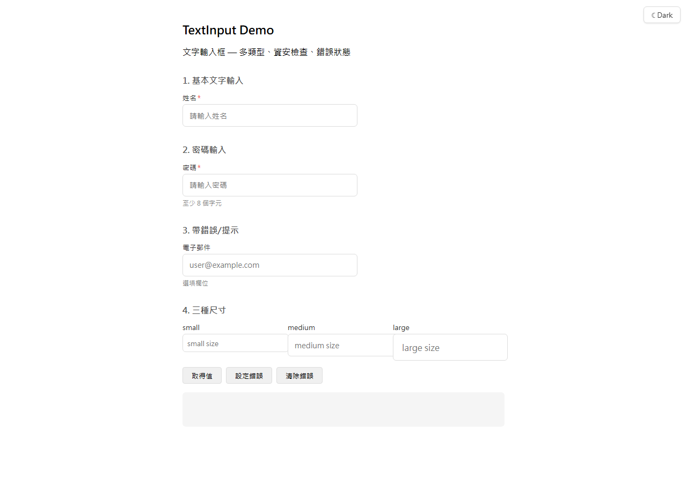

```javascript
import { TextInput } from './ui_components/form/TextInput/TextInput.js';

const nameInput = new TextInput({
  label: 'Name',
  placeholder: 'Enter your name',
  required: true,
  maxLength: 50,
  onChange: (value) => console.log('Value changed:', value)
});

nameInput.mount(document.getElementById('name-field'));

// Get value
const name = nameInput.getValue();

// Set value
nameInput.setValue('John Doe');
```

### 4.2 NumberInput ??Number Input

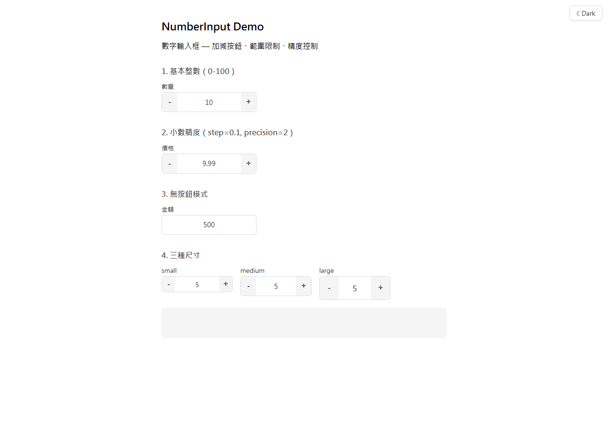

```javascript
import { NumberInput } from './ui_components/form/NumberInput/NumberInput.js';

const ageInput = new NumberInput({
  label: 'Age',
  min: 0,
  max: 150,
  step: 1,
  required: true
});

ageInput.mount(document.getElementById('age-field'));
```

### 4.3 DatePicker ??Date Picker

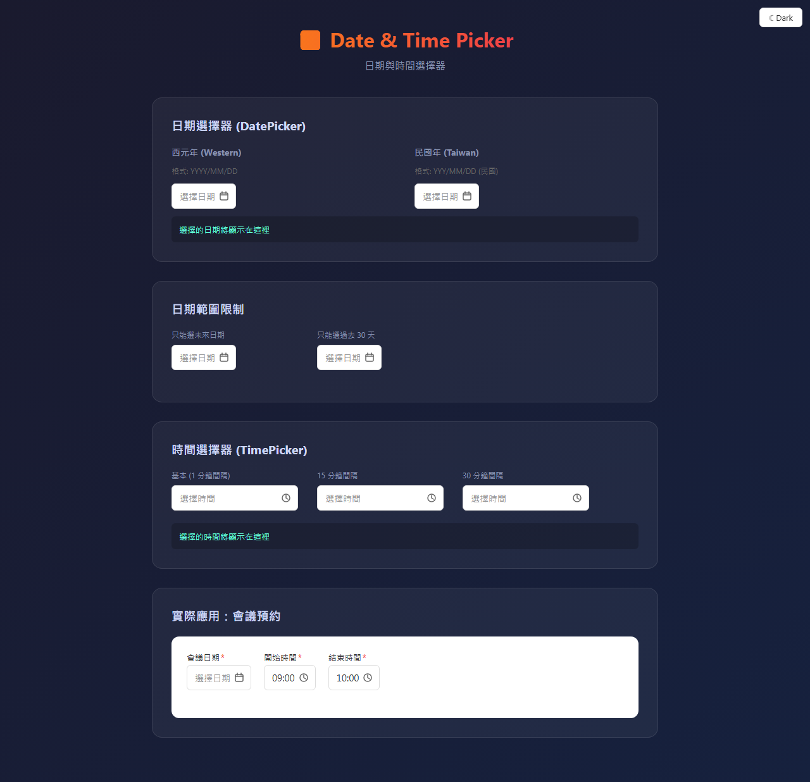

```javascript
import { DatePicker } from './ui_components/form/DatePicker/DatePicker.js';

const datePicker = new DatePicker({
  label: 'Birthday',
  format: 'western',      // 'western' (Gregorian) or 'taiwan' (ROC calendar)
  min: '1900-01-01',
  max: '2026-12-31',
  onChange: (date) => console.log('Date selected:', date)
});

datePicker.mount(document.getElementById('date-field'));
```

### 4.4 TimePicker ??Time Picker

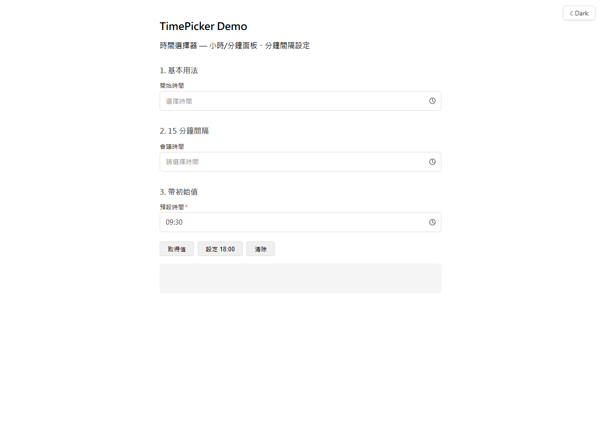

```javascript
import { TimePicker } from './ui_components/form/TimePicker/TimePicker.js';

const timePicker = new TimePicker({
  label: 'Meeting Time',
  minuteStep: 15           // Minute interval (1, 5, 10, 15, 30)
});

timePicker.mount(document.getElementById('time-field'));
```

### 4.5 Dropdown ??Dropdown Select

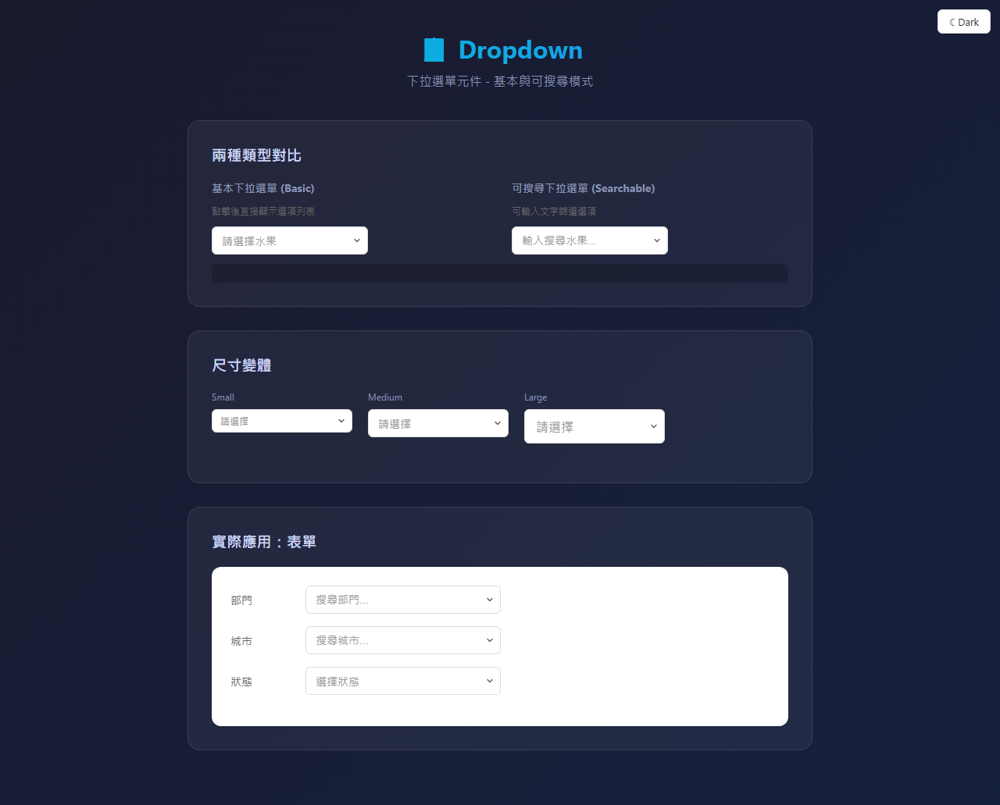

```javascript
import { Dropdown } from './ui_components/form/Dropdown/Dropdown.js';

const cityDropdown = new Dropdown({
  variant: 'searchable',   // 'basic' or 'searchable'
  placeholder: 'Select a city',
  items: [
    { value: 'NYC', label: 'New York' },
    { value: 'LAX', label: 'Los Angeles' },
    { value: 'CHI', label: 'Chicago' }
  ],
  clearable: true,
  onChange: (value) => console.log('Selected:', value)
});

cityDropdown.mount(document.getElementById('city-field'));
```

### 4.6 MultiSelectDropdown ??Multi-Select Dropdown

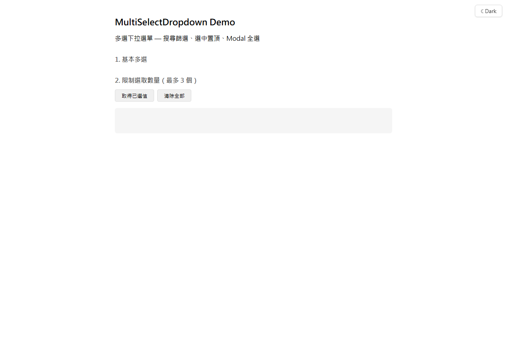

```javascript
import { MultiSelectDropdown } from './ui_components/form/MultiSelectDropdown/MultiSelectDropdown.js';

const tagSelect = new MultiSelectDropdown({
  placeholder: 'Select tags',
  items: [
    { value: 'js', label: 'JavaScript' },
    { value: 'css', label: 'CSS' },
    { value: 'html', label: 'HTML' }
  ],
  maxCount: 5,             // Maximum selectable items
  modalTitle: 'Select Tags'
});

tagSelect.mount(document.getElementById('tag-field'));

// Get selected values (array)
const selected = tagSelect.getValues(); // ['js', 'css']
```

### 4.7 Checkbox ??Checkbox

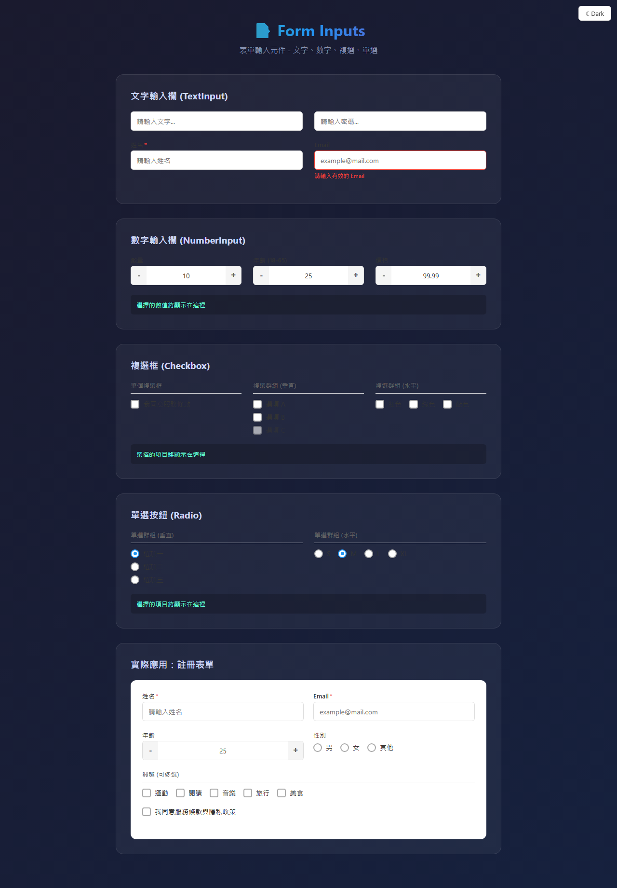

```javascript
import { Checkbox } from './ui_components/form/Checkbox/Checkbox.js';

const agreeCheckbox = new Checkbox({
  label: 'I agree to the terms of service',
  checked: false,
  onChange: (checked) => console.log('Checked:', checked)
});

agreeCheckbox.mount(document.getElementById('agree-field'));
```

### 4.8 Radio ??Radio Button

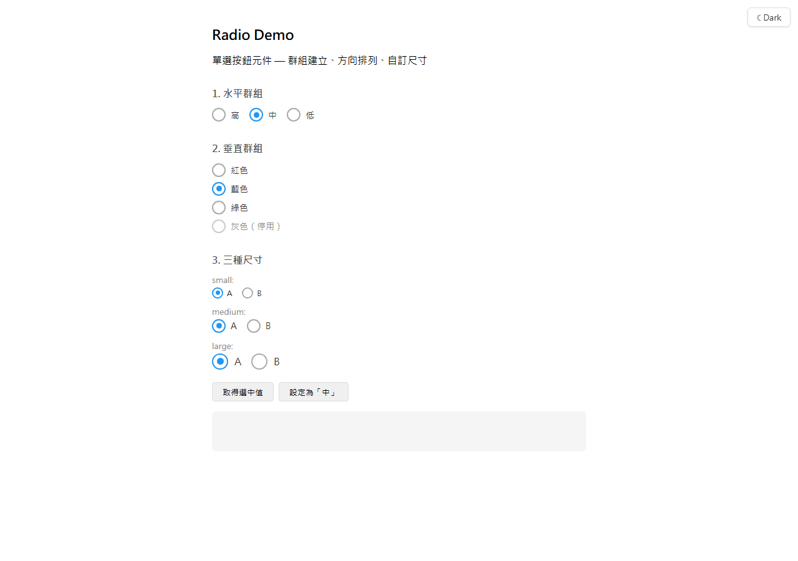

```javascript
import { Radio } from './ui_components/form/Radio/Radio.js';

// Single Radio button
const radio = new Radio({
  name: 'gender',
  label: 'Male',
  value: 'male',
  onChange: (checked) => console.log('Checked:', checked)
});

radio.mount(document.getElementById('radio-field'));

// Create a Radio group (recommended usage)
const genderGroup = Radio.createGroup({
  name: 'gender',
  items: [
    { value: 'male', label: 'Male' },
    { value: 'female', label: 'Female' },
    { value: 'other', label: 'Other' }
  ],
  value: 'male',            // Default selected value
  direction: 'horizontal',  // 'vertical' or 'horizontal'
  onChange: (value) => console.log('Selected:', value)
});

// createGroup returns a group object with getValue/setValue/mount methods
genderGroup.mount(document.getElementById('gender-field'));

// Get current selected value
const selectedGender = genderGroup.getValue();

// Programmatically set selected value
genderGroup.setValue('female');
```

### 4.9 ToggleSwitch ??Toggle Switch

```javascript
import { ToggleSwitch } from './ui_components/form/ToggleSwitch/ToggleSwitch.js';

const toggle = new ToggleSwitch({
  label: 'Enable Notifications',
  checked: true,
  onChange: (enabled) => console.log('Notifications:', enabled ? 'On' : 'Off')
});

toggle.mount(document.getElementById('toggle-field'));
```

### 4.10 FormField ??Form Field Wrapper

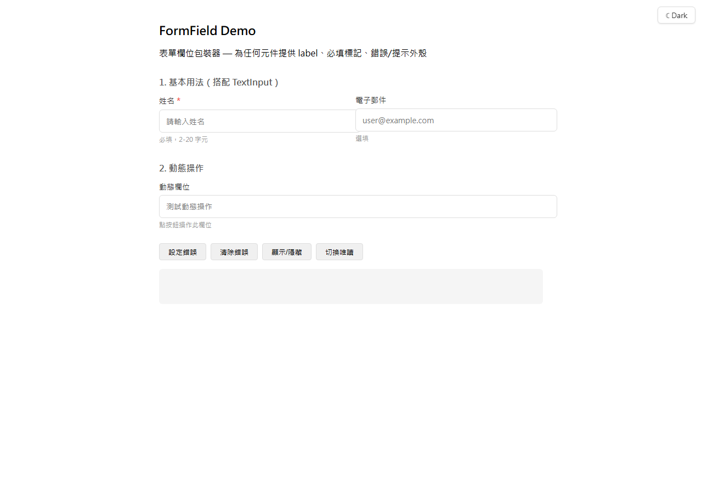

```javascript
import { FormField } from './ui_components/form/FormField/FormField.js';

const field = new FormField({
  label: 'Email',
  required: true,
  hint: 'We will not share your email',
  component: new TextInput({ placeholder: 'user@example.com' })
});

field.mount(document.getElementById('email-field'));
```

### 4.11 SearchForm ??Search Form

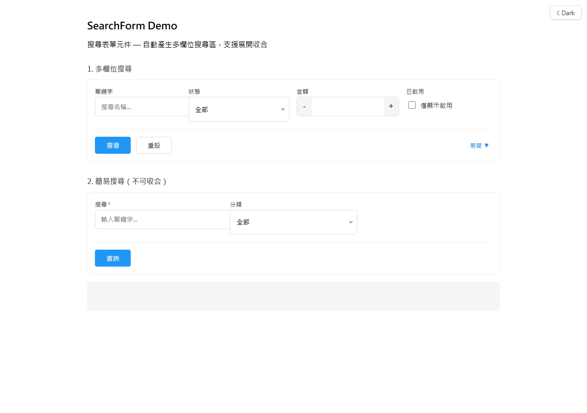

```javascript
import { SearchForm } from './ui_components/form/SearchForm/SearchForm.js';

// Each field is identified by `key` (not `name`); `key` is what the
// onSearch payload is keyed by. type is one of SearchForm.FIELD_TYPES:
// text | number | select | multiselect | date | dateRange | checkbox
const searchForm = new SearchForm({
  columns: 4,          // fields per row
  visibleRows: 1,      // rows shown before "expand"
  fields: [
    { key: 'keyword', type: 'text', label: 'Keyword' },
    { key: 'category', type: 'select', label: 'Category', options: [
      { value: 'all', label: 'All' },
      { value: 'news', label: 'News' }
    ]},
    { key: 'dateRange', type: 'dateRange', label: 'Date Range' }
  ],
  onSearch: (criteria) => console.log('Search criteria:', criteria),
  onReset: () => console.log('Reset')
});

searchForm.mount(document.getElementById('search-area'));
```

### 4.12 BatchUploader ??Batch Uploader

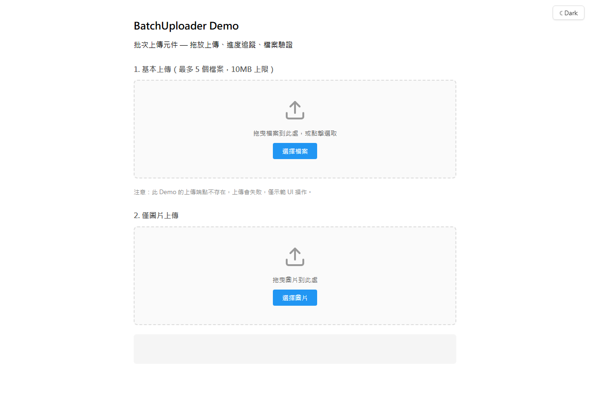

```javascript
import { BatchUploader } from './ui_components/form/BatchUploader/BatchUploader.js';

const uploader = new BatchUploader({
  container: document.getElementById('upload-area'),
  apiEndpoint: '/api/files/upload',
  allowedExtensions: ['.pdf', '.jpg', '.png'],
  maxFileSize: 10 * 1024 * 1024, // 10MB
  maxFiles: 5,
  autoUpload: false,
  uploadMode: 'sequential',  // 'sequential' or 'parallel'
  onComplete: (files) => console.log('Upload complete:', files),
  onError: (err) => console.error('Upload failed:', err)
});
```

---

## 5. Common Components

Common components are located in `packages/javascript/browser/ui_components/common/`, with 40 components total. See `component-catalog.json` for the ones not covered below (`Alert`, `Badge`, `CardGrid`, `CodeBlock`, `DescriptionList`, `Divider`, `DropdownMenu`, `EmptyState`, `FilterBar`, `Heading`, `Icon`, `Link`, `List`, `MediaPlayer`, `Progress`, `ResultList`, `Skeleton`, `StatGrid`, `StepIndicator`, `Tag`, `Text`, `Tooltip`).

### 5.1 Button Series

#### BasicButton ??Basic Button

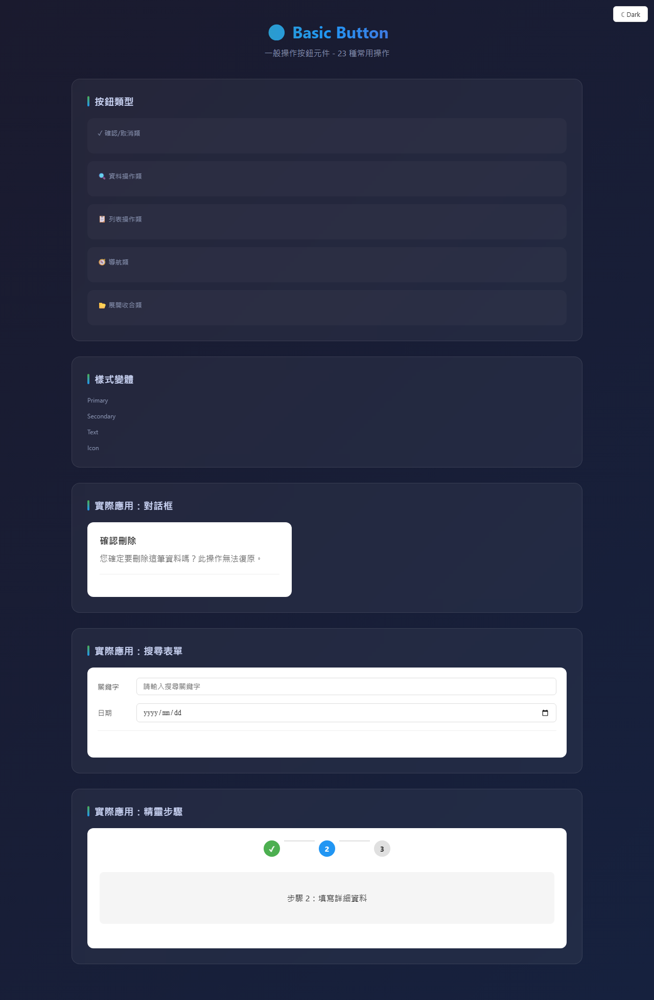

```javascript
import { BasicButton } from './ui_components/common/BasicButton/BasicButton.js';

// There is no `text` option: the label comes from `type` (see
// BasicButton.TYPES - confirm, cancel, save, search, delete, reset, back, ...).
// `customLabel` overrides the built-in text for that type.
const btn = new BasicButton({
  type: 'confirm',
  customLabel: 'Submit',
  variant: 'primary', // primary | secondary | text | icon | plain
  onClick: () => console.log('Button clicked')
});

btn.mount(document.getElementById('btn-container'));
```

#### ActionButton ??Action Button

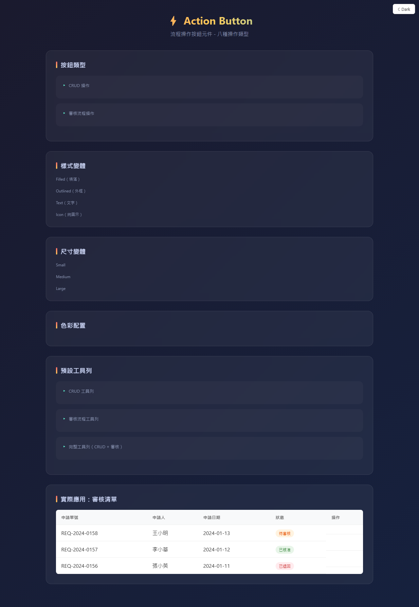

```javascript
import { ActionButton } from './ui_components/common/ActionButton/ActionButton.js';

// Icon and label are both derived from `type`
// (ActionButton.TYPES: add | delete | edit | detail | submit | reject | archive | merge).
const actionBtn = new ActionButton({
  type: 'edit',
  variant: 'filled',
  tooltip: 'Edit this record',
  onClick: () => openEditor()
});

actionBtn.mount(document.getElementById('action-area'));
```

#### AuthButton — Login / Logout Button

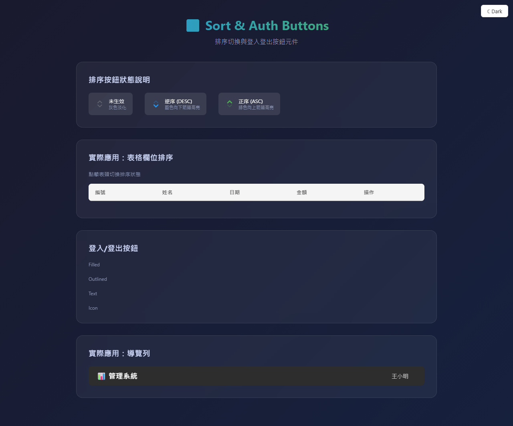

```javascript
import { AuthButton } from './ui_components/common/AuthButton/AuthButton.js';

// AuthButton is a sign-in / sign-out button, not a permission gate:
// `type` is 'login' or 'logout', and there is no `permission` option.
const logoutBtn = new AuthButton({
  type: 'logout',
  confirm: true,               // show a confirmation dialog first
  onClick: () => signOut()
});

logoutBtn.mount(document.getElementById('auth-area'));
```

#### DownloadButton / UploadButton

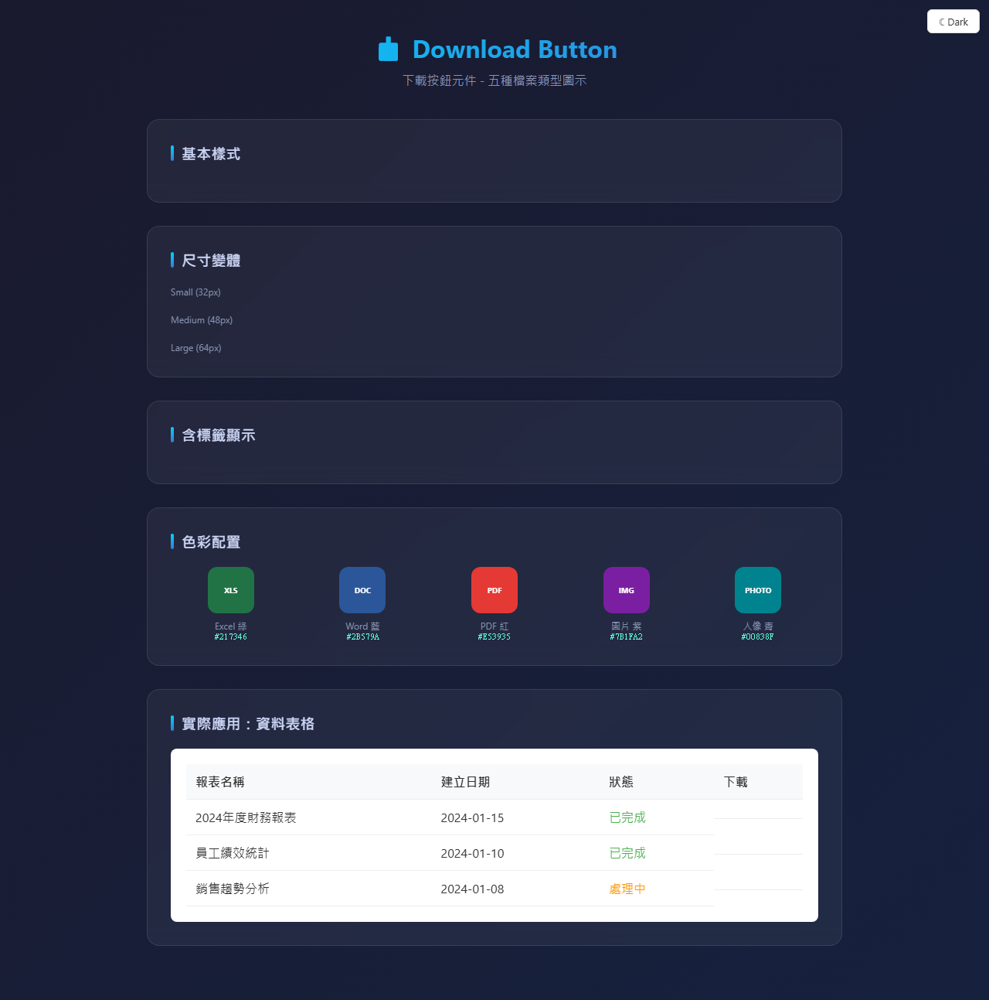

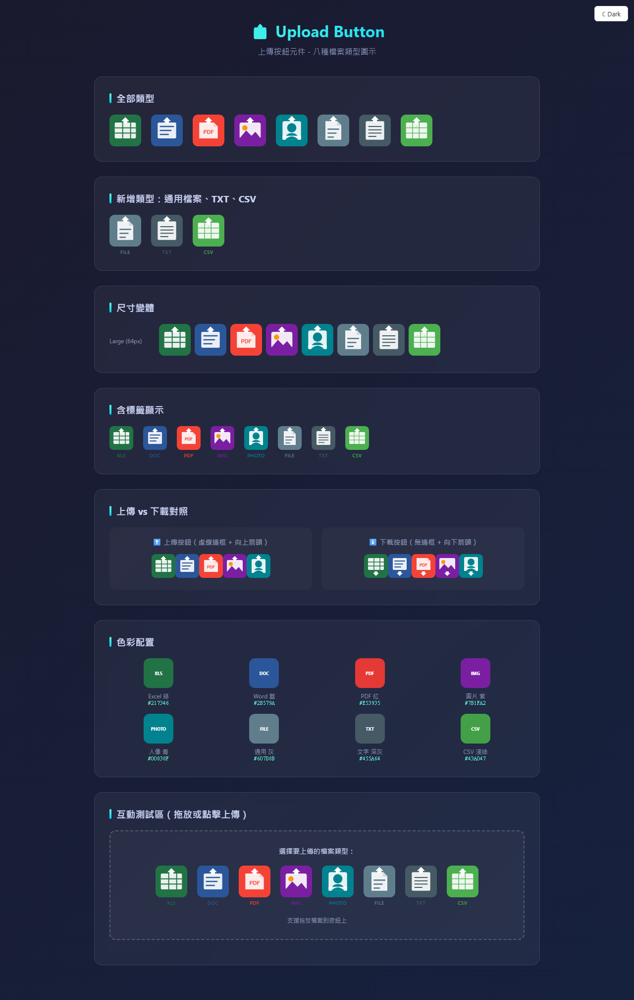

```javascript
import { DownloadButton } from './ui_components/common/DownloadButton/DownloadButton.js';
import { UploadButton } from './ui_components/common/UploadButton/UploadButton.js';

// Both take a `type` that supplies the icon, label and accepted extensions.
// DownloadButton.TYPES: xls | word | pdf | image | portrait | json | css
// UploadButton.TYPES:   xls | word | pdf | image | portrait | file | txt | csv
const downloadBtn = new DownloadButton({
  type: 'xls',
  url: '/api/reports/export',
  filename: 'report.xlsx',
  showLabel: true
});

const uploadBtn = new UploadButton({
  type: 'csv',
  customAccept: '.csv,.xlsx',   // override the accept list for the type
  showLabel: true,
  onSelect: (files) => processFile(files[0])
});
```

#### ButtonGroup ??Button Group

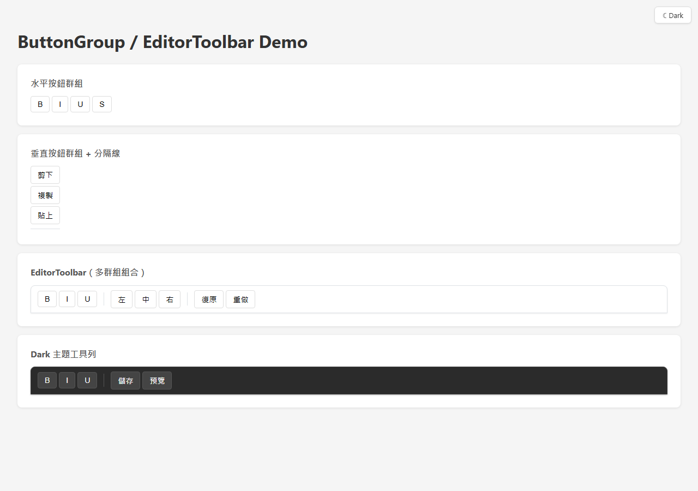

```javascript
import { ButtonGroup } from './ui_components/common/ButtonGroup/ButtonGroup.js';

const group = new ButtonGroup({
  buttons: [saveBtn, cancelBtn, deleteBtn],  // Array of BasicButton instances
  direction: 'horizontal',  // 'horizontal' | 'vertical'
  gap: '8px',
  showSeparator: false,
  theme: 'light'            // 'light' | 'dark' | 'gradient'
});

group.mount(document.getElementById('button-area'));
```

### 5.2 ColorPicker ??Color Picker

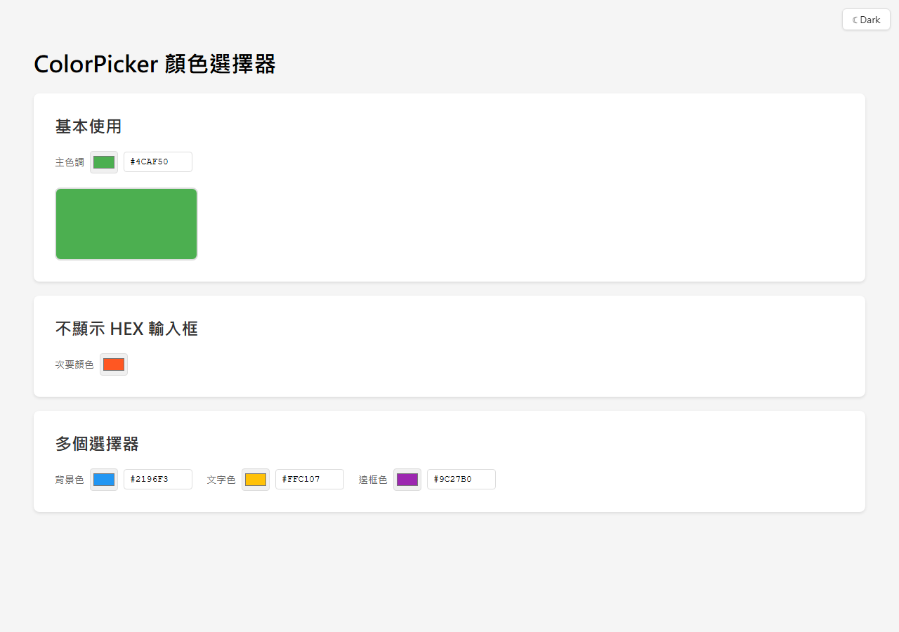

```javascript
import { ColorPicker } from './ui_components/common/ColorPicker/ColorPicker.js';

const colorPicker = new ColorPicker({
  label: 'Theme Color',
  value: '#4A90D9',
  onChange: (color) => applyColor(color)
});

colorPicker.mount(document.getElementById('color-field'));
```

### 5.3 Dialog / SimpleDialog ??Dialog

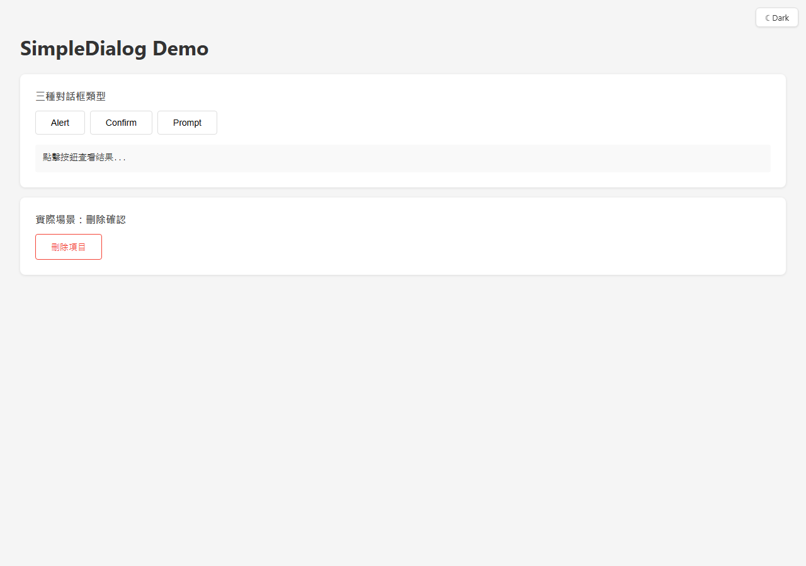

```javascript
import { SimpleDialog } from './ui_components/common/Dialog/SimpleDialog.js';

// Confirmation dialog (returns Promise<boolean>)
const confirmed = await SimpleDialog.confirm('Are you sure you want to delete this item? This action cannot be undone.');
if (confirmed) {
  deleteItem();
}

// Alert dialog (returns Promise<true>)
await SimpleDialog.alert('Data saved successfully.');

// Prompt dialog (returns Promise<string|null>)
const name = await SimpleDialog.prompt('Enter a name', 'default value');
```

### 5.4 Notification ??Notification

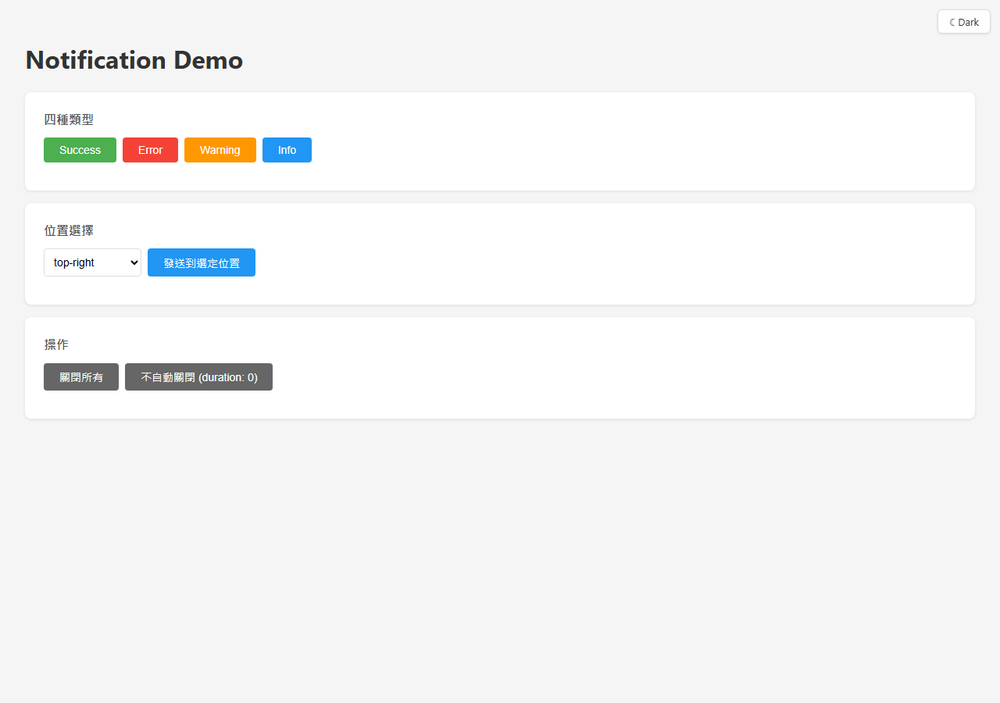

```javascript
import { Notification } from './ui_components/common/Notification/Notification.js';

// Success notification
Notification.success('Saved successfully!');

// Error notification
Notification.error('An error occurred. Please try again.');

// Warning notification
Notification.warning('Please fill in the required fields.');

// Info notification
Notification.info('A new version has been released.');

// Custom options - there is no static show(); construct and call .show()
new Notification({
  type: 'success',
  message: 'Operation complete',
  duration: 5000,    // Display for 5 seconds; 0 keeps it open
  position: 'top-right'   // top-right | top-left | top-center | bottom-right | bottom-left | bottom-center
}).show();

// Close every open notification
Notification.closeAll();
```

### 5.5 LoadingSpinner ??Loading Spinner

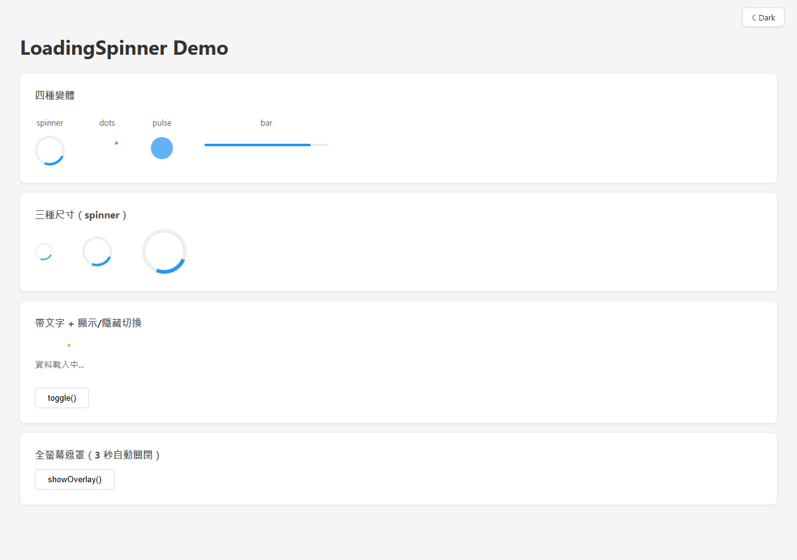

```javascript
import { LoadingSpinner } from './ui_components/common/LoadingSpinner/LoadingSpinner.js';

const spinner = new LoadingSpinner({
  text: 'Loading data...',
  size: 'medium' // small | medium | large
});

// Show loading
spinner.mount(document.getElementById('content-area'));

// Remove when done
spinner.destroy();
```

### 5.6 Pagination ??Pagination

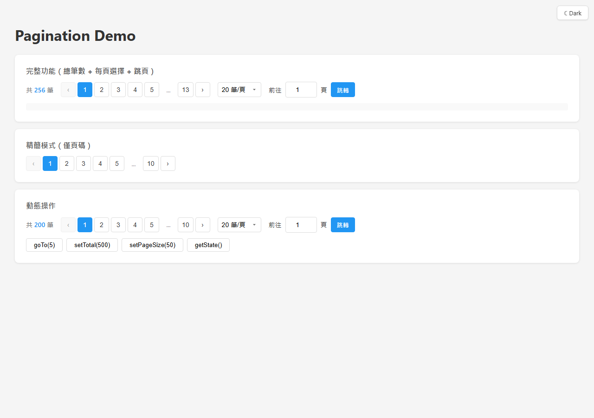

```javascript
import { Pagination } from './ui_components/common/Pagination/Pagination.js';

const pagination = new Pagination({
  total: 200,
  pageSize: 20,
  page: 1,
  onChange: (page, pageSize) => loadData(page)
});

pagination.mount(document.getElementById('pagination-area'));
```

### 5.7 Breadcrumb ??Breadcrumb Navigation

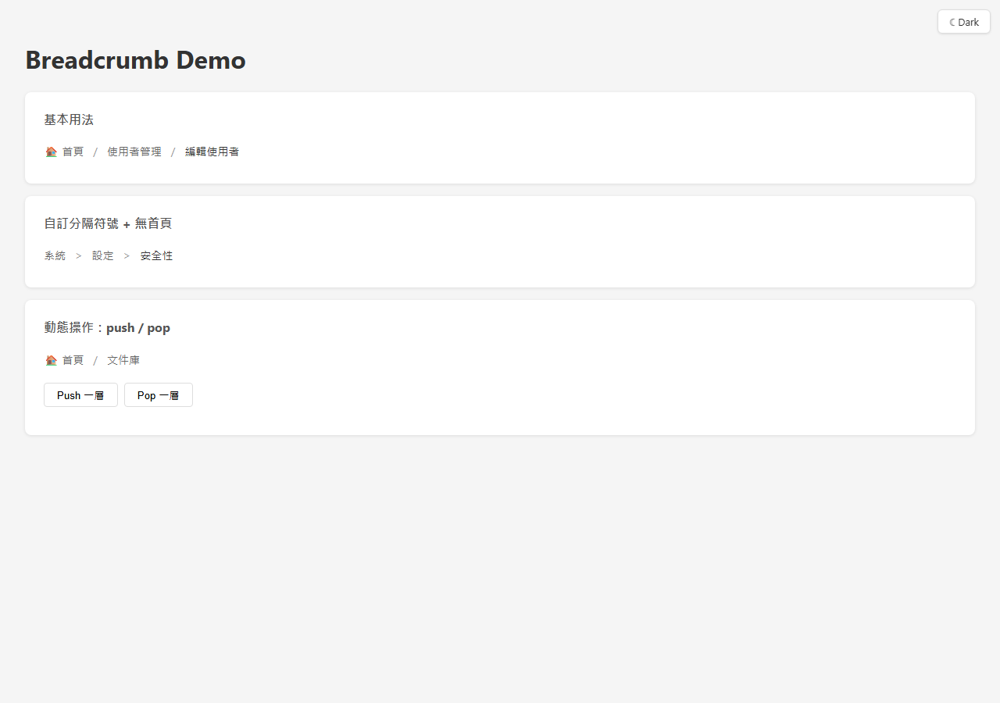

```javascript
import { Breadcrumb } from './ui_components/common/Breadcrumb/Breadcrumb.js';

const breadcrumb = new Breadcrumb({
  items: [
    { text: 'Home', href: '#/' },
    { text: 'User Management', href: '#/users' },
    { text: 'Edit User' }  // Last item doesn't need href
  ]
});

breadcrumb.mount(document.getElementById('breadcrumb-area'));
```

### 5.8 TreeList ??Tree List

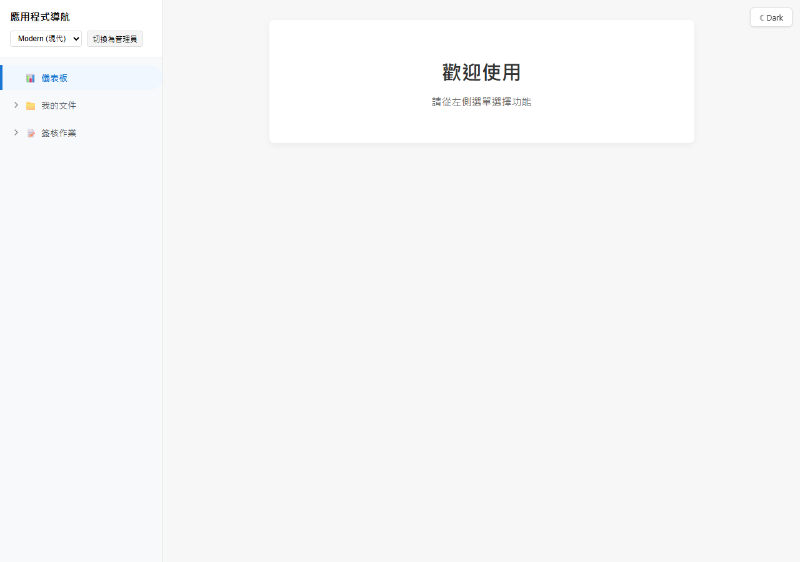

```javascript
import { TreeList } from './ui_components/common/TreeList/TreeList.js';

const tree = new TreeList({
  data: [
    {
      id: 1, label: 'Headquarters', children: [
        { id: 2, label: 'Engineering', children: [
          { id: 3, label: 'Frontend Team' },
          { id: 4, label: 'Backend Team' }
        ]},
        { id: 5, label: 'Sales' }
      ]
    }
  ],
  onSelect: (node) => console.log('Selected:', node)
});

tree.mount(document.getElementById('tree-area'));
```

### 5.9 PhotoCard / FeatureCard ??Card Components

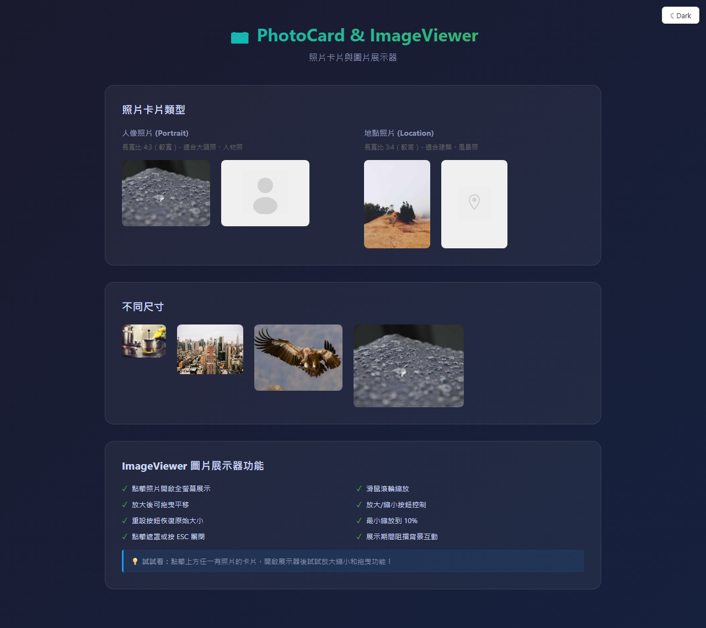

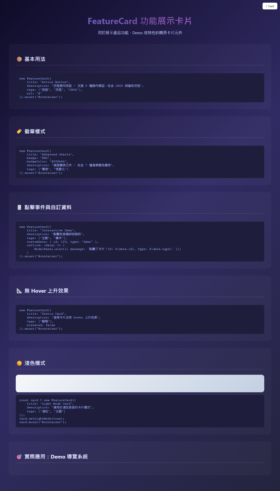

```javascript
import { PhotoCard } from './ui_components/common/PhotoCard/PhotoCard.js';
import { FeatureCard } from './ui_components/common/FeatureCard/FeatureCard.js';

// PhotoCard is an image tile: src / alt / type, no title or description.
const photoCard = new PhotoCard({
  type: 'portrait',      // portrait | landscape
  src: '/images/landscape.jpg',
  oriSrc: '/images/landscape-full.jpg',  // full-size image for the viewer
  alt: 'National Park',
  clickable: true
});

// FeatureCard has no `icon` option; it uses badge / tags instead.
const featureCard = new FeatureCard({
  title: 'Data Analytics',
  description: 'Real-time data statistics and visual reports',
  tags: ['charts', 'reports'],
  badge: 'NEW',
  onClick: () => openDetail()
});
```

### 5.10 ImageViewer ??Image Viewer

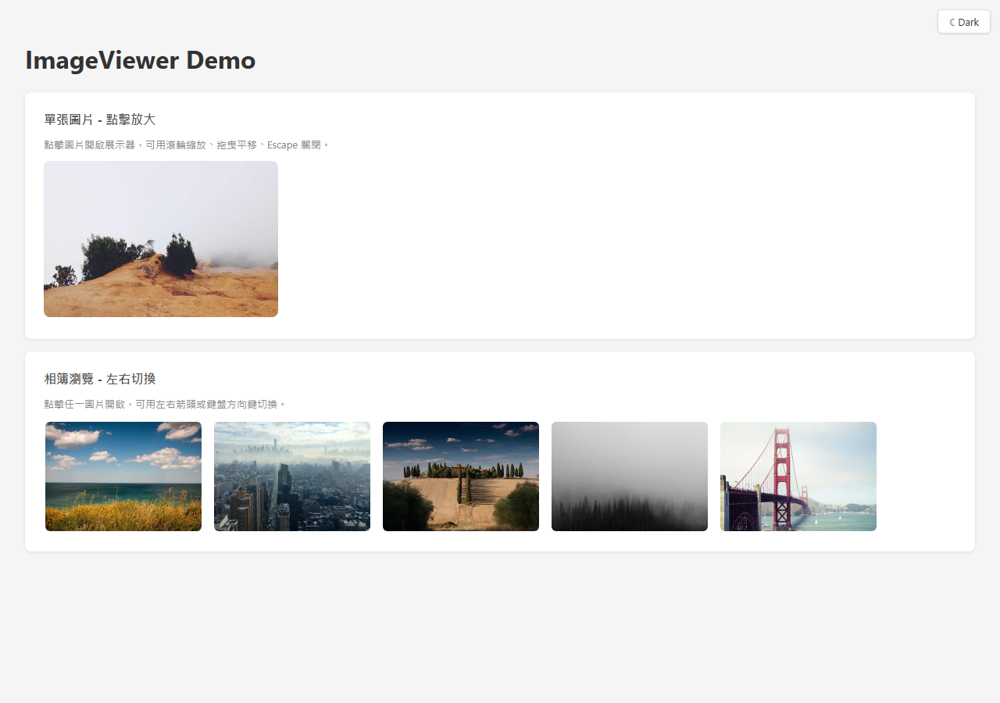

```javascript
import { ImageViewer } from './ui_components/common/ImageViewer/ImageViewer.js';

// ImageViewer is a single-instance lightbox opened by a static method.
// It has no mount(), no `images` array and no fullscreen option.
ImageViewer.open('/photos/1.jpg', {
  minZoom: 0.1,
  maxZoom: 3,
  zoomStep: 0.2,
  onPrev: () => ImageViewer.open('/photos/0.jpg'),
  onNext: () => ImageViewer.open('/photos/2.jpg')
});

ImageViewer.close();
```

### 5.11 SortButton ??Sort Button

Used for table column sorting, cycling through none ??desc ??asc states.

```javascript
import { SortButton } from './ui_components/common/SortButton/SortButton.js';

const sortBtn = new SortButton({
  field: 'name',
  state: 'none',        // 'none'|'desc'|'asc'
  size: 'small',         // 'small'|'medium'
  onSort: (field, state) => {
    console.log(`Sort ${field}: ${state}`);
    loadData({ sortBy: field, order: state });
  }
});

sortBtn.mount(headerCell);
sortBtn.setState('asc');  // Programmatic control
sortBtn.reset();          // Reset to none
```

### 5.12 EditorButton ??Editor Toolbar Button

Provides 70 predefined button types (bold, italic, link, image, etc.) for rich text editor toolbars.

```javascript
import { EditorButton } from './ui_components/common/EditorButton/EditorButton.js';

const boldBtn = new EditorButton({
  type: 'bold',           // one of the 70 EditorButton.TYPES
  onClick: () => document.execCommand('bold'),
  size: 'medium',         // 'small'|'medium'|'large'
  variant: 'default',     // 'default'|'primary'|'ghost'|'outline'
  tooltip: 'Bold (Ctrl+B)'
});

boldBtn.mount(toolbar);
boldBtn.active = true;    // Set active state
boldBtn.setDisabled(true); // Disable
```

---

## 6. Layout Components

Layout components are located in `packages/javascript/browser/ui_components/layout/`, with 13 components total (`EditableTable`, `FormDesigner` and `Stepper` are not covered below).

### 6.1 Panel Series

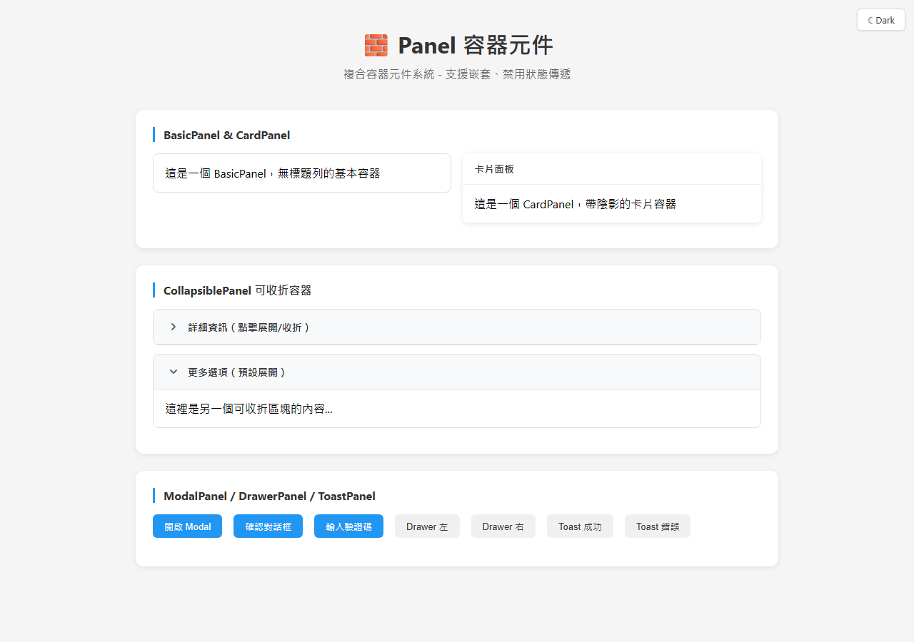

The Panel series provides multiple panel types: BasePanel, BasicPanel, CardPanel, CollapsiblePanel, ModalPanel, DrawerPanel, FocusPanel, ToastPanel, and the unified PanelManager.

```javascript
import { ModalPanel } from './ui_components/layout/Panel/ModalPanel.js';
import { ToastPanel } from './ui_components/layout/Panel/ToastPanel.js';
import { PanelManager } from './ui_components/layout/Panel/PanelManager.js';

// Modal panel. BasePanel has no `width` option - size the content yourself.
// destroyOnClose defaults to false here, so the panel can be reopened;
// ModalPanel.confirm/alert/prompt set destroyOnClose: true and self-destruct.
const modal = new ModalPanel({
  title: 'Edit User',
  closable: true,
  onClose: () => console.log('Closed')
});

modal.setContent('<form>...</form>');
modal.mount(document.body);
modal.open();
modal.close();
modal.destroy();          // release it when you are done with it

// One-shot dialogs that clean themselves up after close. They are
// callback-based and return the ModalPanel instance, not a Promise;
// the body text option is `message`.
ModalPanel.confirm({
  title: 'Delete',
  message: 'Are you sure?',
  onConfirm: () => deleteItem(),
  onCancel: () => {}
});
ModalPanel.alert({ message: 'Saved.' });
ModalPanel.prompt({
  message: 'Enter a name',
  placeholder: 'e.g. Jane',
  validate: (value) => value.trim().length > 0,
  onConfirm: (value) => rename(value)
});

// Toast notification panel: the option is `timeout`, and the usual entry
// point is the static helper rather than the constructor.
ToastPanel.success('Operation successful', { timeout: 3000, position: 'top-right' });

// PanelManager is an exported singleton, not a class you instantiate.
// It tracks parent/child panels, z-index and modal/focus stacks;
// opening and closing stays on the panel itself.
PanelManager.register(modal);
PanelManager.getChildren(modal);
PanelManager.unregister(modal);
```

### 6.2 DataTable ??Data Table

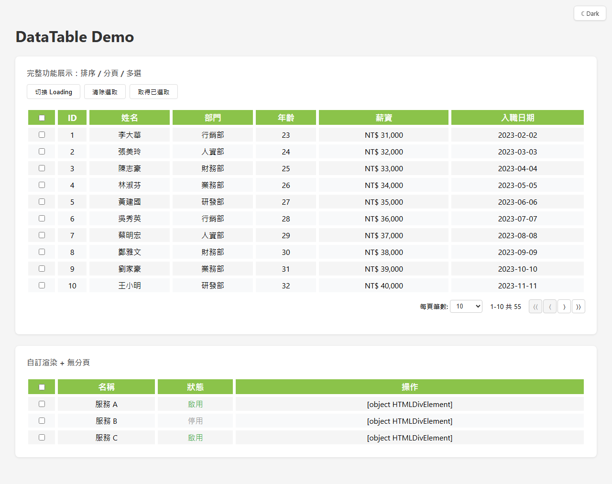

```javascript
import { DataTable } from './ui_components/layout/DataTable/DataTable.js';
import { escapeHtml, raw } from './ui_components/utils/security.js';

const table = new DataTable({
  container: document.getElementById('table-area'),
  title: 'User Management',
  variant: 'default',       // 'default' or 'search'
  columns: [
    { name: 'name', label: 'Name', options: { sort: true } },
    { name: 'email', label: 'Email' },
    { name: 'role', label: 'Role', options: { sort: true } },
    {
      name: 'actions',
      label: 'Actions',
      options: {
        // A plain string returned from customBodyRender is escaped and shown as
        // text. Wrap known-safe markup in raw() to have it written as HTML -
        // and keep inline on* handlers out of it (the CSP audit rejects them);
        // bind behaviour with a delegated listener on the table container.
        customBodyRender: (value, tableMeta) =>
          raw(`<button type="button" data-edit-id="${escapeHtml(String(tableMeta.rowData[0]))}">Edit</button>`)
      }
    }
  ],
  data: [
    ['John Doe', 'john@example.com', 'Admin', ''],
    ['Jane Smith', 'jane@example.com', 'Editor', '']
  ],
  pageSize: 20
});

// Alternative format ??Object array + key/title columns (audit mode)
const auditTable = new DataTable({
  container: document.getElementById('audit-area'),
  columns: [
    { key: 'name', title: 'Name', sortable: true },
    { key: 'email', title: 'Email' },
    // render receives (cellValue, rowObject); the result is escaped unless
    // it is wrapped in raw()
    { key: 'role', title: 'Role', render: (value) => raw(`<b>${escapeHtml(value)}</b>`) }
  ],
  data: [
    { name: 'John Doe', email: 'john@example.com', role: 'Admin' },
    { name: 'Jane Smith', email: 'jane@example.com', role: 'Editor' }
  ]
});
```

### 6.3 SideMenu ??Side Menu

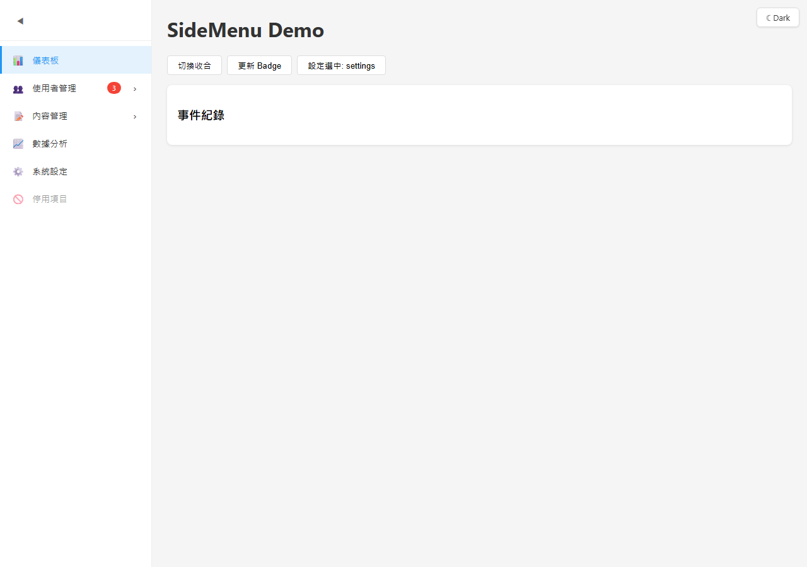

```javascript
import { SideMenu } from './ui_components/layout/SideMenu/SideMenu.js';

const menu = new SideMenu({
  items: [
    { id: 'dashboard', icon: 'home', text: 'Dashboard', href: '#/' },
    {
      id: 'users', icon: 'users', text: 'User Management',
      children: [
        { id: 'user-list', text: 'User List', href: '#/users' },
        { id: 'user-add', text: 'Add User', href: '#/users/add' }
      ]
    },
    { id: 'settings', icon: 'settings', text: 'Settings', href: '#/settings' }
  ],
  activeId: 'dashboard',
  collapsed: false,          // Whether the side menu is collapsed
  accordion: true,           // Accordion mode (only one submenu expanded at a time)
  onSelect: (item) => console.log('Selected:', item)
});

menu.mount(document.getElementById('sidebar'));
```

### 6.4 TabContainer ??Tab Container

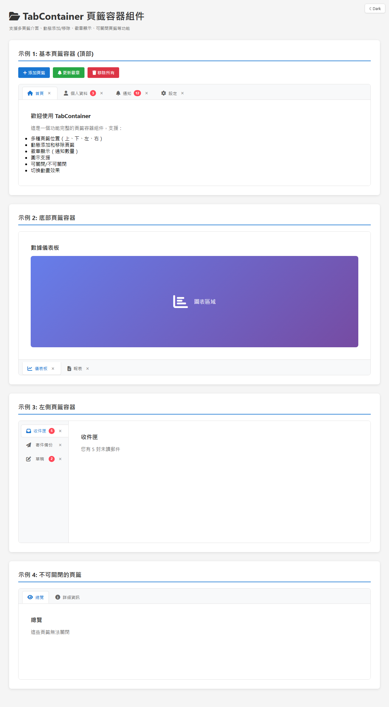

```javascript
import { TabContainer } from './ui_components/layout/TabContainer/TabContainer.js';

const tabs = new TabContainer({
  containerId: 'tab-area',  // DOM id of the mount container
  tabs: [
    { id: 'basic', title: 'Basic Info', content: '<div>...</div>' },
    { id: 'contact', title: 'Contact', content: '<div>...</div>' },
    { id: 'permissions', title: 'Permissions', content: '<div>...</div>', closable: false }
  ],
  position: 'top',          // 'top' | 'bottom' | 'left' | 'right'
  closable: true,           // Whether tabs can be closed
  animated: true,
  onTabChange: (tabId) => console.log('Switched to:', tabId),
  onTabClose: (tabId) => console.log('Closed:', tabId)
});
```

### 6.5 FormRow ??Form Row

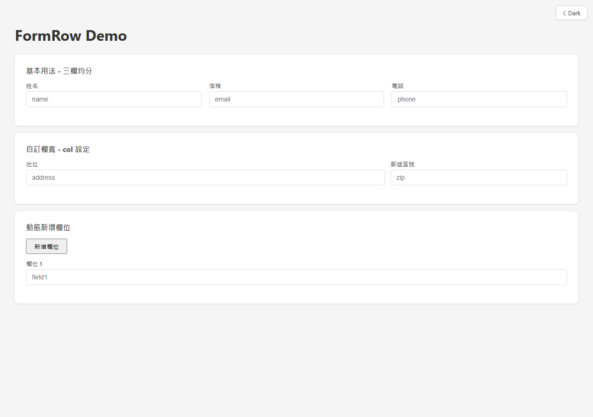

```javascript
import { FormRow } from './ui_components/layout/FormRow/FormRow.js';

// FormRow is a fixed 12-column CSS grid; there is no `columns` option.
// Column width comes from each FormField's `col` (1-12); fields without a
// `col` share the remaining columns evenly.
const row = new FormRow({
  gap: '16px',
  fields: [
    new FormField({ fieldName: 'name', label: 'Name', col: 4, component: nameInput }),
    new FormField({ fieldName: 'email', label: 'Email', col: 4, component: emailInput }),
    new FormField({ fieldName: 'phone', label: 'Phone', col: 4, component: phoneInput })
  ]
});

row.mount(document.getElementById('form-area'));
```

### 6.6 InfoPanel ??Info Panel

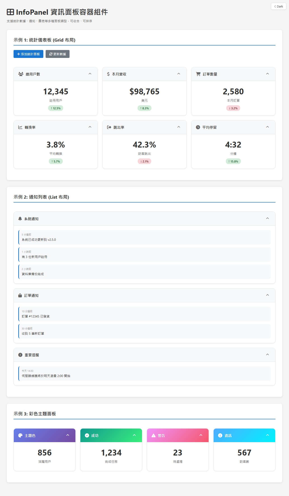

```javascript
import { InfoPanel } from './ui_components/layout/InfoPanel/InfoPanel.js';

const infoPanel = new InfoPanel({
  containerId: 'info-area',  // DOM id of the mount container
  panels: [
    { title: 'Basic Info', fields: [
      { label: 'Name', value: 'John Doe' },
      { label: 'Phone', value: '0912-345-678' }
    ]},
    { title: 'System Info', fields: [
      { label: 'Created', value: '2025-01-15' }
    ]}
  ],
  layout: 'grid',        // 'grid' | 'list' | 'masonry'
  columns: 3,
  collapsible: true
});
```

### 6.7 Other Layout Components

#### FunctionMenu ??Function Menu

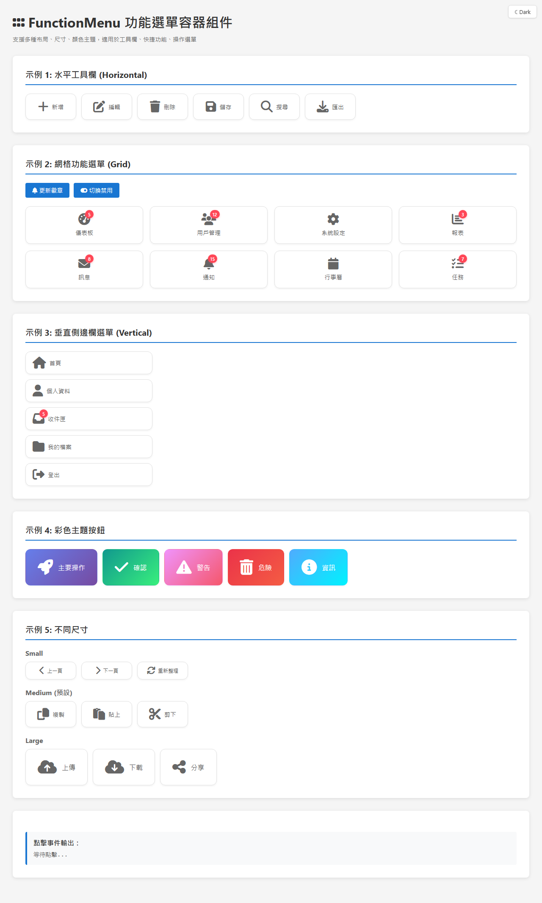

```javascript
import { FunctionMenu } from './ui_components/layout/FunctionMenu/FunctionMenu.js';

const funcMenu = new FunctionMenu({
  containerId: 'func-menu',  // DOM id of the mount container
  items: [
    { id: 'add', icon: 'add', label: 'Add' },
    { id: 'export', icon: 'export', label: 'Export' },
    { id: 'print', icon: 'print', label: 'Print' }
  ],
  layout: 'horizontal',      // 'horizontal' | 'vertical' | 'grid'
  columns: 4,
  size: 'medium',            // 'small' | 'medium' | 'large'
  onItemClick: (item) => console.log('Clicked:', item.id)
});
```

#### WorkflowPanel ??Workflow Panel

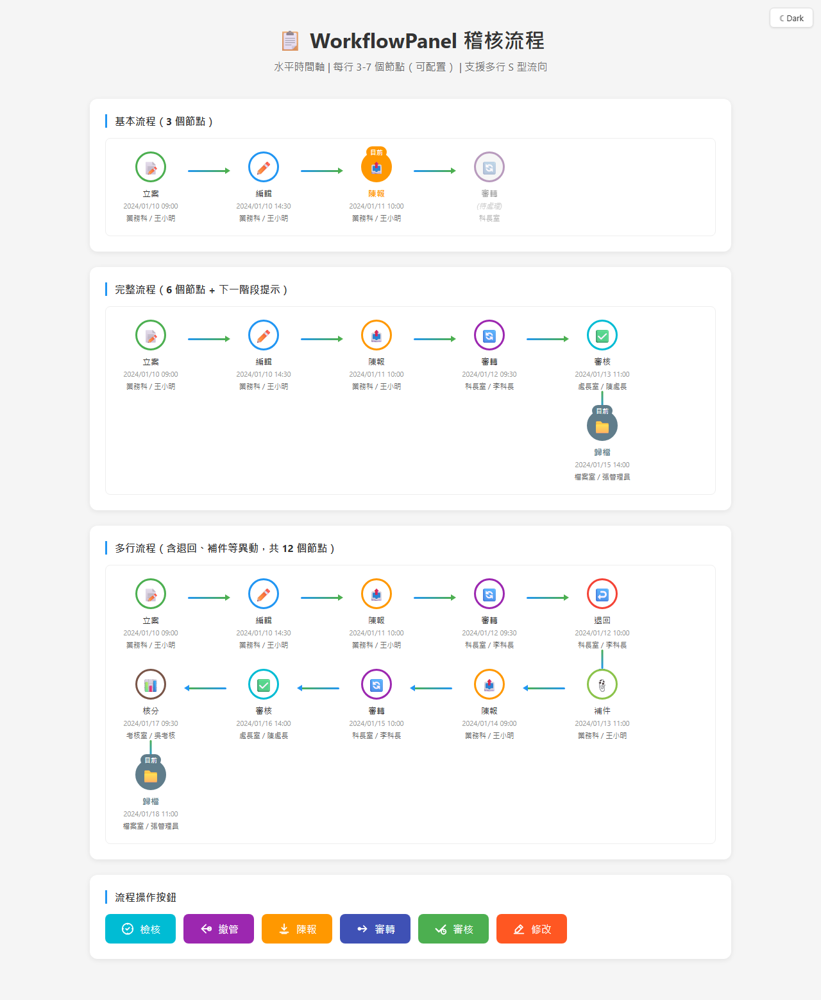

```javascript
import { WorkflowPanel } from './ui_components/layout/WorkflowPanel/WorkflowPanel.js';

const workflow = new WorkflowPanel({
  data: [
    { StageName: 'Created', DateTime: '2026-03-01 10:00', UnitName: 'IT Dept', UserName: 'John' },
    { StageName: 'Submitted', DateTime: '2026-03-02 14:00', UnitName: 'IT Dept', UserName: 'John' },
    { StageName: 'Reviewed', DateTime: '2026-03-03 09:00', UnitName: 'Admin', UserName: 'Jane' },
    { StageName: 'Approved', DateTime: '2026-03-03 16:00', UnitName: 'Admin', UserName: 'Manager' }
  ],
  itemsPerRow: 5,            // Nodes per row (3~7)
  nextStage: { StageName: 'Closed', NextUnit: 'IT Dept' },
  showDetails: true,
  onNodeClick: (node) => console.log('Node:', node)
});

workflow.mount(document.getElementById('workflow-area'));
```

### 6.8 DocumentWall ??Document Wall

Displays documents in a card grid, supports multi-select, batch ZIP download, description editing, and deletion.

```javascript
import { DocumentWall } from './ui_components/layout/DocumentWall/DocumentWall.js';

const wall = new DocumentWall({
  documents: [
    { id: 1, title: 'report.pdf', type: 'pdf', src: '/files/report.pdf', description: 'Annual report' }
  ],
  readOnly: false,
  onDownload: (doc) => {},
  onDescription: (doc, text) => {},
  onEdit: (doc) => {},
  onDelete: (doc) => {}
});

wall.mount(document.getElementById('doc-area'));
wall.removeDocument(0);
```

### 6.9 PhotoWall ??Photo Wall

Image gallery component, supports preview browsing, multi-select, and batch ZIP download.

```javascript
import { PhotoWall } from './ui_components/layout/PhotoWall/PhotoWall.js';

const photos = new PhotoWall({
  photos: [
    { id: 1, src: '/images/photo1.jpg', alt: 'Photo 1' }
  ],
  readOnly: false,
  onAdd: (photo) => {},
  onDelete: (photo) => {},
  onChange: (photos) => {}
});

photos.mount(document.getElementById('gallery'));
photos.addPhoto({ id: 2, src: '/images/photo2.jpg', alt: 'Photo 2' });
const allPhotos = photos.getPhotos();
```

---

## 7. Advanced Input Components

Advanced input components are located in `packages/javascript/browser/ui_components/input/`, with 10 components total. These components handle complex input scenarios such as addresses, phone lists, organization info, etc.

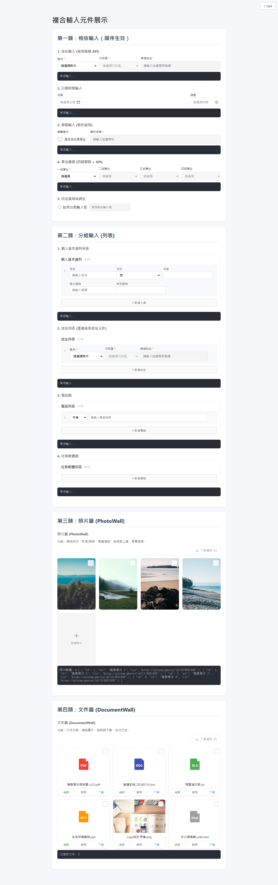

### 7.1 ChainedInput ??Chained Input

Multi-level cascading dropdown selects, suitable for hierarchical data like country/state/city.

```javascript
import { ChainedInput } from './ui_components/input/ChainedInput/ChainedInput.js';

// The option is `fields`, not `levels`, and each select loads its own options
// through its own `loadOptions(parentValue)`. There is no top-level `label`
// and no `onLoadOptions`.
const regionInput = new ChainedInput({
  layout: 'horizontal',        // 'horizontal' | 'vertical'
  gap: '12px',
  fields: [
    { name: 'city', type: 'select', label: 'City', required: true, flex: 1,
      loadOptions: async () => citiesData },
    { name: 'district', type: 'select', label: 'District', flex: 1,
      loadOptions: async (city) => city
        ? fetch(`/api/regions?parent=${city}`).then(r => r.json())
        : [] },
    { name: 'village', type: 'select', label: 'Village', flex: 1,
      loadOptions: async (district) => district
        ? fetch(`/api/regions?parent=${district}`).then(r => r.json())
        : [] }
  ],
  onChange: (values) => console.log(values)
});

regionInput.mount(document.getElementById('region-field'));

// Values are read and written as a whole (setValues is async)
const region = regionInput.getValues();  // { city, district, village }
await regionInput.setValues({ city: 'TPE' });
```

### 7.2 AddressInput ??Address Input

Composite component integrating region cascading and detailed address.

```javascript
import { AddressInput } from './ui_components/input/AddressInput/AddressInput.js';

// AddressInput extends ChainedInput with three fixed fields (city / district /
// address). It has no `label` option, and it throws unless you supply real
// `loadCities` and `loadDistricts` data loaders.
const addressInput = new AddressInput({
  loadCities: async () => api.get('/regions/cities'),
  loadDistricts: async (city) => api.get(`/regions/districts?city=${city}`)
});

addressInput.mount(document.getElementById('address-field'));

// Get full address (getValues, not getValue)
const address = addressInput.getValues();
// { city: 'Taipei', district: 'Zhongzheng', address: '122 Chongqing South Rd.' }
```

### 7.3 AddressListInput ??Multiple Address Input

Add/remove multiple addresses, suitable for scenarios with multiple mailing addresses.

```javascript
import { AddressListInput } from './ui_components/input/AddressListInput/AddressListInput.js';

// Extends ListInput: the heading option is `title`, not `label`.
// Defaults: minItems 1, maxItems 3.
const addressList = new AddressListInput({
  title: 'Address List',
  maxItems: 3
});

addressList.mount(document.getElementById('address-list-field'));
const addresses = addressList.getValues();   // array of address objects
```

### 7.4 PersonInfoList ??Person Info List

```javascript
import { PersonInfoList } from './ui_components/input/PersonInfoList/PersonInfoList.js';

// The per-row fields are fixed (name, gender, age, id, otherId); there is no
// `fields` option. Extends ListInput, so the heading option is `title`.
const personList = new PersonInfoList({
  title: 'Family Members',
  minItems: 1,
  maxItems: 10
});

personList.mount(document.getElementById('person-list'));
```

### 7.5 PhoneListInput ??Phone List

```javascript
import { PhoneListInput } from './ui_components/input/PhoneListInput/PhoneListInput.js';

// The phone-type list comes from the active locale, not from a `types` option.
const phoneList = new PhoneListInput({
  title: 'Contact Phones',
  maxItems: 5
});

phoneList.mount(document.getElementById('phone-list'));
const phones = phoneList.getValues();   // [{ type, number }, ...]
```

### 7.6 OrganizationInput ??Organization Input

```javascript
import { OrganizationInput } from './ui_components/input/OrganizationInput/OrganizationInput.js';

// OrganizationInput extends ChainedInput with three fixed org levels
// (level1 / level2 / level3). It has no `label` or `fields` option and
// throws unless a real `loadUnits` loader is supplied.
const orgInput = new OrganizationInput({
  loadUnits: async (parentId) => api.get(`/org/units?parent=${parentId}`)
});

orgInput.mount(document.getElementById('org-field'));
const org = orgInput.getValues();   // { level1, level2, level3 }
```

### 7.7 Other Advanced Inputs

- **DateTimeInput** ??DateTime composite input

- **ListInput** ??Generic list input (add/remove/reorder items)

- **SocialMediaList** ??Social media account list

- **StudentInput** ??Student information input

These composite inputs expose `mount`, `getValues`, `setValues` and `destroy`. They are multi-field containers, so they use the plural `getValues()` / `setValues()` accessors rather than the single-value `getValue()` / `setValue()` of the plain form components; on `ChainedInput` and its subclasses `setValues()` is async because it may have to reload dependent option lists.

---

## 8. Social Components

Social components (`social/`) provide UI elements for social networking features including profiles, feeds, and network graphs.

### 8.1 Avatar ??Avatar

```javascript
import { Avatar } from './ui_components/social/Avatar/Avatar.js';

const avatar = new Avatar({
  src: '/images/user.jpg',
  alt: 'John Doe',
  size: 'lg',         // 'xs'|'sm'|'md'|'lg'|'xl' (24px ~ 96px)
  badge: 3,           // Notification count
  onClick: () => {}
});

avatar.mount(document.getElementById('avatar-container'));
avatar.update({ badge: 5 });
```

### 8.2 FeedCard ??Feed Card

```javascript
import { FeedCard } from './ui_components/social/FeedCard/FeedCard.js';

const feed = new FeedCard({
  avatar: '/images/user.jpg',
  author: 'John Doe',
  authorSub: 'Senior Engineer',
  timestamp: '2026-03-01T10:30:00',
  type: 'Announcement',
  typeColor: 'var(--cl-primary)',
  title: 'System Update Notice',
  content: 'This update includes performance improvements...',
  images: ['/images/screenshot.png'],
  tags: ['System', 'Update'],
  onClickDetail: () => {},
  onClickAuthor: () => {}
});

feed.mount(document.getElementById('feed'));

// Batch generate feed list
const listHTML = FeedCard.listHTML(feedItems);
```

### 8.3 ConnectionCard ??Connection Card

```javascript
import { ConnectionCard } from './ui_components/social/ConnectionCard/ConnectionCard.js';

const card = new ConnectionCard({
  avatar: '/images/user.jpg',
  name: 'Jane Smith',
  subtitle: 'Product Manager',
  tags: ['Design', 'UX'],
  onClick: () => {}
});

card.mount(container);

// Batch generate connection grid
const gridHTML = ConnectionCard.gridHTML(contacts);
```

### 8.4 StatCard ??Stat Card

```javascript
import { StatCard } from './ui_components/social/StatCard/StatCard.js';

const stat = new StatCard({
  icon: '??',
  label: 'Monthly Revenue',
  value: '$120,000',
  trend: 'up',           // 'up'|'down'|null
  trendValue: '+12%',
  color: 'var(--cl-success)',
  onClick: () => {}
});

stat.mount(container);
```

### 8.5 Timeline ??Timeline

```javascript
import { Timeline } from './ui_components/social/Timeline/Timeline.js';

const timeline = new Timeline({
  items: [
    {
      timestamp: '2026-03-01T10:00:00',
      type: 'Created',
      color: 'var(--cl-success)',
      icon: '??,
      title: 'Account Created',
      description: 'Account automatically created by the system',
      onClick: () => {}
    }
  ],
  grouped: true,       // Group by month
  emptyText: 'No events yet'
});

timeline.mount(container);
```

---

## 9. Visualization Components

Visualization components are located in `packages/javascript/browser/ui_components/viz/`, with 23 components total. They are built on Canvas 2D plus native DOM: SVG is banned library-wide and enforced at hard zero by `node tools/scripts/audit-csp.mjs`. The only third-party code involved is the copy of Leaflet vendored under `ui_components/vendor/`, which the map components load from the same origin.

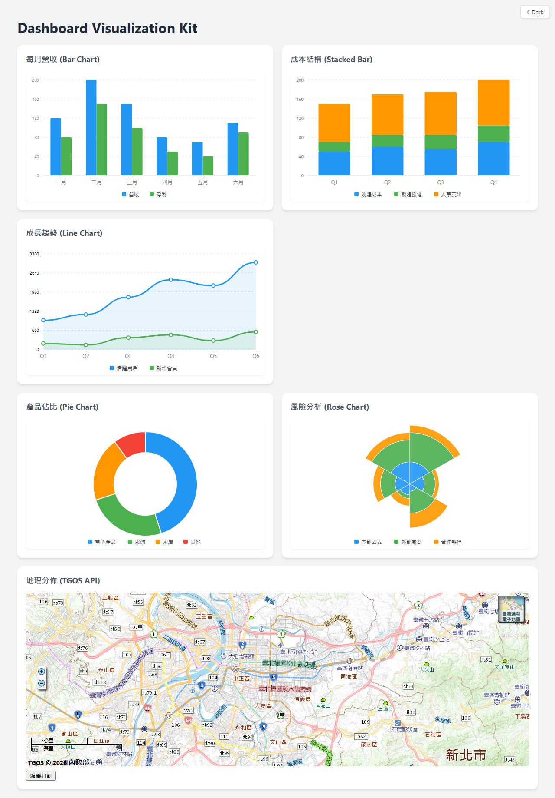

### 9.1 Chart Series

All charts inherit from `CanvasChart` (`viz/CanvasChart.js`), which supplies DPR-aware sizing, hit regions, tooltips and `exportPNG()`. The old SVG `BaseChart` has been deleted. Mount with `mount(container)` and release with `destroy()`.

```javascript
import { BarChart } from './ui_components/viz/BarChart.js';
import { LineChart } from './ui_components/viz/LineChart.js';
import { PieChart } from './ui_components/viz/PieChart.js';
import { RoseChart } from './ui_components/viz/RoseChart.js';

// Bar chart - the data shape is { labels, series }, not an array of points
const barChart = new BarChart({
  title: 'Monthly Revenue',
  data: {
    labels: ['Jan', 'Feb', 'Mar'],
    series: [{ name: 'Revenue', data: [120000, 98000, 150000] }]
  },
  stacked: false,
  unit: 'USD',        // suffix appended after the value in labels/tooltips
  width: 600,
  height: 400
});

barChart.mount(document.getElementById('bar-chart'));

// Line chart - labels and series both live inside `data`
const lineChart = new LineChart({
  title: 'User Trends',
  data: {
    labels: ['Jan', 'Feb', 'Mar', 'Apr', 'May'],
    series: [
      { name: 'New Users', data: [100, 120, 115, 140, 160] },
      { name: 'Active Users', data: [500, 520, 530, 550, 580] }
    ]
  },
  showPoints: true,
  width: 600,
  height: 400
});

lineChart.mount(document.getElementById('line-chart'));

// Pie chart - slices are { name, value }; per-slice colours come from the
// `colors` array (theme tokens), not from a `color` key on each slice
const pieChart = new PieChart({
  title: 'Browser Market Share',
  data: [
    { name: 'Chrome', value: 65 },
    { name: 'Safari', value: 19 },
    { name: 'Firefox', value: 10 },
    { name: 'Other', value: 6 }
  ],
  donut: false
});

pieChart.mount(document.getElementById('pie-chart'));
```

### 9.2 Hierarchy & Relation Charts

```javascript
import { OrgChart } from './ui_components/viz/OrgChart.js';
import { RelationChart } from './ui_components/viz/RelationChart.js';

// Org chart - the option is `root` and it takes an already-nested tree.
// There is no `data` option and no flatToHierarchy helper; flatten/nest your
// data before handing it over.
const orgChart = new OrgChart({
  root: {
    id: 1, label: 'CEO', title: 'Chief Executive',
    children: [
      { id: 2, label: 'CTO', children: [{ id: 4, label: 'Frontend Engineer' }] },
      { id: 3, label: 'VP Sales' }
    ]
  },
  width: 800,
  height: 600
});

orgChart.mount(document.getElementById('org-chart'));

// Relation chart - the edge list option is `links`, not `edges`.
// `group` drives node colouring and the legend.
const relationChart = new RelationChart({
  nodes: [
    { id: 'a', label: 'User', group: 'core' },
    { id: 'b', label: 'Order', group: 'core' },
    { id: 'c', label: 'Product', group: 'catalog' }
  ],
  links: [
    { source: 'a', target: 'b', label: 'Creates' },
    { source: 'b', target: 'c', label: 'Contains' }
  ]
});

relationChart.mount(document.getElementById('relation-chart'));
```

### 9.3 Other Visualization Components

- **TimelineChart** — Timeline chart

- **SankeyChart** — Sankey diagram (flow visualization)

- **SunburstChart** — Sunburst chart (hierarchical proportions)

- **FlameChart** — Flame chart (performance analysis)

- **HierarchyChart** — Hierarchy structure chart

- **HeatmapChart** — Heatmap

- **ScatterChart** — Scatter plot

- **RoseChart** — Rose / polar-area chart

- **Sparkline** — Inline mini chart

- **ClusterGraph** — Clustered force-directed graph

- **WebPainter** — Canvas painter/annotator (base class of the map editors)

### 9.4 Map Components

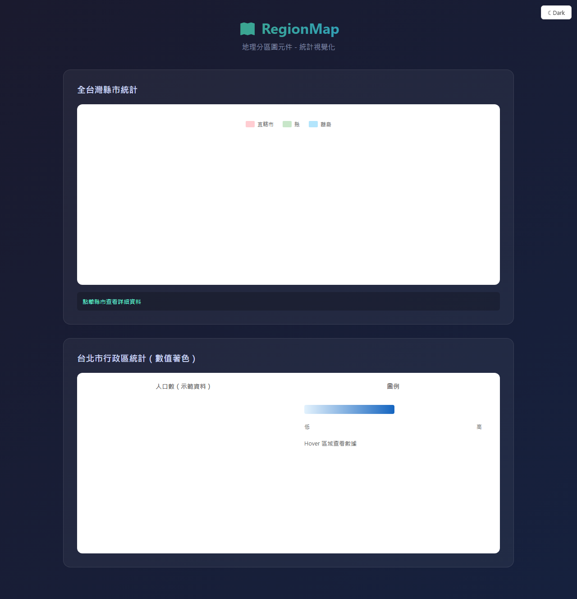

```javascript
import { LeafletMap } from './ui_components/viz/LeafletMap.js';

// LeafletMap takes its container in the constructor and initialises there;
// it has no mount() and no `markers` option. `center` is an object, not an
// array. Leaflet itself is loaded from the vendored copy under
// ui_components/vendor/leaflet/ (same-origin, strict-CSP friendly).
const map = new LeafletMap({
  container: '#map-area',
  center: { lat: 25.0330, lng: 121.5654 }, // Taipei 101
  zoom: 13,
  tileLayer: 'nlsc',   // 'nlsc' (default) | 'osm'
  onReady: (leafletMap) => {
    L.marker([25.0330, 121.5654]).addTo(leafletMap).bindPopup('Taipei 101');
  }
});

map.setCenter(25.0330, 121.5654);
map.setZoom(15);
map.switchLayer('osm');
map.destroy();
```

Other map components: MapEditor, MapEditorV2, CanvasMap, TGOSMapEditor. `MapEditor` and `MapEditorV2` both implement `destroy()`; call it when tearing a page down so their listeners and child components are released.

#### OSMMapEditor ??OSM Map Editor

A map editor extending WebPainter, using OpenStreetMap tiles with integrated drawing tools and geographic features.

```javascript
import { OSMMapEditor } from './ui_components/viz/OSMMapEditor/OSMMapEditor.js';

const editor = new OSMMapEditor({
    container: '#map-editor',
    width: 1000,
    height: 700,
    center: { lat: 25.033, lng: 121.565 },
    zoom: 13,
    tileLayer: 'osm',        // 'osm' | 'osmHot' | 'cartoDB'
    showCompass: true,
    showScale: true,
    showCoords: true
});

// Map operations
editor.setCenter(48.8566, 2.3522);  // Move to Paris
editor.setZoom(15);

// GeoJSON import/export is driven from the editor's own toolbar buttons;
// the underlying methods are private (_importGeoJSON / _exportGeoJSON) and
// are not part of the public API.
```

**Features**: OSM base map (3 tile sources), distance/area measurement, coordinate panel (DD/DMS), scale bar, compass, GeoJSON import/export, map capture, inherits all WebPainter drawing/layer/export features.

### 9.5 Drawing Tools

```javascript
import { DrawingBoard } from './ui_components/viz/DrawingBoard/DrawingBoard.js';

// DrawingBoard renders into the container given to the constructor; it has no
// mount() and no `tools` option (its toolset is pen / line / highlighter /
// eraser, chosen from the built-in toolbar). The stroke width option is
// `lineWidth`, and colours must be theme tokens, not raw hex.
const board = new DrawingBoard({
  container: '#drawing-area',
  width: 800,
  height: 600,
  strokeColor: 'var(--cl-text)',
  lineWidth: 2,
  onDraw: () => {},
  onClear: () => {}
});

// Export image (downloads a PNG; there is no toDataURL())
board.exportPNG('drawing.png');
board.destroy();
```

### 9.6 WebTextEditor ??Rich Text Editor

Located in `editor/WebTextEditor/`, a full WYSIWYG editor.

```javascript
import { WebTextEditor } from './ui_components/editor/WebTextEditor/WebTextEditor.js';

const editor = new WebTextEditor({
  container: '#editor-area',
  placeholder: 'Enter content...',
  height: '400px',
  content: '<p>Initial content</p>',
  readOnly: false,
  onChange: (html) => console.log('Content changed')
});

// Get/Set content - the getter is getHTML()
const html = editor.getHTML();
editor.setContent('<p>New content</p>');
```

**Features**: Toolbar, Find/Replace (Ctrl+F/H), Export (PDF/Word/Markdown), Auto-save, History (Undo/Redo), Table editing, Image resize, Fullscreen, Word count.

### 9.7 RegionMap ??Taiwan Administrative Region Map

Canvas map component supporting data visualization and interaction for the 22 administrative regions of Taiwan. The region outlines are SVG path strings fed to `Path2D` and painted on a canvas; no SVG element is created.

```javascript
import { RegionMap } from './ui_components/data/RegionMap/RegionMap.js';

const map = new RegionMap({
  data: {
    'TPE': { value: 2700000, label: 'Taipei', color: '#FF5722' },
    'NWT': { value: 4000000, label: 'New Taipei', color: '#4CAF50' }
  },
  width: '600px',
  height: '400px',
  showLabels: true,
  showValues: true,
  colorScale: RegionMap.createColorScale(0, 5000000, ['#e3f2fd', '#1565c0']),
  onClick: (regionCode) => console.log(regionCode),
  onChange: ({ code, name }) => console.log(code, name)
});

map.mount(document.getElementById('map-area'));
map.highlightRegion('TPE');
map.setData(updatedData);
```

---

## 10. Behavior Modules & Utilities

### 10.1 TriggerEngine ??Trigger Engine

TriggerEngine provides 8 built-in atomic behaviors for field-to-field cascading logic. Triggers are declared on the source field definition and bound to live component instances; unknown actions and unknown trigger events are ignored with a `console.warn`.

```javascript
import { TriggerEngine } from './page-generator/TriggerEngine.js';

const engine = new TriggerEngine();

// Built-in behaviors: clear, setValue, show, hide, setReadonly, setRequired, reload, reloadOptions

// Triggers live on the source field definition as { on, target, action, params }.
// There is no addRule() and no condition callback: `on` picks the event and
// `action` must already be registered.
const fieldDefinitions = [
  {
    fieldName: 'userType',
    fieldType: 'select',
    triggers: [
      { on: 'change', target: 'adminPanel', action: 'show' },
      { on: 'change', target: 'adminCode', action: 'setRequired', params: { value: true } }
    ]
  },
  { fieldName: 'adminPanel', fieldType: 'text' },
  { fieldName: 'adminCode', fieldType: 'text' }
];

// fieldInstances is a Map: fieldName -> { formField, component }
engine.bind(fieldDefinitions, fieldInstances);

// Run one behavior by hand: execute(action, sourceField, targetField, params)
engine.execute('show', 'userType', 'adminPanel');

// Custom behavior - the handler receives (sourceEntry, targetEntry, params),
// each entry being { formField, component, definition }
engine.registerAction('highlight', (source, target, params = {}) => {
  target.component.element.style.setProperty(
    'background-color', params.color || 'var(--cl-warning-light)');
});

// Release the wrapped callbacks when the page goes away
engine.unbind();
engine.destroy();
```

**Trigger events (`on`):** `change`, `check`, `uncheck`, `upload`.

**Built-in Behaviors:**

| Behavior | Description | Example |
|---|---|---|
| `clear` | Clear target field value | `{ on: 'change', target: 'email', action: 'clear' }` |
| `setValue` | Set target field value | `{ on: 'change', target: 'status', action: 'setValue', params: { value: 'active' } }` |
| `show` | Show target element | `{ on: 'check', target: 'detailSection', action: 'show' }` |
| `hide` | Hide target element | `{ on: 'uncheck', target: 'detailSection', action: 'hide' }` |
| `setReadonly` | Set as read-only | `{ on: 'change', target: 'name', action: 'setReadonly', params: { value: true } }` |
| `setRequired` | Set as required | `{ on: 'change', target: 'phone', action: 'setRequired', params: { value: true } }` |
| `reload` | Reload component data | `{ on: 'upload', target: 'dataTable', action: 'reload' }` |
| `reloadOptions` | Reload options | `{ on: 'change', target: 'cityDropdown', action: 'reloadOptions' }` |

### 10.2 BehaviorDef ??Behavior Definition

BehaviorDef is the `behaviors` block of a PageDefinition. Every value is a **method name string**, not a function: PageGenerator emits `this._<name>()` call sites and generates matching stub methods on the page class. Because these names are written into the generated file as bare identifiers, `generate()` rejects any that is not a valid JavaScript IdentifierName.

```javascript
const definition = {
  name: 'OrderPage',
  type: 'form',
  fields: [
    { name: 'category', type: 'select', label: 'Category' },
    { name: 'country', type: 'select', label: 'Country' }
  ],
  behaviors: {
    onInit: 'loadDefaults',        // becomes: await this._loadDefaults()
    onSave: 'afterSave',           // becomes: await this._afterSave()
    onDelete: 'afterDelete',       // becomes: await this._afterDelete()

    // fieldName -> handler method name, invoked when that field changes
    fieldTriggers: {
      category: 'onCategoryChange',
      country: 'onCountryChange'
    }
  }
};

// PageGenerator emits stub methods you then fill in:
//   async _loadDefaults() { ... }
//   async _afterSave() { ... }
//   async _onCategoryChange() { ... }   // stubs take no arguments
//
// A name that is not a valid identifier fails the whole generate() call:
//   generate({ ..., behaviors: { onInit: 'load-data' } })
//   // -> { code: null, errors: ['behaviors.onInit is emitted as a bare
//   //      JavaScript identifier and must be a valid IdentifierName, ...'] }
```

### 10.3 SPA Core Framework

The SPA core is located in `templates/spa/frontend/core/`, providing a complete single-page application framework.

#### Router — Hash / History Router

```javascript
import { Router } from './core/Router.js';

// Routes are passed to the constructor as a table; there is no addRoute().
// Nested routes are expressed with `children`, and the page class key is
// `component`. `mode` selects hash (default) or history routing.
const router = new Router({
  mode: 'hash',                 // 'hash' | 'history'
  store,
  api,
  layout,
  routes: [
    { path: '/', component: HomePage },
    { path: '/users', component: UserListPage, children: [
      { path: ':id', component: UserDetailPage },
      { path: ':id/edit', component: UserEditPage }
    ]},
    { path: '/admin', component: AdminPage, children: [
      { path: 'settings', component: AdminSettingsPage },
      { path: 'logs', component: AdminLogsPage }
    ]}
  ]
});

// Start router
router.start();

// Programmatic navigation
router.navigate('/users/123');
router.navigate('/users', { query: { page: 2 }, replace: true });
router.back();
```

#### Store ??State Management

```javascript
import { Store } from './core/Store.js';

const store = new Store({
  user: null,
  theme: 'light',
  notifications: []
});

// Subscribe to state changes
store.subscribe('user', (newUser, oldUser) => {
  console.log('User changed:', newUser);
});

// Update state
store.set('user', { id: 1, name: 'John Doe' });

// Get state
const user = store.get('user');
```

#### ApiService ??RESTful API Service

```javascript
import { ApiService } from './core/ApiService.js';

const api = new ApiService({
  baseUrl: '/api',
  // JWT is attached via the Authorization: Bearer header (tokens are stored in localStorage by default)
});

// CRUD operations
const users = await api.get('/users');
const user = await api.get('/users/123');
const newUser = await api.post('/users', { name: 'Jane Smith', email: 'jane@example.com' });
await api.put('/users/123', { name: 'Jane Smith (Updated)' });
await api.delete('/users/123');

// Other verbs and helpers
await api.patch('/users/123', { name: 'Jane' });
await api.upload('/files', formData, (percent) => console.log(percent));
await api.download('/reports/1', 'report.xlsx');

// Token handling (stored in localStorage under access_token / refresh_token)
api.setToken(accessToken, refreshToken);
api.clearToken();
```

#### BasePage ??Page Lifecycle

```javascript
import { BasePage } from './core/BasePage.js';

// The lifecycle is onInit() -> template() -> _bindEvents() -> onMounted(),
// with onDestroy() on teardown. There is no onLoad() and no onRender():
// markup comes from template(), and this.esc() escapes interpolated values.
class UserListPage extends BasePage {
  // The router constructs the page with { router, store, api, params, query, meta }

  async onInit() {
    // Load data before the first render
    this._data = { users: await this.api.get('/users') };
  }

  template() {
    return `<h1>User Management</h1><div id="user-table"></div>`;
  }

  events() {
    return { 'click .refresh': 'reload' };
  }

  async onMounted() {
    // Mount child components into the rendered DOM
    this.table = new DataTable({ container: this.element.querySelector('#user-table') });
    this.table.setData(this._data.users);
  }

  async onDestroy() {
    // Cleanup resources
    this.table.destroy();
  }
}
```

### 10.4 ComponentBinder / ComponentFactory

#### ComponentBinder ??Component Data Binding

```javascript
import { ComponentBinder } from './ui_components/binding/ComponentBinder.js';

// ComponentBinder renders components from a JSON config list; it has no
// bind() / setModel() / getValues(). The constructor takes the context object
// whose methods the `lifecycle` hooks name.
const binder = new ComponentBinder(this);   // `this` = the page/controller

binder.render([
  { component: 'TextInput', fieldName: 'name', displayName: 'Name', required: true },
  { component: 'TextInput', fieldName: 'email', displayName: 'Email' },
  { component: 'Dropdown', fieldName: 'role', displayName: 'Role',
    attrs: { items: [{ value: 'admin', label: 'Admin' }] },
    lifecycle: { onInit: 'onRoleReady', onChange: 'onRoleChanged' } }
], document.getElementById('form-area'));

// Reach a rendered instance and use its own accessors
const nameInput = binder.getComponent('name');
const name = nameInput.getValue();
```

#### ComponentFactory ??Component Factory

```javascript
import { ComponentFactory } from './ui_components/binding/ComponentFactory.js';

// create(name, options): the first argument is the registry name of the
// component, the second is that component's own options object.
const component = ComponentFactory.create('TextInput', {
  label: 'Username',
  required: true,
  maxLength: 50
});

component.mount(container);

// Look a class up without instantiating, or register your own
const Cls = ComponentFactory.getComponentClass('TextInput');
ComponentFactory.register('MyWidget', MyWidget);
```

#### LazyComponentFactory — Deferred Component Factory

`LazyComponentFactory` has the same `create` / `getComponentClass` / `register` surface as `ComponentFactory`, but its registry holds dynamic `import()` loaders instead of eagerly imported classes, so a page only pulls in the modules it actually references. It is the **default factory for `DynamicToolRenderer`** (and therefore for `DynamicPageRenderer` in `tool` mode); pass `factory: ComponentFactory` to opt back into the eager one.

```javascript
import { LazyComponentFactory } from './ui_components/binding/LazyComponentFactory.js';

// Load only the modules a definition needs, then create synchronously
await LazyComponentFactory.preload(['DataTable', 'BarChart']);
const table = LazyComponentFactory.create('DataTable', { columns, data });
```

### 10.5 Utilities & Services (utils/)

#### security.js ??XSS Protection

```javascript
import { escapeHtml, sanitizeUrl, sanitizeHTML } from './utils/security.js';

// HTML content escaping
const safeHtml = escapeHtml(userInput);
element.innerHTML = `<p>${escapeHtml(userInput)}</p>`;

// URL sanitization (blocks javascript: / vbscript: protocols)
element.innerHTML = `<a href="${sanitizeUrl(userUrl)}">Link</a>`;

// HTML tag whitelist filtering
const cleanHtml = sanitizeHTML(dirtyHtml);

// Explicit opt-in for markup you know is safe. raw() brands the returned
// object with Symbol.for('bricks4agent.rawHtml') and isRawHtml() checks that
// brand as an own property, so a plain or JSON-parsed { __html: '...' } object
// is NOT honoured - API data can no longer smuggle itself past escaping.
import { raw, isRawHtml } from './utils/security.js';
const trusted = raw('<b>bold</b>');
isRawHtml(trusted);                 // true
isRawHtml({ __html: '<b>x</b>' });  // false
```

> **Important**: All user input must be escaped using `escapeHtml()` when rendered to HTML, and URLs must be sanitized with `sanitizeUrl()` to prevent XSS attacks.

#### GeolocationService ??Geolocation Service

```javascript
import { GeolocationService } from './utils/GeolocationService.js';

const geo = new GeolocationService();

// Returns the browser's native GeolocationPosition
const position = await geo.getCurrentPosition();
console.log('Lat:', position.coords.latitude, 'Lng:', position.coords.longitude);

// Or get coordinates plus a reverse-geocoded address in one call
const info = await geo.getLocationInfo();
```

#### WeatherService ??Weather Service

```javascript
import { WeatherService } from './utils/WeatherService.js';

// No API key: the service calls Open-Meteo. Point `baseUrl` at your own
// backend proxy if you need connect-src to stay 'self'.
const weather = new WeatherService({ language: 'zh-TW', temperatureUnit: 'celsius' });
const current = await weather.getCurrentWeather(25.033, 121.565);
const forecast = await weather.getForecast(25.033, 121.565, 7);
```

---

## 11. Page Generator

The page generator is located in `packages/javascript/browser/page-generator/`, capable of auto-generating complete pages from field definitions.

### 11.1 Supported 34 Field Types

Run `node tools/page-gen.js --list-types` to print the current list, together with the supported trigger events and actions.

| Category | Field Type | Description |
|---|---|---|
| Basic Text | `text` | Single-line text |
|  | `email` | Email |
|  | `password` | Password |
|  | `tel` | Phone number |
|  | `url` | URL |
|  | `textarea` | Multi-line text |
|  | `richtext` | Rich text editor |
| Number | `number` | Number input |
| Date/Time | `date` | Date |
|  | `time` | Time |
|  | `datetime` | DateTime |
| Selection | `select` | Single-select dropdown |
|  | `multiselect` | Multi-select dropdown |
|  | `checkbox` | Checkbox |
|  | `toggle` | Toggle switch |
|  | `radio` | Radio button |
|  | `color` | Color picker |
| Media | `image` | Image upload |
|  | `file` | File upload |
|  | `canvas` | Drawing canvas |
| Advanced | `geolocation` | Geolocation |
|  | `weather` | Weather info |
|  | `address` | Address input |
|  | `addresslist` | Multiple address input |
|  | `chained` | Cascading dropdown |
|  | `list` | List input |
|  | `personinfo` | Person info |
|  | `phonelist` | Phone list |
|  | `socialmedia` | Social media accounts |
|  | `organization` | Organization info |
|  | `student` | Student info |
| Other | `rating` | Star rating |
|  | `tags` | Tag input |
|  | `hidden` | Hidden field |

### 11.2 Page Definition Format

```javascript
import { PageDefinitionAdapter } from './page-generator/PageDefinitionAdapter.js';

const pageDefinition = {
  page: {
    pageName: 'User Management',
    entity: 'user',
    view: 'adminList'
  },
  fields: [
    {
      fieldName: 'name',
      label: 'Name',
      fieldType: 'text',
      formRow: 1,
      formCol: 6,
      listOrder: 1,
      isRequired: true,
      isSearchable: true
    },
    {
      fieldName: 'role',
      label: 'Role',
      fieldType: 'select',
      formRow: 1,
      formCol: 6,
      listOrder: 2,
      optionsSource: {
        type: 'static',
        items: [
          { value: 'admin', label: 'Admin' },
          { value: 'editor', label: 'Editor' },
          { value: 'viewer', label: 'Viewer' }
        ]
      }
    }
  ]
};

// Convert to the legacy format before passing into PageGenerator
const staticDefinition = PageDefinitionAdapter.toOldFormat(pageDefinition);
```

### 11.3 Static Generation (PageGenerator)

```javascript
import {
  PageDefinitionAdapter,
  PageGenerator
} from './page-generator/index.js';

const generator = new PageGenerator();
const staticDefinition = PageDefinitionAdapter.toOldFormat(pageDefinition);
const result = generator.generate(staticDefinition);

if (result.errors.length > 0) {
  console.error(result.errors);
} else {
  console.log(result.code);
}
```

> `generate()` returns `{ code, errors }`. On any validation failure it returns `{ code: null, errors: [...] }` and emits nothing. Besides schema validation, it checks every name that is written into the generated file as a bare JavaScript identifier - `definition.name`, each `field.name`, and `behaviors.onInit` / `onSave` / `onDelete` / `fieldTriggers.*` - and reports each offender through the same `errors` array. If the definition does not provide a complete API contract or custom behaviors, the generated file keeps `_save()` / behavior stubs for follow-up implementation.

### 11.4 Dynamic Rendering (DynamicPageRenderer)

DynamicPageRenderer supports four rendering modes - `form`, `detail`, `list` and `tool` - creating pages dynamically without generating static files. `tool` mode lazily imports `DynamicToolRenderer`, which builds its components through `LazyComponentFactory`. When `mode` is omitted, a declarative query definition is treated as `list` and a `type: 'tool'` definition as `tool`.

```javascript
import { DynamicPageRenderer } from './page-generator/DynamicPageRenderer.js';

const formPage = new DynamicPageRenderer({
  definition: pageDefinition,
  mode: 'form',
  data: existingData,
  onSave: async (values) => api.post('/users', values),
  onCancel: () => router.navigate('/users')
});

await formPage.init();
formPage.mount(document.getElementById('app'));

const detailPage = new DynamicPageRenderer({
  definition: pageDefinition,
  mode: 'detail',
  data: userData,
  // lazyTabs defaults to true: a structured detail view (detail.tabs) creates
  // each tab panel immediately but fills its content on first activation.
  // Pass false to build every tab's content up front.
  lazyTabs: true,
  onBack: () => router.navigate('/users'),
  onEdit: () => router.navigate(`/users/${userData.id}/edit`)
});

await detailPage.init();
detailPage.mount(document.getElementById('detail'));

const listPage = new DynamicPageRenderer({
  definition: pageDefinition,
  mode: 'list',
  onSearch: async (params) => api.get('/users', { params }),
  onAction: (action, row) => router.navigate(`/users/${row.id}`),
  pageSize: 20
});

await listPage.init();
listPage.mount(document.getElementById('list'));
```

### 11.5 PageDefinitionAdapter - Format Conversion

```javascript
import { PageDefinitionAdapter } from './page-generator/PageDefinitionAdapter.js';

// New format (DynamicPageRenderer / page-gen CLI) -> legacy format (PageGenerator)
const oldDefinition = PageDefinitionAdapter.toOldFormat(pageDefinition);

// Legacy format (PageGenerator) -> new format (DynamicPageRenderer)
const newDefinition = PageDefinitionAdapter.toNewFormat(oldDefinition);
```

---

## 12. SPA Generator

The SPA tooling is split into two parts:

- `tools/spa-generator/`: Web UI

- `templates/spa/scripts/`: template CLI

### 12.1 Web UI (port 3080)

Startup:

```bash
npm run serve
# Open http://localhost:3080 in your browser
```

The Web UI provides:

- **Project creation**: `ProjectCreatePage` for project name, output path, ports, and admin settings

- **Page generation**: `PageGeneratorPage` for frontend page scaffolding

- **API generation**: `ApiGeneratorPage` for Model / Service / API route generation

- **Feature generation**: `FeatureGeneratorPage` for full CRUD skeletons

- **Page Builder**: `PageBuilderPage` for JSON-driven form / detail / list preview

- **Page Definition Editor**: `PageDefinitionEditorPage` for GUI editing of PageDefinition

### 12.2 CLI Commands

```bash
# Create a new project (interactive). --name and --output only preset the
# default answers; every prompt is still asked.
node templates/spa/scripts/spa-cli.js new --name my-blog --output ./projects

# Create a new project without prompts: --config is the only non-interactive
# path. Start from templates/spa/scripts/project-config.example.json.
node templates/spa/scripts/spa-cli.js new --config ./my-blog.json

# Generate a page (frontend)
node templates/spa/scripts/spa-cli.js page article/ArticleList
node templates/spa/scripts/spa-cli.js page article/ArticleDetail --detail

# Generate an API (backend)
node templates/spa/scripts/spa-cli.js api Article --fields "Title:string,PublishedAt:datetime"

# Generate a complete feature (frontend + backend)
node templates/spa/scripts/spa-cli.js feature Article --fields "Title:string,PublishedAt:datetime"
```

### 12.3 Generated Project Structure

```
projects/my-app/
+-- frontend/
|   +-- components/         # Template-bundled components
|   +-- core/               # SPA core framework
|   |   +-- App.js          # App shell
|   |   +-- Router.js       # Hash / history router
|   |   +-- Store.js        # State management
|   |   +-- ApiService.js   # API calls
|   |   +-- BasePage.js     # Page base class
|   |   +-- DefinedPage.js  # PageDefinition-driven page
|   |   +-- NestedPage.js   # Nested-route page
|   |   +-- Layout.js       # Layout
|   |   \-- Security.js     # Security utilities
|   +-- definition/         # PageDefinition JSON consumed at runtime
|   +-- runtime/            # Definition runtime glue
|   +-- pages/              # Pages (routes.js + generated/ + per-entity folders)
|   +-- styles/             # Styles
|   \-- index.html          # Entry file
+-- backend/
|   +-- Data/               # AppDbContext (BaseOrm) / initialization
|   +-- Generated/          # Generated endpoints and services
|   +-- Models/             # Data models
|   +-- Services/           # Business logic
|   +-- definition/         # Backend copy of the page definitions
|   +-- Program.cs          # .NET 10 Minimal API entry (endpoints live here)
|   +-- appsettings.json    # Configuration
|   \-- my-app.csproj       # Project file
+-- tools/
|   \-- static-server/      # Frontend static server
+-- project.json            # Sanitized project config
+-- README.html             # Generated project readme
+-- start.bat               # Windows startup script
\-- start.sh                # Unix startup script
```

> The SQLite filename is configured through `project.json` / `appsettings.json`; the actual database file is created on first run.

---

## 13. C# Backend Packages

C# backend packages are located in `packages/csharp/`, providing foundational architecture for .NET 10 Minimal APIs.

### 13.1 BaseOrm - Micro ORM Foundation

`BaseOrm` is a micro ORM. It provides explicit SQL execution, attribute-driven CRUD helpers, simple schema bootstrap, and async APIs. It does not provide LINQ, change tracking, or migrations.

```csharp
using BaseOrm;

await using var db = BaseDb.UseSqlite("Data Source=app.db");
await db.EnsureTableAsync<User>();

var users = await db.QueryAsync<User>(
    "SELECT * FROM Users WHERE Name LIKE @Name",
    new { Name = "%John%" });

var paged = await db.QueryPagedAsync<User>(
    "SELECT * FROM Users ORDER BY Id",
    page: 1,
    pageSize: 20);

var id = await db.InsertAsync(new User
{
    Name = "John Doe",
    Email = "john@example.com",
    CreatedAt = DateTime.UtcNow
});

var user = await db.GetAsync<User>(id);
user!.Email = "john.updated@example.com";
await db.UpdateAsync(user);
await db.DeleteAsync<User>(id);
```

### 13.2 Transactions

BaseOrm ships no Repository or UnitOfWork type - there is no `BaseRepository<T>` and no `UnitOfWork` class anywhere in the repository. Group writes with a transaction on the `BaseDb` instance and wrap your own query methods around it.

```csharp
await using var db = BaseDb.UseSqlite("Data Source=app.db");

await db.BeginTransactionAsync();
try
{
    await db.InsertAsync(newUser);
    await db.InsertAsync(newRole);
    await db.CommitAsync();
}
catch
{
    await db.RollbackAsync();
    throw;
}
```

### 13.3 JWT Helper + PasswordHasher

```csharp
using Bricks4Agent.Security.Encryption;
using Bricks4Agent.Security.JWT;

// packages/csharp/security/Encryption/PasswordHasher.cs uses BCrypt
// (work factor 12) through instance methods - not static PBKDF2 helpers.
var hasher = new PasswordHasher();
var hashedPassword = hasher.HashPassword("MyPassword123");
bool isValid = hasher.VerifyPassword("MyPassword123", hashedPassword);
bool needsRehash = hasher.NeedsRehash(hashedPassword);

// The generated SPA backend uses a different scheme: BCryptHelper in
// backend/Data/AppDbContext.cs stores PBKDF2-SHA256 (100,000 iterations,
// 16-byte salt, 32-byte hash) formatted as "iterations.salt.hash".

// JwtHelper is configuration-driven; it reads Jwt:SecretKey (required),
// Jwt:Issuer, Jwt:Audience and Jwt:ExpirationMinutes (default 60).
var jwtHelper = new JwtHelper(configuration);

// Generate Token
var token = jwtHelper.GenerateToken(
    userId: 123,
    username: "jdoe",
    email: "jdoe@example.com",
    roles: new[] { "admin" },
    additionalClaims: new Dictionary<string, string> { ["tenant"] = "acme" });

// Validate Token -> ClaimsPrincipal
ClaimsPrincipal principal = jwtHelper.ValidateToken(token);
```

### 13.4 BaseController + Middleware

```csharp
// Program.cs ??.NET 10 Minimal API
var builder = WebApplication.CreateBuilder(args);
var app = builder.Build();

// Register middleware. The extension in
// packages/csharp/api/Middleware/ExceptionMiddleware.cs is called
// UseGlobalExceptionHandler(); there is no UseExceptionMiddleware().
app.UseGlobalExceptionHandler();  // Global exception handling
app.UseCors("AllowedOrigins");    // CORS
app.UseAuthentication();
app.UseAuthorization();

// API endpoints. The ApiResponse factory methods are SuccessResponse /
// ErrorResponse / NotFoundResponse / UnauthorizedResponse / ForbiddenResponse.
app.MapGet("/api/users", async (UserService service, int page = 1, int pageSize = 20) =>
{
    var result = await service.GetPagedAsync(page, pageSize);
    return ApiResponse<PagedResult<User>>.SuccessResponse(result);
});

app.MapPost("/api/users", async (UserService service, CreateUserDto dto) =>
{
    var user = await service.CreateAsync(dto);
    return ApiResponse<User>.SuccessResponse(user, "Created", 201);
});

app.MapPut("/api/users/{id}", async (UserService service, int id, UpdateUserDto dto) =>
{
    await service.UpdateAsync(id, dto);
    return ApiResponse.SuccessResponse();
});

app.MapDelete("/api/users/{id}", async (UserService service, int id) =>
{
    await service.DeleteAsync(id);
    return ApiResponse.SuccessResponse();
});

app.Run();
```

### 13.5 ApiResponse + Pagination

```csharp
// Unified API response format (packages/csharp/api/Responses/ApiResponse.cs)
public class ApiResponse<T>
{
    public bool Success { get; set; }
    public int StatusCode { get; set; }
    public string Message { get; set; }
    public T Data { get; set; }
    public List<string> Errors { get; set; }
    public DateTime Timestamp { get; set; }
    public string TraceId { get; set; }
}

// Usage examples - the factory methods are *Response, and there is no
// Success() / Created() / Error() / Paged()
return ApiResponse<User>.SuccessResponse(user);                  // 200
return ApiResponse<User>.SuccessResponse(user, "Created", 201);  // 201
return ApiResponse<User>.ErrorResponse("Invalid input");         // 400
return ApiResponse<User>.NotFoundResponse();                     // 404
return ApiResponse<User>.UnauthorizedResponse();                 // 401
return ApiResponse<User>.ForbiddenResponse();                    // 403
return ApiResponse.SuccessResponse();                            // no payload

// Paging is a separate BaseOrm type, PagedResult<T>
// { Items, TotalCount, Page, PageSize, TotalPages }
var paged = await db.QueryPagedAsync<User>("SELECT * FROM Users ORDER BY Id", 1, 20);
return ApiResponse<PagedResult<User>>.SuccessResponse(paged);
```

### 13.6 BaseCache ??In-Memory Cache

Redis-style in-memory cache supporting Key-Value, Queue, Stack, List, Hash, Set, and Pub/Sub.

```csharp
using BaseCache;

var cache = new BaseCache(new CachOptions {
    CleanupInterval = TimeSpan.FromMinutes(1),
    MaxItems = 10000
});

// Key-Value operations
cache.Set("user:1", userData, ttl: TimeSpan.FromMinutes(30));
var user = cache.Get<User>("user:1");

// GetOrSet ??Cache penetration protection
var data = cache.GetOrSet("report:daily", () => {
    return GenerateReport(); // Only executes on cache miss
}, ttl: TimeSpan.FromHours(1));

// Hash operations (similar to Redis HSET/HGET)
cache.HSet("session:abc", "userId", "123");
cache.HSet("session:abc", "role", "admin");
var userId = cache.HGet<string>("session:abc", "userId");

// Queue and Stack
cache.Enqueue("tasks", new Task { Id = 1 });
var task = cache.Dequeue<Task>("tasks");

// Pub/Sub - the handler is Action<string channel, object? message>
cache.Subscribe("notifications", (channel, msg) => Console.WriteLine($"{channel}: {msg}"));
int delivered = cache.Publish("notifications", "New message");

// Persistence
cache.SaveToFile("cache.json");
cache.LoadFromFile("cache.json");

// Statistics
var stats = cache.Stats; // Hits, Misses, HitRate
```

---

## 14. Security Guidelines

### 14.1 XSS Protection

**All user input must be escaped when rendered.**

```javascript
import { escapeHtml, sanitizeUrl } from './utils/security.js';

// Correct approach
element.innerHTML = `<p>${escapeHtml(userInput)}</p>`;
element.innerHTML = `<a href="${sanitizeUrl(url)}" title="${escapeHtml(title)}">Link</a>`;

// Wrong approach ??NEVER do this!
element.innerHTML = `<p>${userInput}</p>`;         // XSS vulnerability!
element.innerHTML = `<a href="${url}">Link</a>`;   // XSS vulnerability!
```

### 14.2 Password Security

The generated SPA backend hashes passwords with PBKDF2-SHA256 at 100,000 iterations (16-byte salt, 32-byte hash), stored as `iterations.salt.hash`. The helper lives in `backend/Data/AppDbContext.cs` and is named `BCryptHelper` despite being PBKDF2. Do not change the iteration count, salt size, hash size or stored format: the unit tests and the SPA template tests pin compatibility vectors against them.

```csharp
// Hash password (when storing to database)
var hashed = BCryptHelper.HashPassword(plainPassword);

// Verify password (when logging in)
bool isMatch = BCryptHelper.VerifyPassword(plainPassword, storedHash);

// The shared library type, Bricks4Agent.Security.Encryption.PasswordHasher,
// is a separate BCrypt implementation with instance methods
// (HashPassword / VerifyPassword / NeedsRehash).
```

> Never store passwords in plaintext, and do not use outdated hashing algorithms like MD5 or SHA1.

### 14.3 JWT Authentication

```csharp
// Configure JWT (in Program.cs)
var jwtKey = builder.Configuration["Jwt:Key"]
    ?? throw new InvalidOperationException("Jwt:Key is required");
var jwtIssuer = builder.Configuration["Jwt:Issuer"] ?? "SpaApi";

builder.Services.AddAuthentication(JwtBearerDefaults.AuthenticationScheme)
    .AddJwtBearer(options =>
    {
        options.TokenValidationParameters = new TokenValidationParameters
        {
            ValidateIssuer = true,
            ValidateAudience = true,
            ValidateLifetime = true,
            ValidateIssuerSigningKey = true,
            ValidIssuer = jwtIssuer,
            ValidAudience = jwtIssuer,
            IssuerSigningKey = new SymmetricSecurityKey(
                Encoding.UTF8.GetBytes(jwtKey)),
            ClockSkew = TimeSpan.FromMinutes(1)
        };
    });
```

The current SPA template and SPA Generator send JWTs through the `Authorization: Bearer` header, with tokens stored in `localStorage` by default. If you switch to cookie transport, enable `HttpOnly`, `Secure`, and `SameSite`.

### 14.4 CORS Configuration

```csharp
builder.Services.AddCors(options =>
{
    options.AddDefaultPolicy(policy =>
    {
        policy.WithOrigins("http://localhost:3080")  // Explicitly specify allowed origins
              .AllowAnyMethod()
              .AllowAnyHeader();
    });
});
```

> Never use `AllowAnyOrigin()` in production. Only add `AllowCredentials()` when you actually use cookie-based authentication.

### 14.5 Rate Limiting

All API endpoints must implement rate limiting to prevent brute force attacks and abuse:

```csharp
// .NET 10 built-in rate limiting
builder.Services.AddRateLimiter(options =>
{
    options.AddFixedWindowLimiter("api", limiter =>
    {
        limiter.PermitLimit = 100;       // 100 requests per window
        limiter.Window = TimeSpan.FromMinutes(1);
        limiter.QueueLimit = 0;
    });
});

app.UseRateLimiter();
```

### 14.6 Input Validation

```csharp
// Backend validation example
app.MapPost("/api/users", async (CreateUserDto dto) =>
{
    // Validate required fields
    if (string.IsNullOrWhiteSpace(dto.Name))
        return ApiResponse.Error("Name is required", 400);

    // Validate format
    if (!IsValidEmail(dto.Email))
        return ApiResponse.Error("Invalid email format", 400);

    // Validate length
    if (dto.Name.Length > 100)
        return ApiResponse.Error("Name must not exceed 100 characters", 400);

    // Process after validation
    var user = await service.CreateAsync(dto);
    return ApiResponse.Created(user);
});
```

### 14.7 Security Checklist

Before deployment, verify the following:

- [ ] All user input is escaped with `escapeHtml()` / `sanitizeUrl()`

- [ ] Passwords are hashed with the project helper, unchanged (generated backend: PBKDF2-SHA256, 100K iterations; shared `Security` library: BCrypt, work factor 12)

- [ ] JWT transport and storage are reviewed (default: Bearer header; if cookies are used, `HttpOnly` / `Secure` / `SameSite` are enabled)

- [ ] CORS has explicitly configured allowed origins (not `*`)

- [ ] API endpoints have rate limiting enabled

- [ ] All input is validated on the backend

- [ ] Sensitive settings (keys, connection strings) are not hardcoded

- [ ] HTTPS is enabled

### 14.8 Azure VM IIS Deployment

The broker now includes a governed deployment path for Azure virtual machines that host IIS.

What exists now:

- broker-managed Azure IIS deployment targets

- dry-run request build and preview

- execution path that runs `dotnet publish`, packages the output, and invokes PowerShell remoting

- child-application deployment mode under a parent IIS site via `deployment_mode=iis_application`

- broker route: `deploy_azure_vm_iis`

Configuration:

- define deployment credentials in `DeploymentSecrets:Mappings`

- or expose them through environment variables derived from `secret_ref`

Limits:

- only `winrm_powershell` transport is implemented

- target project paths must be absolute

- a directory input must resolve to exactly one `.csproj`

- `iis_application` targets must define `application_path`

- the current implementation creates or updates the IIS application, but app-specific path-base handling is still application-dependent

- the target VM must already expose PowerShell remoting and IIS management modules

See:

- [AzureVmIisDeployment.md](../designs/AzureVmIisDeployment.md)

- [tool.json](../../packages/csharp/broker/tool-specs/deploy.azure-vm-iis/tool.json)

- [TOOL.md](../../packages/csharp/broker/tool-specs/deploy.azure-vm-iis/TOOL.md)

---

> **This guide covers the core features and usage of Bricks4Agent. For more detailed documentation on specific components, refer to the README.md in each component's directory.**
