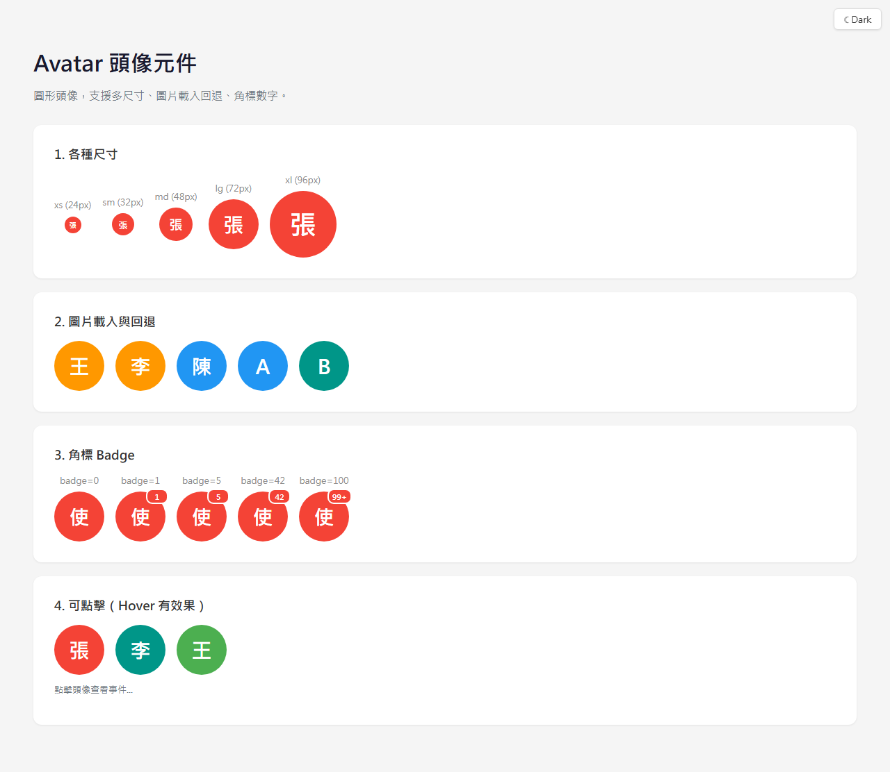
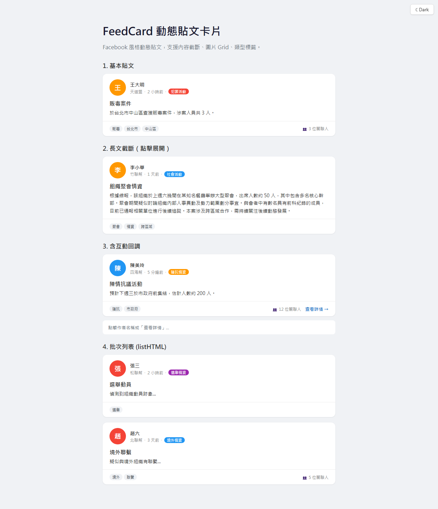
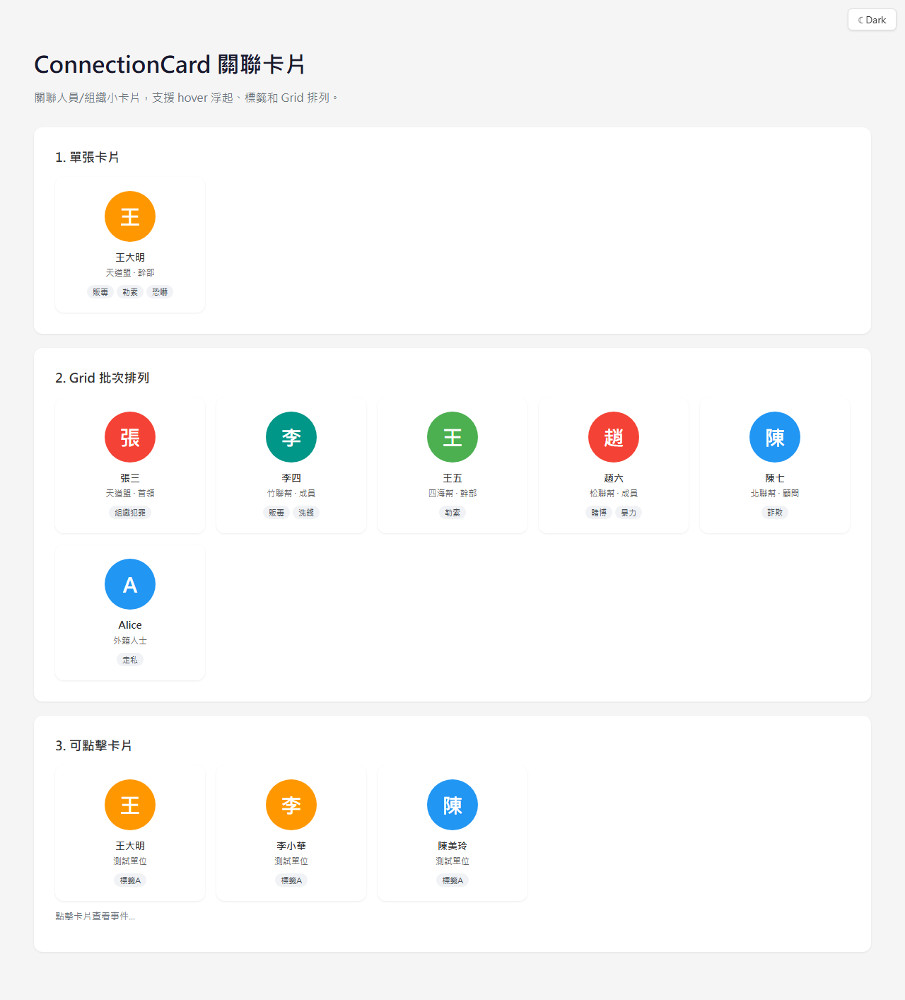
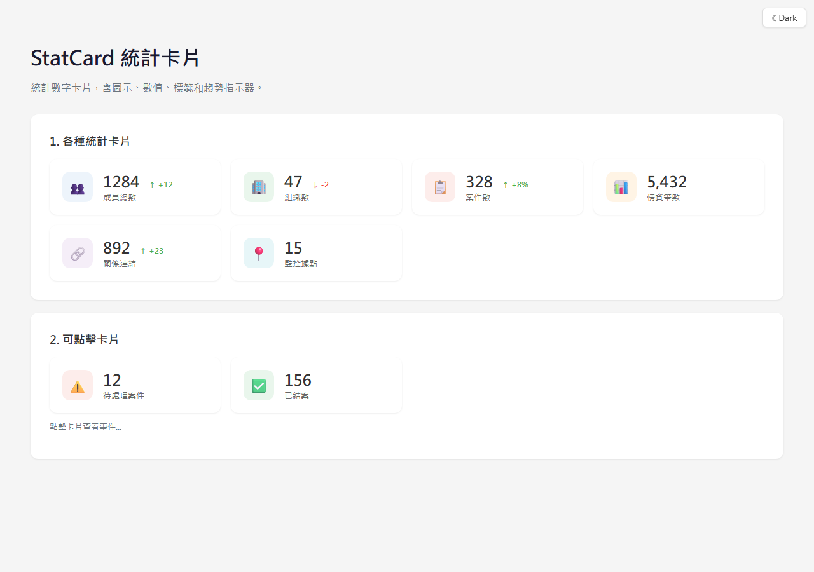
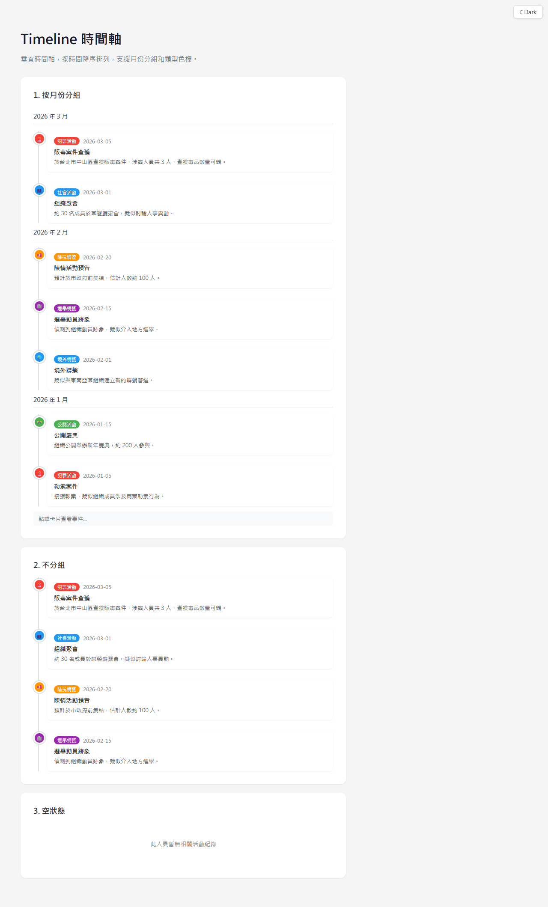

# Bricks4Agent 使用手冊

> 本手冊適用於專案經理、設計師、管理者等非技術背景的讀者。
> 這裡不會出現程式碼，只用白話文說明每個功能長什麼樣、能做什麼事。

---

## 目錄

1. [這是什麼？](#1-這是什麼)
2. [功能總覽](#2-功能總覽)
3. [表單功能 — 讓使用者輸入資料](#3-表單功能--讓使用者輸入資料)
4. [資料展示功能 — 把資料呈現出來](#4-資料展示功能--把資料呈現出來)
5. [圖表與視覺化 — 把數字變成圖](#5-圖表與視覺化--把數字變成圖)
6. [社群功能 — 社群類的介面元素](#6-社群功能--社群類的介面元素)
7. [智慧聯動與自動化](#7-智慧聯動與自動化)
8. [外觀主題切換](#8-外觀主題切換)
9. [頁面自動生成](#9-頁面自動生成)
10. [SPA 生成器](#10-spa-生成器)
11. [完整功能清單](#11-完整功能清單)
12. [常見問題 FAQ](#12-常見問題-faq)

---

## 1. 這是什麼？

把 Bricks4Agent 想像成一個**網頁積木盒**。

蓋一棟房子，你不需要自己燒磚頭，你可以直接用現成的磚塊、窗框、門板來組裝。Bricks4Agent 就是這樣的概念：裡面有 **80 種可直接使用的前端介面元件**，工程師可以直接拿來組合，快速打造出各種網頁應用程式，不需要從零開始；另外還有 6 個支援工程整合的綁定與服務模組，讓整體開發更快。

**對你來說，這代表什麼？**

- 開發時程大幅縮短：許多常見功能不用重新開發
- 品質一致：所有專案用同一套元件，操作體驗統一
- 溝通更順暢：你可以直接指著這份手冊告訴工程師「我要這個功能」

---

## 2. 功能總覽

整個 Bricks4Agent 的功能可以分成八大類：

| 類別 | 說明 | 元件數量 |
|------|------|----------|
| 表單功能 | 讓使用者輸入各種資料 | 12 種 |
| 通用功能 | 按鈕、對話框、通知等常見互動元素 | 18 種 |
| 版面配置 | 頁面的骨架與排版 | 10 種 |
| 進階輸入 | 台灣地址、組織層級、日期時間等特殊複合輸入 | 10 種 |
| 圖表與視覺化 | 長條圖、折線圖、組織圖、地圖、畫板等資料圖表 | 18 種 |
| 社群功能 | 頭像、動態卡片、連線卡片、時間軸等 | 5 種 |
| 內容編輯 | 富文字編輯器 | 1 種 |
| 地理資料 | 區域地圖展示 | 1 種 |

除了元件本身，還有三大特色能力：

- **智慧聯動** — 元件之間會自動連動，例如選了縣市就自動帶出鄉鎮
- **主題切換** — 淺色、深色兩種外觀，一鍵切換
- **自動生成** — 只要定義欄位，系統就能自動產出完整頁面

前面章節會先介紹最常用的功能；如果你要看完整對照表，請直接跳到第 11 節。

---

## 3. 表單功能 — 讓使用者輸入資料

表單是所有應用程式最基礎的部分。使用者要填寫資料、送出申請、登錄資訊，都需要表單元件。

### 文字輸入框

讓使用者輸入一段文字，例如姓名、地址、備註等。可以設定字數上限，也可以設為必填。

### 數字輸入框

專門用來輸入數字的欄位，例如年齡、金額、數量。可以設定最小值和最大值，避免使用者輸入不合理的數字。

### 日期選擇器

點一下就會跳出日曆，直接點選日期即可。特別支援**民國年**顯示，符合國內公務系統的習慣。

### 時間選擇器

選擇時、分，適合預約系統、排班表等需要指定時間的場景。

### 下拉選單

從一份清單中選擇一個選項。當選項很多的時候，可以直接**打字搜尋**，快速找到想要的項目。

### 多選下拉

和下拉選單類似，但可以**同時選擇多個**選項。選中的項目會以小標籤的形式顯示出來。

### 核取方塊

就是打勾的方框。適合用在「同意條款」、「訂閱電子報」等需要勾選確認的地方。可以單獨使用，也可以多個一起用。

### 單選按鈕

多個選項中只能選一個，例如性別、付款方式。和核取方塊的差別是：核取方塊可以多選，單選按鈕只能選一個。

### 搜尋表單

把多個條件組合在一起的搜尋區塊。使用者可以同時設定多個篩選條件（例如日期範圍 + 狀態 + 關鍵字），一次搜尋出想要的結果。

### 批次上傳

可以一次選擇並上傳多個檔案。會顯示上傳進度，讓使用者知道目前的狀況。

### 表單欄位

這是所有表單元件共用的外框，會自動處理欄位標題、必填標記、錯誤提示等細節，讓每個欄位看起來整齊一致。

---

## 4. 資料展示功能 — 把資料呈現出來

資料輸入之後，還需要有好的方式呈現出來。這一節涵蓋按鈕、導航、面板、表格等常用的展示與互動元件。

### 按鈕系列

按鈕是使用者和系統互動最直覺的方式。我們提供了多種按鈕，適用於不同情境：

- **基本按鈕** — 最常見的操作按鈕，有不同顏色區分重要程度

- **操作按鈕** — 帶有圖示的功能按鈕，例如新增、編輯、刪除

- **登入/登出按鈕** — 專用於身分驗證的按鈕

- **下載按鈕** — 一鍵下載檔案

- **上傳按鈕** — 選擇檔案並上傳

- **按鈕群組** — 把多個相關按鈕排在一起

### 顏色選擇器

讓使用者挑選顏色，可以用在主題設定、標籤分類等需要選色的功能。

### 對話框

彈出一個小視窗，用來確認操作、顯示重要訊息，或是請使用者做決定。例如「確定要刪除嗎？」

### 通知訊息

在畫面角落彈出一則訊息，告訴使用者操作結果。例如「儲存成功」或「發生錯誤」，幾秒後會自動消失。

### 載入動畫

當系統正在處理資料時，畫面上會顯示一個轉圈動畫，讓使用者知道系統還在運作中，請稍候。

### 分頁

當資料很多的時候，把它分成好幾頁顯示。使用者可以點「上一頁」「下一頁」或直接跳到特定頁數。

### 麵包屑導航

顯示使用者目前在網站中的位置，像是「首頁 > 員工管理 > 新增員工」。可以點擊任何一層快速跳回去。

### 樹狀列表

把有階層關係的資料用樹狀結構展示，例如部門組織、資料夾結構。可以展開、收合各個節點。

### 照片卡片

以卡片形式展示一張照片搭配標題和簡短說明，適合相簿、商品目錄等場景。

### 功能卡片

用圖示加標題的方式呈現一個功能入口，使用者點了就能進入對應的功能頁面。

### 圖片檢視器

點擊圖片後放大顯示，可以縮放、平移，方便看清楚圖片細節。

### 面板

面板是頁面上用來裝內容的容器，我們提供了 8 種不同用途的面板：

| 面板類型 | 用途 |
|----------|------|
| 基本面板 | 最簡單的內容區塊 |
| 卡片面板 | 有邊框和陰影的卡片 |
| 可摺疊面板 | 可以展開/收合的區塊 |
| 彈出視窗 | 在畫面中央彈出的對話視窗 |
| 抽屜面板 | 從畫面側邊滑出的面板 |
| 焦點面板 | 強調重要內容的面板 |
| 吐司通知 | 角落彈出的簡短通知 |
| 工作流程面板 | 展示步驟流程的面板 |

### 資料表格

用表格的方式展示大量資料。內建自動排序（點欄位標題）、篩選、分頁功能，使用者不需要額外操作就能快速找到想要的資料。

### 側邊選單

在頁面左側或右側的導航選單，可以展開/收合。適合功能項目較多的系統。

### 標籤頁

把不同類別的內容放在不同的分頁中，使用者點擊標籤就能切換。例如「基本資料」「聯絡方式」「工作經歷」。

### 功能選單

以圖示加文字的方式呈現多個功能入口，像手機桌面的 App 圖示排列。

### 表單排版

控制表單欄位的排列方式，讓多個欄位整齊地排成一行或多行。

### 資訊面板

專門用來展示唯讀資訊的面板，例如個人資料檢視頁面，只看不能改。

### 工作流程面板

用步驟條的方式展示流程進度，讓使用者知道目前在哪一步、還有幾步要走。

### 進階複合輸入

這些是針對特定情境設計的複合元件，把多個輸入欄位組合在一起：

| 元件 | 說明 |
|------|------|
| 台灣地址輸入 | 選縣市後自動帶出鄉鎮區，再填詳細地址。三個欄位自動連動 |
| 組織層級輸入 | 四層下拉選單自動聯動（例如：公司 → 處 → 科 → 組） |
| 電話列表 | 可以新增多筆電話號碼，每筆可標記類型（手機、市話等） |
| 人員資訊列表 | 填寫多位人員的基本資料 |
| 社群媒體帳號 | 輸入各種社群平台的帳號連結 |

---

## 5. 圖表與視覺化 — 把數字變成圖

數字看不出趨勢，但圖表可以。這些視覺化元件讓資料一目了然。

### 統計圖表

以下四種是最常見的統計圖表，適用於報表、儀表板等場景：

| 圖表類型 | 適合展示 |
|----------|----------|
| 長條圖 | 不同類別的數量比較（例如各部門人數） |
| 折線圖 | 數值隨時間的變化趨勢（例如月營收） |
| 圓餅圖 | 各部分佔總體的比例（例如預算分配） |
| 玫瑰圖 | 類似圓餅圖，但用面積而非角度區分大小 |

### 關係與結構圖表

這類圖表用來呈現人或事物之間的關係：

| 圖表類型 | 適合展示 |
|----------|----------|
| 組織圖 | 公司組織架構、上下級關係 |
| 關係圖 | 人員之間的社交網路、案件關聯 |
| 時間軸 | 事件的時間順序 |
| 桑基圖 | 資源或流量的流向（例如預算流向） |
| 旭日圖 | 多層級的比例關係 |
| 火焰圖 | 系統效能分析 |

### 互動式工具

| 工具 | 說明 |
|------|------|
| 地圖編輯 | 在地圖上標記、框選區域 |
| OSM 地圖編輯器 | 整合 OpenStreetMap 底圖的地理編輯器，含測量、座標、GeoJSON 匯入匯出 |
| 繪圖板 | 簡單的線上繪圖工具 |
| 網頁畫板 | 更進階的繪圖功能 |

---

## 6. 社群功能 — 社群類的介面元素

這些元件適合用在需要展示人員資訊、社交互動的系統中。

### 使用者頭像

顯示使用者的大頭貼照片。如果沒有上傳照片，會自動用姓名的首字母產生一個預設頭像。

### 動態卡片

類似社群媒體的貼文卡片，展示一則動態訊息，包含發文者、時間、內容和互動按鈕。

### 連線卡片

展示兩個人之間的關聯，例如「同事」「主管」「好友」等關係。

### 統計卡片

用數字搭配圖示的方式展示一個統計數據，例如「追蹤者 1,234 人」。

### 時間軸

按照時間順序排列事件，適合展示個人經歷、案件歷程等。

---

## 7. 智慧聯動與自動化

元件之間不是各自獨立的，它們可以互相連動，讓操作更順暢。

### 自動連動範例

- **地址聯動**：選了「台北市」，下一個下拉選單會自動變成台北市的行政區（中正區、大安區...）
- **組織聯動**：選了某個公司，會自動帶出該公司下的處、科、組

### 8 種內建自動動作

當某個操作發生時（例如選擇了某個值、按下儲存），系統可以自動執行以下動作：

| 動作 | 說明 |
|------|------|
| 清空 | 自動清空指定欄位的內容 |
| 設值 | 自動填入指定的值 |
| 顯示 | 自動顯示原本隱藏的欄位 |
| 隱藏 | 自動隱藏指定的欄位 |
| 唯讀 | 讓欄位變成不可編輯 |
| 必填 | 讓欄位變成必須填寫 |
| 重新載入 | 重新讀取資料 |
| 重新載入選項 | 重新讀取下拉選單的選項 |

### 實際應用場景

想像一個請假單：

1. 使用者選擇假別為「病假」
2. 系統自動**顯示**「診斷證明上傳」欄位
3. 系統自動將該欄位設為**必填**
4. 如果改選「事假」，上傳欄位自動**隱藏**

這些都不需要寫額外的程式，只要在設定中定義好規則即可。

---

## 8. 外觀主題切換

所有元件都支援兩種視覺主題：

| 主題 | 適合場景 |
|------|----------|
| 淺色主題 | 一般辦公環境，光線充足的場合 |
| 深色主題 | 夜間使用、長時間注視螢幕、監控中心 |

**切換方式**：只需要修改一個設定，整個應用程式的所有元件就會同時切換外觀。不需要逐一調整每個元件。

**一致性**：不管用了多少種元件，它們的配色、字體、間距都會自動保持一致。

---

## 9. 頁面自動生成

這是最能節省開發時間的功能。工程師只需要「定義」資料長什麼樣，系統就能自動產出完整的操作頁面。

### 運作方式

1. **定義資料欄位**：例如「員工」有姓名（文字）、生日（日期）、部門（下拉選單）...
2. **系統自動產出**：
   - 新增/編輯表單頁面
   - 資料列表頁面（含搜尋、排序、分頁）
   - 資料明細檢視頁面

### 支援 30 種欄位類型

從最基本的文字、數字，到日期、下拉選單、檔案上傳、地址輸入等，涵蓋了絕大多數的資料輸入需求。

### 效益

| 傳統開發 | 使用自動生成 |
|----------|-------------|
| 每個頁面手動撰寫 | 定義一次，自動產出 |
| 修改時要改多個檔案 | 修改定義後重新產出 |
| 容易出現不一致 | 所有頁面風格統一 |

---

## 10. SPA 生成器

SPA 生成器是一個**網頁介面的操作工具**，讓你可以透過圖形化操作來建立完整的網頁應用程式。

### 它能做什麼？

- 透過網頁介面設定專案基本資訊
- 定義需要哪些功能頁面
- 一鍵生成完整的應用程式，包含：
  - 前端頁面（使用者看到的畫面）
  - 後端 API（處理資料的伺服器程式）
  - 資料庫結構（儲存資料的地方）

### 適合誰用？

- 需要快速建立原型（Prototype）的團隊
- 想要統一技術架構的組織
- 希望減少重複開發工作的專案

---

## 11. 完整功能清單

以下是目前已整理完成的完整功能清單。前 80 項是會直接出現在畫面上的介面元件，最後再補上 6 個工程支援模組。

### 表單元件（12 種）

| 元件名稱 | 功能說明 |
|----------|----------|
| 文字輸入框（TextInput） | 輸入單行或多行文字 |
| 數字輸入框（NumberInput） | 輸入數字，可設定範圍 |
| 日期選擇器（DatePicker） | 點選日曆選日期，支援民國年 |
| 時間選擇器（TimePicker） | 選擇時、分 |
| 下拉選單（Dropdown） | 從清單中選一個，支援搜尋 |
| 多選下拉（MultiSelectDropdown） | 從清單中選多個 |
| 核取方塊（Checkbox） | 打勾選取，可多選 |
| 單選按鈕（Radio） | 多個選項只能選一個 |
| 開關（ToggleSwitch） | 開啟/關閉切換 |
| 搜尋表單（SearchForm） | 多條件組合搜尋 |
| 批次上傳（BatchUploader） | 同時上傳多個檔案 |
| 表單欄位（FormField） | 統一處理標題、必填、錯誤提示與欄位外框 |

### 通用元件（23 種）

| 元件名稱 | 功能說明 |
|----------|----------|
| 基本按鈕（BasicButton） | 一般操作按鈕 |
| 操作按鈕（ActionButton） | 帶圖示的功能按鈕 |
| 登入/登出按鈕（AuthButton） | 身分驗證相關按鈕 |
| 下載按鈕（DownloadButton） | 檔案下載按鈕 |
| 上傳按鈕（UploadButton） | 檔案上傳按鈕 |
| 按鈕群組（ButtonGroup） | 多個按鈕的組合排列 |
| 徽章（Badge） | 狀態指示、數字計數、圓點標記 |
| 標籤（Tag） | 分類標記，支援可關閉與可點擊模式 |
| 提示框（Tooltip） | 滑鼠懸停時顯示的提示資訊 |
| 進度條（Progress） | 線性與環形進度指示器 |
| 分隔線（Divider） | 水平/垂直分隔線，可帶文字標籤 |
| 顏色選擇器（ColorPicker） | 挑選顏色 |
| 對話框（SimpleDialog） | 彈出確認、提示或輸入視窗 |
| 通知訊息（Notification） | 角落彈出的提示 |
| 載入動畫（LoadingSpinner） | 讀取中的轉圈動畫 |
| 分頁（Pagination） | 資料分頁切換 |
| 麵包屑導航（Breadcrumb） | 顯示目前頁面層級位置 |
| 樹狀列表（TreeList） | 階層式資料展示 |
| 照片卡片（PhotoCard） | 圖文搭配的卡片 |
| 功能卡片（FeatureCard） | 功能入口卡片 |
| 圖片檢視器（ImageViewer） | 放大檢視圖片 |
| 排序按鈕（SortButton） | 表格欄位排序切換 |
| 編輯器工具列按鈕（EditorButton） | 富文字工具列按鈕元件 |

### 版面配置元件（10 種）

| 元件名稱 | 功能說明 |
|----------|----------|
| 面板（Panel 系列） | 內容容器，含基本、卡片、可摺疊、彈出、抽屜、焦點、吐司等樣式 |
| 資料表格（DataTable） | 含排序、搜尋、分頁的表格 |
| 側邊選單（SideMenu） | 可展開收合的導航選單 |
| 標籤頁（TabContainer） | 分頁式內容切換 |
| 表單排版列（FormRow） | 控制欄位排列方式 |
| 資訊面板（InfoPanel） | 唯讀資訊展示 |
| 功能選單（FunctionMenu） | 圖示式功能入口 |
| 工作流程面板（WorkflowPanel） | 步驟式流程展示 |
| 文件牆（DocumentWall） | 文件/卡片式資訊牆 |
| 照片牆（PhotoWall） | 照片或縮圖集合展示 |

### 進階輸入元件（10 種）

| 元件名稱 | 功能說明 |
|----------|----------|
| 台灣地址輸入（AddressInput） | 縣市、鄉鎮、地址三級聯動 |
| 地址清單輸入（AddressListInput） | 一次管理多筆地址 |
| 連動下拉（ChainedInput） | 多層級選單聯動 |
| 日期時間輸入（DateTimeInput） | 日期與時間整合輸入 |
| 通用清單輸入（ListInput） | 重複資料列輸入 |
| 組織層級輸入（OrganizationInput） | 多級組織選擇 |
| 人員資訊列表（PersonInfoList） | 多位人員資料填寫 |
| 電話列表（PhoneListInput） | 多筆電話號碼管理 |
| 社群媒體帳號（SocialMediaList） | 各平台帳號輸入 |
| 學生資訊輸入（StudentInput） | 學生身分與附加欄位輸入 |

### 圖表與視覺化元件（18 種）

| 元件名稱 | 功能說明 |
|----------|----------|
| 長條圖（BarChart） | 類別數量比較 |
| 折線圖（LineChart） | 時間趨勢變化 |
| 圓餅圖（PieChart） | 比例分配展示 |
| 玫瑰圖（RoseChart） | 面積式比例圖 |
| 組織圖（OrgChart） | 組織架構展示 |
| 階層圖（HierarchyChart） | 多層級結構展示 |
| 關係圖（RelationChart） | 人員/事物關聯 |
| 桑基圖（SankeyChart） | 流量/資源流向 |
| 旭日圖（SunburstChart） | 多層級比例 |
| 火焰圖（FlameChart） | 效能分析 |
| 圖表式時間軸（TimelineChart） | 事件時序排列 |
| 畫布地圖（CanvasMap） | 以 Canvas 呈現地圖資料 |
| 互動地圖（LeafletMap） | 可平移縮放的地圖 |
| 地圖編輯器（MapEditor） | 地圖標記與區域框選 |
| 地圖編輯器 V2（MapEditorV2） | 強化版地圖編輯 |
| OSM 地圖編輯器（OSMMapEditor） | OpenStreetMap 地理編輯（測量、座標、GeoJSON） |
| 繪圖板（DrawingBoard） | 線上繪圖工具 |
| 網頁畫板（WebPainter） | 更完整的畫筆與畫布操作 |

### 社群功能元件（5 種）

| 元件名稱 | 功能說明 |
|----------|----------|
| 使用者頭像（Avatar） | 大頭貼或首字母頭像 |
| 動態卡片（FeedCard） | 社群貼文樣式卡片 |
| 連線卡片（ConnectionCard） | 人際關係展示 |
| 統計卡片（StatCard） | 數據統計展示 |
| 時間軸（Timeline） | 個人經歷或事件歷程 |

### 內容編輯元件（1 種）

| 元件名稱 | 功能說明 |
|----------|----------|
| 富文字編輯器（WebTextEditor） | 文章、公告、說明內容編輯 |

### 地理資料元件（1 種）

| 元件名稱 | 功能說明 |
|----------|----------|
| 區域地圖（RegionMap） | 區域著色、資料對照與地理展示 |

### 工程支援模組（6 項）

這些模組通常不會單獨出現在畫面上，但會讓整體系統更容易整合、自動化與擴充。

| 模組名稱 | 功能說明 |
|----------|----------|
| ComponentBinder | 負責元件間資料綁定 |
| ComponentFactory | 依設定自動建立元件實例 |
| SecurityManager | 前端安全控制與輸入保護 |
| CompressionManager | 前端壓縮與資料縮減工具 |
| GeolocationService | 地理定位服務 |
| WeatherService | 天氣服務 |

---

## 12. 常見問題 FAQ

### Q1：Bricks4Agent 是用什麼技術做的？

前端使用原生 JavaScript（不依賴 React、Vue 等框架），後端使用 .NET 8，資料庫預設使用 SQLite。這代表部署簡單、效能好、不需要額外安裝框架。

### Q2：可以只用其中幾個元件嗎？

可以。每個元件都是獨立的，工程師可以根據需求挑選需要的元件使用，不需要全部引入。

### Q3：元件的外觀可以客製化嗎？

可以。所有元件的外觀都透過樣式設定檔控制，可以調整顏色、字體、間距等。切換淺色/深色主題也只需要改一個設定。

### Q4：支援手機版嗎？

元件設計時有考慮響應式排版（Responsive Design），在不同螢幕尺寸下會自動調整佈局。

### Q5：資料安全有保障嗎？

有。Bricks4Agent 內建多項安全機制：
- 密碼以高強度加密方式儲存
- 防範常見的網頁攻擊（XSS）
- 所有使用者輸入都會經過驗證
- API 端點有速率限制，防止惡意大量存取

### Q6：一個專案大約多久可以完成？

取決於功能複雜度，但使用 Bricks4Agent 和自動生成工具後，相比傳統開發方式，通常可以節省 50% 以上的開發時間。簡單的 CRUD 應用（新增、查詢、修改、刪除）可能只需要幾天就能完成基本功能。

### Q7：使用 Bricks4Agent 需要什麼前置準備？

工程師需要安裝：
- Node.js（前端開發環境）
- .NET 8 SDK（後端開發環境）

非技術人員不需要安裝任何東西，可以直接透過瀏覽器使用 SPA 生成器。

### Q8：已經開發中的專案可以導入這些元件嗎？

可以。Bricks4Agent 中的元件可以單獨引入到現有專案中使用，不會影響原本的程式碼。

### Q9：怎麼決定一個功能該用哪個元件？

參考本手冊第 11 節的完整功能清單，找到最接近你需求的元件，然後告訴工程師你想用哪一個。如果不確定，可以把需求描述出來，工程師會幫你選擇最適合的元件。

### Q10：有沒有元件的互動展示可以看？

可以透過 SPA 生成器的網頁介面來瀏覽和試用各個元件。請聯繫開發團隊取得存取方式。

---

> 最後更新：2026 年 3 月
