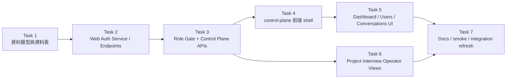

# Broker Control Plane Console Phase 1 Implementation Plan

> **For agentic workers:** REQUIRED SUB-SKILL: Use superpowers:subagent-driven-development (recommended) or superpowers:executing-plans to implement this plan task-by-task. Steps use checkbox (`- [ ]`) syntax for tracking.

**Goal:** 將現有 `line-admin` 升級為 broker control plane console 的第一批可用版本，交付 web 註冊/登入、角色化 console shell、dashboard、users/conversations、以及 project interview operator 視角。

**Architecture:** 採演化式升級，不重寫前端框架。後端新增 `web-auth` 與 `control-plane` API，保留 `local-admin` 作為 localhost bootstrap 與高權限 fallback；前端新增 `control-plane.html` 與模組化 JS shell，逐步吸收 `line-admin` 的既有能力。資料真相仍由 broker 擁有，project interview / memory / artifact 等狀態直接從 broker 文件與 DB projection 讀取。

**Tech Stack:** ASP.NET Core 8 Minimal API、BrokerDb(SQLite)、vanilla JS ES modules、既有 `line-admin.html` / `LocalAdminAuthService` / `HighLevelCoordinator` / xUnit / Vitest / Playwright smoke

---

## 範圍切分

這份計劃只做 **Phase 1 可落地切片**，不一次展開整份 spec 的所有子系統。

本計劃要完成：

- `control-plane.html` 基礎 shell
- web 使用者註冊 / 登入 / 登出 / me
- pending-review 註冊審核
- role-based console gating（`admin` / `operator` / `reviewer` / `user`）
- dashboard summary
- users / conversations operator 視圖
- project interview list/detail/version DAG 的 read-only operator 視圖

本計劃暫不完成：

- LINE identity linking 完整流
- `user` workspace 全功能
- memory write/delete 控制
- artifact / browser / deployment 的全面改版
- end-user 專屬 artifact portal

---

## 依賴圖



---

## File Map

### Create

- `packages/csharp/broker-core/Models/WebConsoleUser.cs`
  - Web 使用者帳號、狀態、角色
- `packages/csharp/broker-core/Models/WebConsoleSession.cs`
  - web session cookie 對應的 session 記錄
- `packages/csharp/broker-core/Models/UserIdentityLink.cs`
  - 預留 web / line 綁定關係
- `packages/csharp/broker/Services/WebConsoleAuthService.cs`
  - web 註冊、登入、登出、session 驗證
- `packages/csharp/broker/Services/ControlPlaneAuthorizationService.cs`
  - 角色檢查與 endpoint gate
- `packages/csharp/broker/Services/ControlPlaneDashboardService.cs`
  - dashboard summary 與 queue/failure projection
- `packages/csharp/broker/Services/ControlPlaneProjectInterviewService.cs`
  - project interview list/detail/version DAG read model
- `packages/csharp/broker/Endpoints/WebAuthEndpoints.cs`
  - `/api/v1/web-auth/*`
- `packages/csharp/broker/Endpoints/ControlPlaneEndpoints.cs`
  - `/api/v1/control-plane/*`
- `packages/csharp/tests/integration/Api/WebAuthEndpointsTests.cs`
  - register/login/me/review/role gate 整合測試
- `packages/csharp/tests/integration/Api/ControlPlaneDashboardTests.cs`
  - dashboard、users、conversations、project interviews 讀取整合測試
- `packages/csharp/tests/unit/Services/WebConsoleAuthServiceTests.cs`
  - 帳號狀態與 session 驗證單元測試
- `packages/csharp/tests/unit/Services/ControlPlaneProjectInterviewServiceTests.cs`
  - project interview projection 單元測試
- `packages/csharp/broker/wwwroot/control-plane.html`
  - 新 console 入口頁
- `packages/csharp/broker/wwwroot/control-plane/styles.css`
  - shell 與 workspace 樣式
- `packages/csharp/broker/wwwroot/control-plane/app.js`
  - 入口、tab/router、boot sequence
- `packages/csharp/broker/wwwroot/control-plane/api.js`
  - request helper
- `packages/csharp/broker/wwwroot/control-plane/state.js`
  - 前端 state store
- `packages/csharp/broker/wwwroot/control-plane/auth.js`
  - login/register/me/logout UI
- `packages/csharp/broker/wwwroot/control-plane/dashboard.js`
  - dashboard render
- `packages/csharp/broker/wwwroot/control-plane/users.js`
  - users / review queue / conversations render
- `packages/csharp/broker/wwwroot/control-plane/project-interviews.js`
  - project interview list/detail/version render
- `packages/javascript/browser/__tests__/control-plane/DashboardShell.test.js`
  - dashboard / auth shell 渲染 smoke

### Modify

- `packages/csharp/broker-core/Data/BrokerDbInitializer.cs`
  - 建立新資料表
- `packages/csharp/broker/Program.cs`
  - 註冊新 services / endpoints
- `packages/csharp/broker/Endpoints/LocalAdminEndpoints.cs`
  - 補 localhost bootstrap to approve/review web users 或 alias
- `packages/csharp/broker/wwwroot/line-admin.html`
  - 加入導向新 console 的入口提示或 alias
- `packages/csharp/tests/integration/Fixtures/BrokerFixture.cs`
  - 補 web-auth / control-plane helper

### Reuse Without Structural Change

- `packages/csharp/broker/Services/LocalAdminAuthService.cs`
  - 保留 localhost bootstrap admin
- `packages/csharp/broker/Services/HighLevelCoordinator.cs`
  - 重用 line users / permissions / project interview 狀態來源
- `packages/csharp/broker/Services/ProjectInterviewStateService.cs`
  - project interview 真相來源
- `packages/csharp/broker/wwwroot/line-admin.html`
  - 作為 visual/layout 參考與 API 行為來源

---

## Task 1: 建立 Web Auth 資料模型與資料表

**Files:**
- Create: `packages/csharp/broker-core/Models/WebConsoleUser.cs`
- Create: `packages/csharp/broker-core/Models/WebConsoleSession.cs`
- Create: `packages/csharp/broker-core/Models/UserIdentityLink.cs`
- Modify: `packages/csharp/broker-core/Data/BrokerDbInitializer.cs`
- Test: `packages/csharp/tests/unit/Services/WebConsoleAuthServiceTests.cs`

- [ ] **Step 1: 先寫失敗中的模型/表結構測試**

```csharp
[Fact]
public void WebConsoleUser_DefaultStatus_IsPendingReview()
{
    var user = new WebConsoleUser
    {
        WebUserId = "wu_001",
        Username = "alice"
    };

    user.Status.Should().Be("pending_review");
    user.Role.Should().Be("user");
}
```

- [ ] **Step 2: 跑單元測試，確認因型別不存在而失敗**

Run:

```powershell
dotnet test packages/csharp/tests/unit/Unit.Tests.csproj -v minimal --filter WebConsoleUser_DefaultStatus_IsPendingReview --disable-build-servers -p:UseSharedCompilation=false
```

Expected:

- FAIL
- `WebConsoleUser` type not found

- [ ] **Step 3: 建立 `WebConsoleUser.cs`**

```csharp
namespace BrokerCore.Models;

public class WebConsoleUser
{
    public string WebUserId { get; set; } = string.Empty;
    public string UserId { get; set; } = string.Empty;
    public string Username { get; set; } = string.Empty;
    public string PasswordSalt { get; set; } = string.Empty;
    public string PasswordHash { get; set; } = string.Empty;
    public int HashIterations { get; set; } = 120000;
    public string Status { get; set; } = "pending_review";
    public string Role { get; set; } = "user";
    public DateTime CreatedAt { get; set; } = DateTime.UtcNow;
    public DateTime UpdatedAt { get; set; } = DateTime.UtcNow;
    public DateTime? ApprovedAt { get; set; }
    public string? ApprovedBy { get; set; }
}
```

- [ ] **Step 4: 建立 `WebConsoleSession.cs` 與 `UserIdentityLink.cs`**

```csharp
namespace BrokerCore.Models;

public class WebConsoleSession
{
    public string SessionId { get; set; } = string.Empty;
    public string WebUserId { get; set; } = string.Empty;
    public string TokenHash { get; set; } = string.Empty;
    public DateTime ExpiresAt { get; set; }
    public DateTime CreatedAt { get; set; } = DateTime.UtcNow;
    public DateTime LastSeenAt { get; set; } = DateTime.UtcNow;
    public DateTime? RevokedAt { get; set; }
}

public class UserIdentityLink
{
    public string LinkId { get; set; } = string.Empty;
    public string UserId { get; set; } = string.Empty;
    public string IdentityType { get; set; } = string.Empty;
    public string ExternalId { get; set; } = string.Empty;
    public string Status { get; set; } = "active";
    public DateTime LinkedAt { get; set; } = DateTime.UtcNow;
}
```

- [ ] **Step 5: 在 `BrokerDbInitializer.cs` 建表**

```csharp
db.Execute(@"
CREATE TABLE IF NOT EXISTS web_console_users (
    web_user_id TEXT PRIMARY KEY,
    user_id TEXT NOT NULL,
    username TEXT NOT NULL UNIQUE,
    password_salt TEXT NOT NULL,
    password_hash TEXT NOT NULL,
    hash_iterations INTEGER NOT NULL,
    status TEXT NOT NULL,
    role TEXT NOT NULL,
    created_at TEXT NOT NULL,
    updated_at TEXT NOT NULL,
    approved_at TEXT NULL,
    approved_by TEXT NULL
);");

db.Execute(@"
CREATE TABLE IF NOT EXISTS web_console_sessions (
    session_id TEXT PRIMARY KEY,
    web_user_id TEXT NOT NULL,
    token_hash TEXT NOT NULL,
    expires_at TEXT NOT NULL,
    created_at TEXT NOT NULL,
    last_seen_at TEXT NOT NULL,
    revoked_at TEXT NULL
);");

db.Execute(@"
CREATE TABLE IF NOT EXISTS user_identity_links (
    link_id TEXT PRIMARY KEY,
    user_id TEXT NOT NULL,
    identity_type TEXT NOT NULL,
    external_id TEXT NOT NULL,
    status TEXT NOT NULL,
    linked_at TEXT NOT NULL
);");
```

- [ ] **Step 6: 再跑單元測試，確認通過**

Run:

```powershell
dotnet test packages/csharp/tests/unit/Unit.Tests.csproj -v minimal --filter WebConsoleUser_DefaultStatus_IsPendingReview --disable-build-servers -p:UseSharedCompilation=false
```

Expected:

- PASS

- [ ] **Step 7: Commit**

```powershell
git add packages/csharp/broker-core/Models/WebConsoleUser.cs packages/csharp/broker-core/Models/WebConsoleSession.cs packages/csharp/broker-core/Models/UserIdentityLink.cs packages/csharp/broker-core/Data/BrokerDbInitializer.cs packages/csharp/tests/unit/Services/WebConsoleAuthServiceTests.cs
git commit -m "feat: add web console auth models"
```

---

## Task 2: 實作 Web 註冊/登入/登出/我自己 與待審核狀態

**Files:**
- Create: `packages/csharp/broker/Services/WebConsoleAuthService.cs`
- Create: `packages/csharp/broker/Endpoints/WebAuthEndpoints.cs`
- Modify: `packages/csharp/broker/Program.cs`
- Test: `packages/csharp/tests/unit/Services/WebConsoleAuthServiceTests.cs`
- Test: `packages/csharp/tests/integration/Api/WebAuthEndpointsTests.cs`

- [ ] **Step 1: 先寫 `register -> pending_review` 的整合測試**

```csharp
[Fact]
public async Task Register_CreatesPendingReviewUser()
{
    var response = await _fixture.Client.PostAsJsonAsync("/api/v1/web-auth/register", new
    {
        username = "alice",
        password = "Password123!"
    });

    response.StatusCode.Should().Be(HttpStatusCode.OK);
    var json = JsonDocument.Parse(await response.Content.ReadAsStringAsync());
    json.RootElement.GetProperty("data").GetProperty("status").GetString().Should().Be("pending_review");
}
```

- [ ] **Step 2: 跑測試，確認因 endpoint 不存在而失敗**

Run:

```powershell
dotnet test packages/csharp/tests/integration/Integration.Tests.csproj -v minimal --filter Register_CreatesPendingReviewUser --disable-build-servers -p:UseSharedCompilation=false
```

Expected:

- FAIL
- 404 或 endpoint missing

- [ ] **Step 3: 建立 `WebConsoleAuthService.cs`**

```csharp
public sealed class WebConsoleAuthService
{
    public const string SessionCookieName = "b4a_web_console";

    private readonly BrokerDb _db;

    public WebConsoleAuthService(BrokerDb db)
    {
        _db = db;
    }

    public WebConsoleUser Register(string username, string password)
    {
        // validate unique username, create user_id/user row, hash password, pending_review
    }

    public WebConsoleLoginResult Login(HttpContext context, string username, string password)
    {
        // deny if not approved, issue cookie if active
    }

    public void Logout(HttpContext context) { }

    public WebConsoleUser? GetCurrentUser(HttpContext context) { return null; }
}
```

- [ ] **Step 4: 補最小可用實作**

```csharp
public WebConsoleUser Register(string username, string password)
{
    var existing = _db.Query<WebConsoleUser>(
        "SELECT * FROM web_console_users WHERE username = @username",
        new { username }).FirstOrDefault();
    if (existing != null)
        throw new InvalidOperationException("Username already exists.");

    var salt = RandomNumberGenerator.GetBytes(16);
    var user = new WebConsoleUser
    {
        WebUserId = $"wu_{Guid.NewGuid():N}",
        UserId = $"user_web_{Guid.NewGuid():N}",
        Username = username.Trim(),
        PasswordSalt = Convert.ToBase64String(salt),
        PasswordHash = Convert.ToBase64String(HashPassword(password, salt, 120000)),
        HashIterations = 120000,
        Status = "pending_review",
        Role = "user",
        CreatedAt = DateTime.UtcNow,
        UpdatedAt = DateTime.UtcNow
    };
    _db.Insert(user);
    return user;
}
```

- [ ] **Step 5: 建立 `WebAuthEndpoints.cs`**

```csharp
public static class WebAuthEndpoints
{
    public static void Map(RouteGroupBuilder group)
    {
        var web = group.MapGroup("/web-auth");

        web.MapPost("/register", (HttpContext ctx, WebConsoleAuthService auth) =>
        {
            var body = RequestBodyHelper.GetBody(ctx);
            if (!RequestBodyHelper.TryGetRequiredFields(body, new[] { "username", "password" }, out var values, out var error))
                return error!;

            var user = auth.Register(values["username"], values["password"]);
            return Results.Ok(ApiResponseHelper.Success(new
            {
                web_user_id = user.WebUserId,
                user_id = user.UserId,
                username = user.Username,
                status = user.Status
            }));
        });
    }
}
```

- [ ] **Step 6: 在 `Program.cs` 註冊 service 與 endpoints**

```csharp
builder.Services.AddSingleton<WebConsoleAuthService>();
builder.Services.AddSingleton<ControlPlaneAuthorizationService>();
builder.Services.AddSingleton<ControlPlaneDashboardService>();
builder.Services.AddSingleton<ControlPlaneProjectInterviewService>();

// later, after var api = app.MapGroup("/api/v1");
WebAuthEndpoints.Map(api);
ControlPlaneEndpoints.Map(api);
```

- [ ] **Step 7: 補 login / me / logout 測試與實作**

```csharp
[Fact]
public async Task ApprovedUser_CanLogin_AndReadMe()
{
    // register
    // approve through admin endpoint
    // login
    // GET /api/v1/web-auth/me
}
```

- [ ] **Step 8: 跑 unit + integration**

Run:

```powershell
dotnet test packages/csharp/tests/unit/Unit.Tests.csproj -v minimal --filter WebConsoleAuthService --disable-build-servers -p:UseSharedCompilation=false
dotnet test packages/csharp/tests/integration/Integration.Tests.csproj -v minimal --filter WebAuthEndpointsTests --disable-build-servers -p:UseSharedCompilation=false
```

Expected:

- PASS

- [ ] **Step 9: Commit**

```powershell
git add packages/csharp/broker/Services/WebConsoleAuthService.cs packages/csharp/broker/Endpoints/WebAuthEndpoints.cs packages/csharp/broker/Program.cs packages/csharp/tests/unit/Services/WebConsoleAuthServiceTests.cs packages/csharp/tests/integration/Api/WebAuthEndpointsTests.cs
git commit -m "feat: add web console registration and login"
```

---

## Task 3: 加入角色檢查與 Control Plane API

**Files:**
- Create: `packages/csharp/broker/Services/ControlPlaneAuthorizationService.cs`
- Create: `packages/csharp/broker/Services/ControlPlaneDashboardService.cs`
- Create: `packages/csharp/broker/Services/ControlPlaneProjectInterviewService.cs`
- Create: `packages/csharp/broker/Endpoints/ControlPlaneEndpoints.cs`
- Modify: `packages/csharp/broker/Endpoints/LocalAdminEndpoints.cs`
- Test: `packages/csharp/tests/integration/Api/ControlPlaneDashboardTests.cs`

- [ ] **Step 1: 先寫角色 gate 測試**

```csharp
[Fact]
public async Task User_CannotRead_ControlPlaneUsers()
{
    var client = await _fixture.CreateApprovedWebClientAsync(role: "user");
    var response = await client.GetAsync("/api/v1/control-plane/users");
    response.StatusCode.Should().Be(HttpStatusCode.Forbidden);
}
```

- [ ] **Step 2: 寫 `ControlPlaneAuthorizationService.cs`**

```csharp
public sealed class ControlPlaneAuthorizationService
{
    public bool TryRequireRole(HttpContext context, WebConsoleAuthService auth, string minimumRole, out WebConsoleUser user, out IResult denied)
    {
        user = null!;
        denied = null!;

        user = auth.GetCurrentUser(context)!;
        if (user == null)
        {
            denied = Results.Json(ApiResponseHelper.Error("Web login required.", 401), statusCode: 401);
            return false;
        }

        if (!HasSufficientRole(user.Role, minimumRole))
        {
            denied = Results.Json(ApiResponseHelper.Error("Forbidden.", 403), statusCode: 403);
            return false;
        }

        return true;
    }
}
```

- [ ] **Step 3: 寫 `ControlPlaneDashboardService.cs`**

```csharp
public sealed class ControlPlaneDashboardService
{
    private readonly BrokerDb _db;
    private readonly HighLevelCoordinator _coordinator;
    private readonly HighLevelWorkflowAdminService _workflow;

    public object GetSummary()
    {
        return new
        {
            active_users = _coordinator.ListLineUsers().Count,
            active_conversations = _db.Query<int>("SELECT COUNT(DISTINCT key) FROM shared_context_entries WHERE key LIKE 'convlog:%'").FirstOrDefault(),
            pending_web_registrations = _db.Query<int>("SELECT COUNT(*) FROM web_console_users WHERE status = 'pending_review'").FirstOrDefault(),
            recent_execution_intents = _workflow.GetSnapshot(10).ExecutionIntents.Count
        };
    }
}
```

- [ ] **Step 4: 寫 `ControlPlaneProjectInterviewService.cs`**

```csharp
public sealed class ControlPlaneProjectInterviewService
{
    private readonly BrokerDb _db;

    public IReadOnlyList<object> ListSessions(int limit)
    {
        return _db.Query<SharedContextEntry>(
            "SELECT * FROM shared_context_entries WHERE document_id LIKE 'hlm.project-interview.task:%' ORDER BY updated_at DESC LIMIT @limit",
            new { limit })
            .Select(x => new { x.DocumentId, x.Channel, x.UserId, x.UpdatedAt })
            .Cast<object>()
            .ToList();
    }
}
```

- [ ] **Step 5: 寫 `ControlPlaneEndpoints.cs`**

```csharp
public static class ControlPlaneEndpoints
{
    public static void Map(RouteGroupBuilder group)
    {
        var cp = group.MapGroup("/control-plane");

        cp.MapGet("/dashboard/summary", (HttpContext ctx, WebConsoleAuthService auth, ControlPlaneAuthorizationService gate, ControlPlaneDashboardService dashboard) =>
        {
            if (!gate.TryRequireRole(ctx, auth, "operator", out _, out var denied))
                return denied;
            return Results.Ok(ApiResponseHelper.Success(dashboard.GetSummary()));
        });
    }
}
```

- [ ] **Step 6: 補 `/users`、`/conversations`、`/project-interviews` read-only endpoints**

```csharp
cp.MapGet("/users", ...);
cp.MapGet("/conversations", ...);
cp.MapGet("/conversations/{userId}", ...);
cp.MapGet("/project-interviews", ...);
cp.MapGet("/project-interviews/{channel}/{userId}", ...);
cp.MapGet("/project-interviews/{channel}/{userId}/versions/{version}", ...);
```

- [ ] **Step 7: 跑 integration 測試**

Run:

```powershell
dotnet test packages/csharp/tests/integration/Integration.Tests.csproj -v minimal --filter ControlPlaneDashboardTests --disable-build-servers -p:UseSharedCompilation=false
```

Expected:

- PASS

- [ ] **Step 8: Commit**

```powershell
git add packages/csharp/broker/Services/ControlPlaneAuthorizationService.cs packages/csharp/broker/Services/ControlPlaneDashboardService.cs packages/csharp/broker/Services/ControlPlaneProjectInterviewService.cs packages/csharp/broker/Endpoints/ControlPlaneEndpoints.cs packages/csharp/broker/Endpoints/LocalAdminEndpoints.cs packages/csharp/tests/integration/Api/ControlPlaneDashboardTests.cs
git commit -m "feat: add control plane role-gated read APIs"
```

---

## Task 4: 建立 `control-plane.html` 與 auth shell

**Files:**
- Create: `packages/csharp/broker/wwwroot/control-plane.html`
- Create: `packages/csharp/broker/wwwroot/control-plane/styles.css`
- Create: `packages/csharp/broker/wwwroot/control-plane/app.js`
- Create: `packages/csharp/broker/wwwroot/control-plane/api.js`
- Create: `packages/csharp/broker/wwwroot/control-plane/state.js`
- Create: `packages/csharp/broker/wwwroot/control-plane/auth.js`
- Test: `packages/javascript/browser/__tests__/control-plane/DashboardShell.test.js`

- [ ] **Step 1: 先寫前端 smoke test**

```javascript
import { describe, expect, it } from "vitest";
import { createShell } from "../../../csharp/broker/wwwroot/control-plane/app.js";

describe("control-plane shell", () => {
  it("renders login view before authenticated boot", () => {
    const root = document.createElement("div");
    createShell(root, { authenticated: false });
    expect(root.textContent).toContain("登入");
    expect(root.textContent).toContain("註冊");
  });
});
```

- [ ] **Step 2: 跑 Vitest，確認失敗**

Run:

```powershell
npm.cmd --prefix packages/javascript/browser run test -- --run DashboardShell.test.js
```

Expected:

- FAIL
- module not found

- [ ] **Step 3: 建 `control-plane.html`**

```html
<!DOCTYPE html>
<html lang="zh-TW">
<head>
  <meta charset="UTF-8">
  <meta name="viewport" content="width=device-width, initial-scale=1.0">
  <title>B4A Control Plane</title>
  <link rel="stylesheet" href="/control-plane/styles.css">
</head>
<body>
  <div id="app"></div>
  <script type="module" src="/control-plane/app.js"></script>
</body>
</html>
```

- [ ] **Step 4: 建 `app.js` 最小 shell**

```javascript
import { renderAuthShell } from "./auth.js";

export function createShell(root, bootState) {
  root.innerHTML = "";
  if (!bootState?.authenticated) {
    renderAuthShell(root);
    return;
  }
  root.innerHTML = `<div class="cp-shell"><aside class="cp-nav"></aside><main class="cp-main"></main></div>`;
}

const root = document.getElementById("app");
if (root) createShell(root, { authenticated: false });
```

- [ ] **Step 5: 建 `auth.js`**

```javascript
export function renderAuthShell(root) {
  root.innerHTML = `
    <section class="auth-shell">
      <h1>Broker Control Plane</h1>
      <div class="auth-card">
        <h2>登入</h2>
        <button id="show-login">登入</button>
        <button id="show-register">註冊</button>
      </div>
    </section>
  `;
}
```

- [ ] **Step 6: 跑 Vitest，確認通過**

Run:

```powershell
npm.cmd --prefix packages/javascript/browser run test
```

Expected:

- 新增 shell test PASS

- [ ] **Step 7: Commit**

```powershell
git add packages/csharp/broker/wwwroot/control-plane.html packages/csharp/broker/wwwroot/control-plane/styles.css packages/csharp/broker/wwwroot/control-plane/app.js packages/csharp/broker/wwwroot/control-plane/api.js packages/csharp/broker/wwwroot/control-plane/state.js packages/csharp/broker/wwwroot/control-plane/auth.js packages/javascript/browser/__tests__/control-plane/DashboardShell.test.js
git commit -m "feat: add control plane frontend shell"
```

---

## Task 5: 搬移 Dashboard / Users / Conversations 到新 console

**Files:**
- Create: `packages/csharp/broker/wwwroot/control-plane/dashboard.js`
- Create: `packages/csharp/broker/wwwroot/control-plane/users.js`
- Modify: `packages/csharp/broker/wwwroot/control-plane/app.js`
- Modify: `packages/csharp/broker/wwwroot/control-plane/api.js`
- Modify: `packages/csharp/broker/wwwroot/control-plane/state.js`
- Modify: `packages/csharp/broker/wwwroot/line-admin.html`

- [ ] **Step 1: 先寫 dashboard render test**

```javascript
it("renders dashboard counters", () => {
  const root = document.createElement("div");
  renderDashboard(root, {
    active_users: 3,
    active_conversations: 5,
    pending_web_registrations: 2
  });
  expect(root.textContent).toContain("3");
  expect(root.textContent).toContain("5");
  expect(root.textContent).toContain("2");
});
```

- [ ] **Step 2: 建立 dashboard/users module**

```javascript
export function renderDashboard(root, summary) {
  root.innerHTML = `
    <section class="dashboard-grid">
      <div class="metric-card"><span>活躍使用者</span><strong>${summary.active_users ?? 0}</strong></div>
      <div class="metric-card"><span>進行中對話</span><strong>${summary.active_conversations ?? 0}</strong></div>
      <div class="metric-card"><span>待審核註冊</span><strong>${summary.pending_web_registrations ?? 0}</strong></div>
    </section>
  `;
}
```

- [ ] **Step 3: 用 `/api/v1/control-plane/dashboard/summary`、`/users`、`/conversations` 接資料**

```javascript
export async function loadDashboard(api) {
  const result = await api.get("/api/v1/control-plane/dashboard/summary");
  return result;
}
```

- [ ] **Step 4: 在 `line-admin.html` 加入口**

```html
<div class="notice">
  新版 Broker Control Plane Console：
  <a href="/control-plane.html">開啟 control-plane.html</a>
</div>
```

- [ ] **Step 5: 跑 browser tests + integration**

Run:

```powershell
npm.cmd --prefix packages/javascript/browser run test
dotnet test packages/csharp/tests/integration/Integration.Tests.csproj -v minimal --filter ControlPlaneDashboardTests --disable-build-servers -p:UseSharedCompilation=false
```

Expected:

- PASS

- [ ] **Step 6: Commit**

```powershell
git add packages/csharp/broker/wwwroot/control-plane/dashboard.js packages/csharp/broker/wwwroot/control-plane/users.js packages/csharp/broker/wwwroot/control-plane/app.js packages/csharp/broker/wwwroot/control-plane/api.js packages/csharp/broker/wwwroot/control-plane/state.js packages/csharp/broker/wwwroot/line-admin.html
git commit -m "feat: add dashboard and user workspace to control plane"
```

---

## Task 6: 加入 Project Interview Operator 視圖

**Files:**
- Create: `packages/csharp/broker/wwwroot/control-plane/project-interviews.js`
- Modify: `packages/csharp/broker/wwwroot/control-plane/app.js`
- Modify: `packages/csharp/broker/wwwroot/control-plane/styles.css`
- Test: `packages/csharp/tests/unit/Services/ControlPlaneProjectInterviewServiceTests.cs`
- Test: `packages/csharp/tests/integration/Api/ControlPlaneDashboardTests.cs`

- [ ] **Step 1: 先寫 project interview projection 單元測試**

```csharp
[Fact]
public async Task ListSessions_ReturnsLatestProjectInterviewDocuments()
{
    var service = new ControlPlaneProjectInterviewService(db);
    var items = service.ListSessions(20);
    items.Should().NotBeNull();
}
```

- [ ] **Step 2: 實作 `project-interviews.js`**

```javascript
export function renderProjectInterviewList(root, sessions) {
  root.innerHTML = sessions.map(item => `
    <button class="pi-row" data-channel="${item.channel}" data-user="${item.user_id}">
      <strong>${item.user_id}</strong>
      <span>${item.current_phase}</span>
    </button>
  `).join("");
}
```

- [ ] **Step 3: 補 detail 與 version inspector**

```javascript
export function renderProjectInterviewDetail(root, detail) {
  root.innerHTML = `
    <section class="pi-detail">
      <h2>${detail.user_id}</h2>
      <pre>${JSON.stringify(detail.session_state, null, 2)}</pre>
      <pre>${JSON.stringify(detail.assertions, null, 2)}</pre>
      <pre>${JSON.stringify(detail.versions, null, 2)}</pre>
    </section>
  `;
}
```

- [ ] **Step 4: 補整合測試**

```csharp
[Fact]
public async Task Operator_CanRead_ProjectInterviewDetail()
{
    await _fixture.CompleteProjectInterviewToReviewAsync();
    var client = await _fixture.CreateApprovedWebClientAsync(role: "operator");
    var response = await client.GetAsync("/api/v1/control-plane/project-interviews/line/line-project-user");
    response.StatusCode.Should().Be(HttpStatusCode.OK);
}
```

- [ ] **Step 5: 跑 unit + integration + browser tests**

Run:

```powershell
dotnet test packages/csharp/tests/unit/Unit.Tests.csproj -v minimal --filter ControlPlaneProjectInterviewServiceTests --disable-build-servers -p:UseSharedCompilation=false
dotnet test packages/csharp/tests/integration/Integration.Tests.csproj -v minimal --filter ProjectInterview --disable-build-servers -p:UseSharedCompilation=false
npm.cmd --prefix packages/javascript/browser run test
```

Expected:

- PASS

- [ ] **Step 6: Commit**

```powershell
git add packages/csharp/broker/wwwroot/control-plane/project-interviews.js packages/csharp/broker/wwwroot/control-plane/app.js packages/csharp/broker/wwwroot/control-plane/styles.css packages/csharp/tests/unit/Services/ControlPlaneProjectInterviewServiceTests.cs packages/csharp/tests/integration/Api/ControlPlaneDashboardTests.cs
git commit -m "feat: add project interview operator views"
```

---

## Task 7: 文件、Smoke 與收尾

**Files:**
- Modify: `docs/manuals/line-sidecar-runbook.md`
- Modify: `docs/manuals/line-sidecar-runbook.zh-TW.md`
- Modify: `docs/0329/09-frontend-and-ui.md`
- Modify: `docs/0329/01-broker.md`

- [ ] **Step 1: 更新 runbook 與分析文件**

```md
- new entry: `/control-plane.html`
- web registration / login exists
- operator dashboard exists
- project interview operator views exist
```

- [ ] **Step 2: 跑完整驗證**

Run:

```powershell
dotnet run --project packages/csharp/broker/verify/Broker.Verify.csproj --disable-build-servers
dotnet test packages/csharp/tests/unit/Unit.Tests.csproj -v minimal --disable-build-servers -p:UseSharedCompilation=false
dotnet test packages/csharp/tests/integration/Integration.Tests.csproj -v minimal --disable-build-servers -p:UseSharedCompilation=false
npm.cmd --prefix packages/javascript/browser run test
```

Expected:

- broker verify PASS
- unit PASS
- integration PASS
- browser tests PASS

- [ ] **Step 3: Commit**

```powershell
git add docs/manuals/line-sidecar-runbook.md docs/manuals/line-sidecar-runbook.zh-TW.md docs/0329/09-frontend-and-ui.md docs/0329/01-broker.md
git commit -m "docs: document control plane console phase 1"
```

---

## 風險與限制

### 1. 先不要把 `local-admin` 拔掉

`local-admin` 仍然是 localhost bootstrap 與高權限 fallback。  
在 `web-auth` 穩定前，不要直接移除它。

### 2. 第 1 版先做 role gate，不做細粒度 ACL

先用角色門檻控制頁面與 API。

不要在這一版就擴成：

- resource-level ACL
- field-level masking
- tenant isolation

### 3. project interview 先做 read-only operator 視圖

先把：

- session
- assertions
- versions
- DAG

看得見。

不要一開始就加入大量 operator write actions，不然風險太高。

---

## 覆蓋檢查

本計劃已覆蓋 spec 的第一批落地需求：

- web 註冊/登入
- 角色分層
- control plane shell
- dashboard
- users / conversations
- project interview 管理視圖

尚未納入此計劃、留給後續子計劃：

- LINE identity linking 完整流
- user workspace 全功能
- artifact / browser / deployment 的統一新版工作台
- memory 的 write/delete 控制
- 更完整的 reviewer flow

這些應在本計劃完成後，依成熟度拆成第二批與第三批子計劃。
