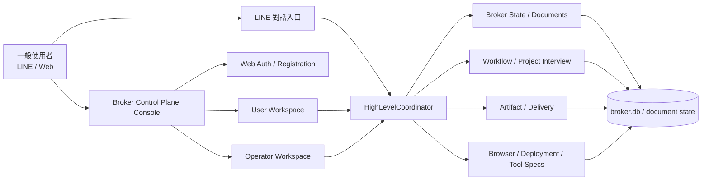
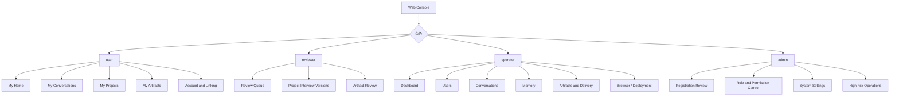
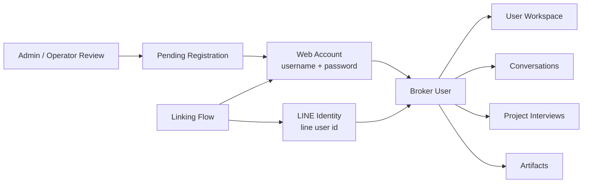
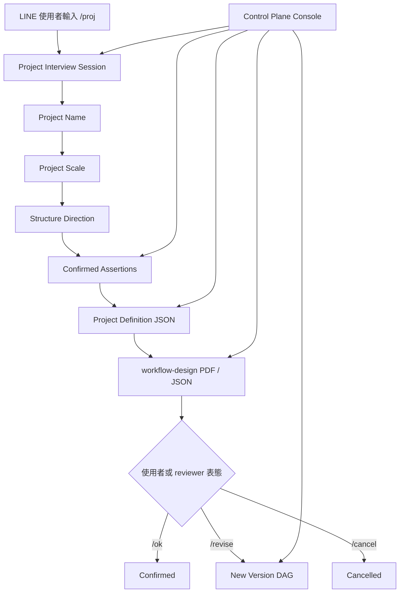
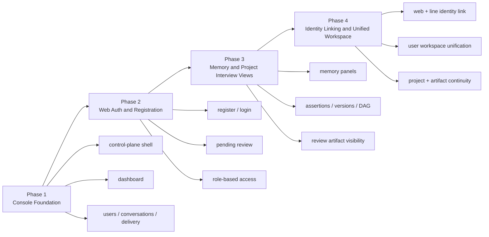

# Broker Control Plane Console 設計

Date: 2026-03-31  
Status: draft for review

## 目的

將現有以 [line-admin.html](/d:/Bricks4Agent/packages/csharp/broker/wwwroot/line-admin.html) 為核心的本機管理頁，升級為真正的 **Broker Control Plane Console**。

這個 console 不再只是 LINE sidecar 的操作面，而是整個 broker 的：

- 身分與註冊入口
- 使用者管理面
- 對話與任務工作台
- 記憶與狀態觀測面
- Artifact / Delivery / Review 控制面
- Browser / Deployment / Tool / Alert 操作面

LINE 仍然是一般使用者的重要入口，但完整功能以 **Web** 提供。

---

## 問題定義

現有 `line-admin.html` 已經有可用雛型，但仍有明顯限制：

- 結構上仍是 LINE operator 頁，而不是完整 control plane
- 身分系統只有 localhost local-admin，沒有正式 web 使用者註冊/登入
- 對一般使用者與 operator/admin 沒有明確角色分層
- 對話、workflow、memory、artifact、delivery、browser、deployment 仍是分散視圖，缺乏同一使用者/任務的整體工作台
- `/proj` 與 project interview 已上線，但沒有對應的 operator-grade 管理與審查介面
- 記憶目前可存在 broker 中，但缺少完整的可視化、稽核與控制能力

這會造成兩個問題：

1. **操作斷裂**  
   一般使用者在 LINE 啟動流程，進到 web 後卻沒有同一套身份與工作台。

2. **控制面不足**  
   Broker 雖然已經擁有高階協調、artifact delivery、workflow、browser binding 等控制能力，但管理端沒有把這些真相組織成可操作的 console。

---

## 設計目標

第 1 版 Control Plane Console 要達成：

1. 提供 **正式 web 身分入口**
   - 註冊
   - 登入
   - 待審核狀態
   - 與 LINE identity 綁定

2. 提供 **角色分層**
   - `admin`
   - `operator`
   - `reviewer`
   - `user`

3. 提供 **雙工作面**
   - 使用者工作區
   - 管理/操作控制台

4. 提供 **任務與記憶觀測面**
   - 對話紀錄
   - profile / projected memory
   - project interview assertions / versions / DAG
   - execution intents / handoffs

5. 提供 **artifact 與 delivery 控制面**
   - artifact 列表與詳細資料
   - Drive delivery 狀態
   - broker signed download fallback 狀態
   - retry / regenerate / inspect

6. 保持 **broker 為唯一真相**
   - console 只讀寫 broker 擁有的狀態
   - 不建立前端自有真相模型

---

## 非目標

第 1 版不做：

- 完整 public SaaS multi-tenant portal
- 外部 OAuth SSO
- email magic link
- 任意第三方身份供應商登入
- 重新設計整個前端 runtime
- 將整個 console 重寫成 React/Vue SPA

---

## 核心設計決策

### 1. 不是重做新前端，而是升級現有 `line-admin`

建議採 **演化式升級**，不是丟棄既有頁面重做。

實際做法：

- 保留現有 vanilla JS / single-file admin shell 模式
- 新增新的 entry，例如：
  - `control-plane.html`
- 原有：
  - `line-admin.html`
  保留為相容入口，可導向新的 shell 或作為 alias

原因：

- 現有頁面已經連好了大量 `/api/v1/local-admin/*` 端點
- 目前需求是擴充控制面，不是更換前端技術棧
- 在同 repo 現況下，增量重構比框架重寫更可控

### 2. console 需要角色化，而不只是 admin-only

第 1 版角色：

- `admin`
  - 系統設定、使用者核准、權限調整、危險操作
- `operator`
  - 看 dashboard、對話、workflow、delivery、browser、deployment
  - 可執行低到中風險操作
- `reviewer`
  - 看 project interview review、artifact、task state
  - 可做 `/ok` 類型審核或人工備註
- `user`
  - 只看自己的對話、任務、artifact、review 文件、綁定狀態

### 3. 身分必須支援 Web 與 LINE 綁定

第 1 版身份模型：

- `web account` 可自行註冊帳密
- `line identity` 可獨立存在
- 兩者可綁定成同一個 broker user identity

這代表系統內至少要分清：

- `account`
- `identity`
- `user`

建議概念：

- `user`：業務上的使用者實體
- `identity`：登入或通道身份（web / line）
- `account`：web 認證資料（帳號密碼）

### 4. 註冊先開放，但必須審核

第 1 版採：

- web 可自助註冊
- 註冊完成後狀態是 `pending_review`
- 未核准前不可進入完整 console
- admin/operator 可在 console 中審核通過或拒絕

原因：

- control plane 不是一般 public app
- 先做審核式開放，風險可控
- 日後若要改成 invite-only 或 allow-all，比較容易

### 5. 記憶要以 broker 擁有的文件與狀態為中心

console 內要能看見與控制的記憶，不應只是聊天列表，而應包含多層狀態：

- raw conversation log
- user profile
- projected memory
- high-level interpretation records
- execution intents
- handoffs
- project interview task documents
- assertions / pending options / confirmed restatements
- per-version review DAG

---

## 資訊架構

建議將現有 `line-admin` 重新整理成兩大工作區：

### A. User Workspace

給一般 web 使用者與已綁定 LINE 使用者使用。

包含：

1. `My Home`
   - 帳號狀態
   - 綁定狀態
   - 最近任務
   - 最近 artifact

2. `My Conversations`
   - 自己的對話歷史
   - 可切換 LINE / web 對話

3. `My Projects`
   - `/proj` 任務列表
   - review 狀態
   - workflow-design PDF / JSON

4. `My Artifacts`
   - 文件、網站原型、scaffold zip
   - delivery 狀態
   - Drive / broker 下載連結

5. `Account & Linking`
   - 基本資料
   - 密碼
   - LINE 綁定

### B. Control Plane Workspace

給 admin/operator/reviewer。

包含：

1. `Dashboard`
   - 系統健康
   - active users
   - active conversations
   - active tasks
   - pending registrations
   - pending reviews
   - delivery failures
   - browser/deployment alerts

2. `Users`
   - 使用者列表
   - pending registration queue
   - 身分綁定
   - 角色與權限
   - 使用者狀態

3. `Conversations`
   - 對話列表
   - 對話詳情
   - channel 切換
   - 測試送訊息
   - 清除或封存

4. `Memory`
   - profile memory
   - projected memory
   - interpretation records
   - execution intent store
   - handoff records
   - memory search / delete / inspect

5. `Project Interviews`
   - active sessions
   - session phase
   - assertions
   - pending options
   - version history
   - per-version DAG
   - review artifact actions

6. `Artifacts & Delivery`
   - artifact 列表
   - detail
   - delivery status
   - retry drive
   - retry notification
   - fallback link visibility

7. `Browser`
   - site bindings
   - user grants
   - system bindings
   - leases
   - executions

8. `Deployment`
   - targets
   - previews
   - executions

9. `Tool Specs`
   - registry list
   - detail view

10. `Alerts & Audit`
   - system alerts
   - auth / registration / delivery / deployment 異常

---

## 主要使用流程

### 1. Web 註冊流程

1. 使用者打開 web console
2. 看見登入 / 註冊頁
3. 使用帳號密碼註冊
4. 帳號狀態進入 `pending_review`
5. admin/operator 在 `Users > Pending Registration` 審核
6. 核准後，使用者可登入 user workspace

### 2. LINE 綁定流程

1. 使用者已登入 web
2. 到 `Account & Linking`
3. 系統顯示綁定碼或綁定步驟
4. 使用者透過 LINE 完成身份確認
5. broker 建立 `web identity` 與 `line identity` 的對應

### 3. `/proj` 審查流程

1. 使用者在 LINE 啟動 `/proj`
2. broker 建立 `project_interview` session
3. session 狀態、assertions、versions 在 console 可見
4. review artifact 生成後：
   - 使用者可在 LINE 或 web 看
   - reviewer/operator 可從 console 檢視
5. `/ok`、`/revise`、`/cancel` 在 console 也可做對應管理操作

### 4. 記憶檢查與控制流程

1. operator 進入某個使用者
2. 看到：
   - conversations
   - profile
   - projected memory
   - interpretations
   - execution intents
   - project interview assertions
3. 可做：
   - inspect
   - compare
   - clear
   - mark
   - export

---

## UI 設計原則

### 1. 不是一般後台表單堆疊

這個 console 應是 **operator workspace**，不是一組 CRUD 表單拼起來的頁面。

應採：

- 左側 global navigation
- 上方 context bar
- 主區多 pane 工作台
- detail drawer / inspector panel
- timeline / event-oriented views

### 2. 一切以實體關聯切換

應支援從任何核心實體切換到關聯實體：

- user -> conversations -> project interview -> artifacts -> delivery
- task -> assertions -> version DAG -> review artifact
- artifact -> delivery -> notification -> owner

### 3. 對一般使用者與 operator 分開語氣

- User workspace：簡潔、少術語
- Control plane：可暴露內部名詞，但仍要可讀

---

## Broker 端需要補的能力

目前已有不少 `/api/v1/local-admin/*` 端點，但要支撐完整 control plane，還需要新增或整理下列能力。

### A. Auth / Registration

新增建議：

- `POST /api/v1/web-auth/register`
- `POST /api/v1/web-auth/login`
- `POST /api/v1/web-auth/logout`
- `GET /api/v1/web-auth/me`
- `POST /api/v1/web-auth/change-password`
- `GET /api/v1/local-admin/web-users`
- `POST /api/v1/local-admin/web-users/review`
- `POST /api/v1/local-admin/web-users/roles`

### B. Identity Linking

- `POST /api/v1/web/linking/start-line-link`
- `POST /api/v1/high-level/line/link/complete`
- `GET /api/v1/local-admin/users/{userId}/identities`

### C. Memory / State Inspection

- `GET /api/v1/local-admin/memory/users/{userId}/profile`
- `GET /api/v1/local-admin/memory/users/{userId}/projected`
- `GET /api/v1/local-admin/memory/users/{userId}/interpretations`
- `GET /api/v1/local-admin/memory/users/{userId}/execution-intents`
- `GET /api/v1/local-admin/memory/users/{userId}/handoffs`
- `GET /api/v1/local-admin/project-interviews`
- `GET /api/v1/local-admin/project-interviews/{taskId}`
- `GET /api/v1/local-admin/project-interviews/{taskId}/versions/{version}`
- `POST /api/v1/local-admin/project-interviews/{taskId}/actions`

### D. Dashboard

- `GET /api/v1/local-admin/dashboard/summary`
- `GET /api/v1/local-admin/dashboard/queues`
- `GET /api/v1/local-admin/dashboard/failures`

---

## 資料模型建議

### Web 使用者相關

建議新增：

- `web_users`
- `web_user_sessions`
- `user_identities`
- `user_links`

至少需要：

- `web_user_id`
- `user_id`
- `username`
- `password_hash`
- `status`
  - `pending_review`
  - `active`
  - `rejected`
  - `disabled`
- `role`
  - `user`
  - `reviewer`
  - `operator`
  - `admin`

### 身分綁定

`user_identities` 至少需要：

- `identity_id`
- `user_id`
- `identity_type`
  - `web`
  - `line`
- `external_id`
- `linked_at`
- `status`

### Project interview admin projection

目前 `project_interview` 真相仍存在 broker 文件中；第 1 版不建議複製一份新的 SQL 真相，而是：

- 以 document 為真相
- 需要 dashboard / list 時再做 projection 或 summary cache

---

## 前端實作策略

### 路線選擇

推薦使用：

- **保留 vanilla JS + 單頁 shell**
- **模組化拆分現有 `line-admin.html` 的 script**
- **逐步從單檔 HTML 演進成多檔 JS module**

不建議第 1 版：

- 直接整頁重寫成 React
- 同時改寫 broker 前端 runtime

### 建議檔案拆分

新增建議：

- `packages/csharp/broker/wwwroot/control-plane.html`
- `packages/csharp/broker/wwwroot/control-plane/`
  - `app.js`
  - `state.js`
  - `api.js`
  - `auth.js`
  - `dashboard.js`
  - `users.js`
  - `conversations.js`
  - `memory.js`
  - `project-interviews.js`
  - `artifacts.js`
  - `delivery.js`
  - `browser.js`
  - `deployment.js`
  - `tools.js`
  - `alerts.js`
  - `styles.css`

相容策略：

- `line-admin.html` 可先保留
- 再視需要轉為：
  - redirect 到 `control-plane.html`
  - 或載入同一組 JS shell

---

## 分階段實作計畫

### Phase 1: Console Foundation

目標：

- 建立新的 `control-plane.html` shell
- 將現有 `line-admin` 主要分頁模組化
- 補 `Dashboard` 與共用 app shell

交付：

- 可登入 local admin
- 可切換 dashboard / users / conversations / delivery / workflow

### Phase 2: Web Auth + Registration

目標：

- web 使用者註冊 / 登入
- pending review queue
- role-based access

交付：

- `user` workspace 初版
- admin/operator registration review

### Phase 3: Memory & Project Interview Console

目標：

- 完整 project interview 管理面
- assertion / version / DAG 可視化
- memory inspection 面板

交付：

- operator/reviewer 可完整檢視 `/proj` 任務狀態

### Phase 4: Identity Linking + Unified Workspace

目標：

- web 與 LINE identity 綁定
- user workspace 與 LINE 任務整合

交付：

- 同一使用者能在 web 看自己在 LINE 啟動的 `/proj` 任務與 artifacts

---

## 測試策略

### 後端

- xUnit unit tests
  - auth / registration
  - identity linking
  - role checks
  - dashboard summary composition
  - project interview projection

- xUnit integration tests
  - web register / login / review
  - role-gated endpoints
  - project interview admin detail
  - artifact / delivery / fallback views

### 前端

- Vitest
  - dashboard rendering
  - user list / detail
  - project interview inspector
  - memory panel rendering

- Playwright
  - admin login
  - registration review
  - select user -> inspect conversation -> inspect memory -> inspect artifacts
  - reviewer open project interview -> inspect versions -> open PDF/JSON link

---

## 建議的第一個實作切片

若進入實作，我建議第一批不要同時碰所有功能，而是先做這個最小切片：

1. 新 `control-plane.html` shell
2. 從 `line-admin.html` 拆出：
   - dashboard
   - users
   - conversations
   - delivery
3. 補 `Dashboard` API
4. 補 `Project Interviews` read-only operator view
5. 補 `web register/login/review` 基礎骨架

這樣能最快把「admin 頁」升級成真正的 control plane 雛型，同時把 `/proj` 與使用者註冊兩條線接進來。

---

## 設計結論

這個功能不應被視為「把 `line-admin.html` 多加幾個 tab」。

更正確的定位是：

- 建立一個 **Broker Control Plane Console**
- 以 broker 為唯一真相
- 將 LINE、Web、Workflow、Memory、Artifact、Delivery、Browser、Deployment 統一到同一個操作面

第 1 版的最務實路線是：

- 演化現有 `line-admin`
- 補正式 web auth / registration / review
- 建立 role-based console
- 先把 `/proj` 與 memory/state inspection 串起來

這樣既不會把工程重心浪費在前端重寫，也能真正補上目前平台最缺的控制面。

---

## 圖表總覽

以下圖表用來補足這份設計文件的整體視角。  
原則上：

- 使用者先看圖，再讀各章節細節
- 圖中的英文識別字以實作命名為準
- 圖的語意說明以中文為主

### 圖 1：整體控制面架構

### 圖 2：角色與工作區

### 圖 3：身份與綁定模型

### 圖 4：`/proj` 與審查控制面

### 圖 5：建議分階段實作順序

