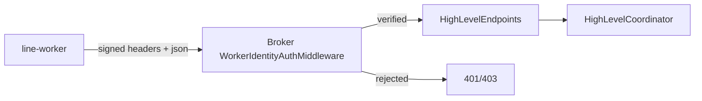
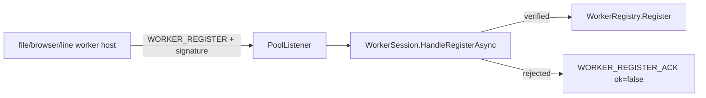
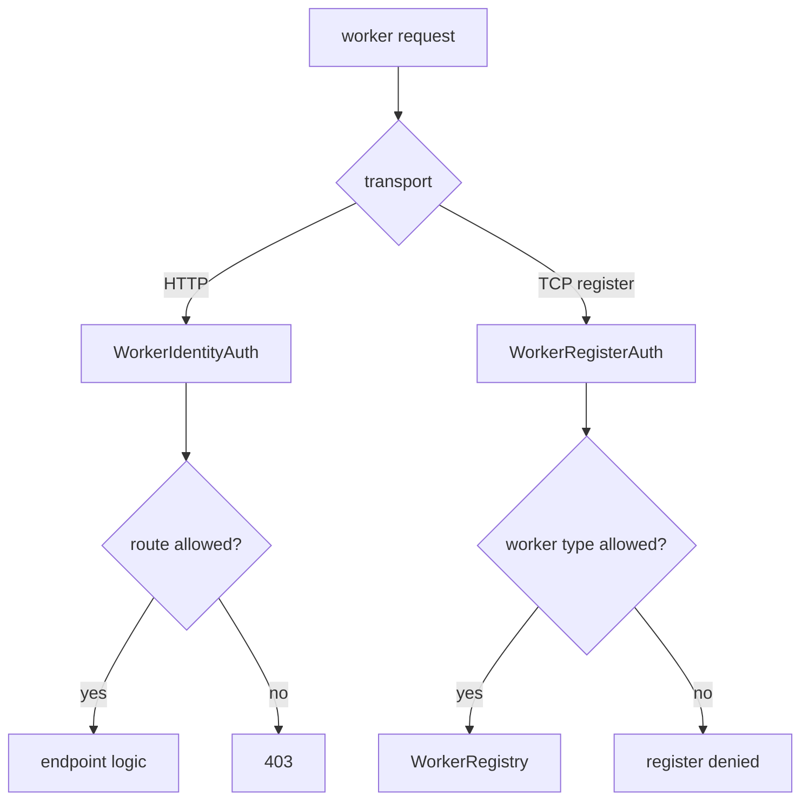

# 統一 Worker Identity 驗證設計

Date: 2026-04-07  
Status: draft for review

## 摘要

目前 broker 對不同 worker 類型採用了不一致的信任模型：

- 一般 agent / capability execution path 會經過 session、scoped token、grant、policy 檢查。
- `line-worker -> /api/v1/high-level/line/*` 則被視為 trusted internal plain JSON path，缺少 broker-side caller authentication。
- function-pool 的 worker registration 目前只要能連上 TCP listener 並送出 `WORKER_REGISTER`，就可能被註冊到 `WorkerRegistry`。

這種設計的問題不是「完全沒有安全性」，而是「安全邊界不一致」：同樣是 worker，卻因為歷史演進而分裂成一部分要驗證、一部分靠 trusted path 豁免。

本設計把原則收斂成一句話：

**worker 就是 worker，不應該有免驗證特例。**

v1 採用「每種 worker 一組 credential」的 HMAC-based identity model，統一覆蓋：

- `line-worker -> broker` HTTP 呼叫
- function-pool worker registration

藉此把目前的 trusted path 改成 authenticated worker path。

---

## 問題定義

### 現況問題

1. `line-worker -> broker` 沒有 broker-side caller authentication  
   broker middleware 目前把 `/api/v1/high-level/line/*` 視為 trusted internal plain JSON path，因此：
   - 不要求 encryption envelope
   - 不要求 scoped token
   - endpoint 本身也不要求 worker identity

2. function-pool `WORKER_REGISTER` 沒有 worker identity proof  
   目前只要 TCP 連到 pool listener，就可以送出 `WORKER_REGISTER` 並進入註冊流程。這代表 broker 證明不了「這真的是合法 worker」。

3. worker trust model 不一致  
   - session/scoped token/grant/policy 是一套
   - trusted internal paths 是另一套
   - function-pool registration 幾乎是第三套

### 風險

- 可偽造 `line-worker` 對 broker 發送 high-level line message
- 可偽造或冒充 function-pool worker
- trusted path 一旦被誤暴露或被其他本機/內網程序打到，broker 缺少 caller proof
- 安全規則分裂，未來更難推導哪些路徑真的安全

---

## 設計目標

1. 建立統一的 worker identity model，不再為特定 worker 保留免驗證例外。
2. 讓 broker 能驗證：
   - 這個請求來自哪種 worker
   - 它是否持有正確 credential
   - 這個請求是否在可接受的時間窗內
   - 這個請求是否可能是 replay
3. 在不大幅打亂現有架構的前提下，先補上最急迫風險。
4. 保持未來可升級到 per-instance credential 或 mTLS。

---

## 非目標

v1 不處理以下事項：

1. 不引入 mTLS。
2. 不做每個 worker instance 一組 credential。
3. 不在 v1 對 function-pool 的每個 `WORKER_EXECUTE` / `WORKER_RESULT` frame 逐包簽章。
4. 不取代 scoped token / grant / policy；worker identity auth 只補「來源驗證」，不取代「能力授權」。

---

## 設計理由

### 為什麼不用 trusted internal path

trusted path 的前提是「只有受信任程序能打到它」，但這不是 broker 可驗證的事實，而只是部署假設。  
這種設計會讓系統正確性依賴環境配置，而不是依賴可驗證協議。

### 為什麼採每種 worker 一組 credential

這是成本與一致性的平衡：

- 比 per-instance credential 容易部署與輪替
- 比單一 global secret 更容易隔離不同 worker 類型
- 足以把目前 `line-worker` 與 function-pool registration 的主要風險補上

### 為什麼採 HMAC

對目前 repo 而言，HMAC 有幾個實際優點：

- 可直接套用在 HTTP header 與 TCP registration payload
- 不需要先建 PKI
- 可用相同 base string 規則覆蓋不同 transport
- 對 Windows / sidecar / function-pool 現況的導入成本最低

---

## 替代方案比較

### 方案 A：沿用 trusted internal path，只縮網路暴露面

優點：
- 改動最少

缺點：
- broker 仍然無法驗證 caller identity
- 依賴部署正確性，不是協議正確性

### 方案 B：每種 worker 一組 HMAC credential

優點：
- 可快速落地
- 統一規則
- 容易測試

缺點：
- 同一 worker type 內部無法區分 individual instance
- secret 洩漏會影響該類 worker

### 方案 C：mTLS / cert-based mutual auth

優點：
- 安全性最佳

缺點：
- 導入成本高
- 對當前 sidecar 與 function-pool 改動過大

### 採用方案

採用 **方案 B** 作為 v1。

---

## 核心設計

### 統一原則

所有 worker 都必須提供 identity proof。  
差異只存在於：

- `worker_type`
- 可呼叫的 route / op
- capability / role / grant

差異不應存在於「某些 worker 免驗證」。

### Credential 粒度

v1 採 **每種 worker 一組 credential**：

- `line-worker`
- `file-worker`
- `browser-worker`
- 未來新 worker type 各自新增

### Credential 模型

每筆 credential 至少包含：

```json
{
  "worker_type": "line-worker",
  "key_id": "line-worker-v1",
  "shared_secret": "base64-or-raw-secret",
  "status": "active"
}
```

### 設定來源

v1 先使用 broker / worker 設定檔載入：

- broker: `WorkerAuth:Credentials`
- worker: `WorkerAuth:KeyId`, `WorkerAuth:SharedSecret`, `WorkerAuth:WorkerType`

之後可再演進成 DB 管理或 secret manager。

---

## HTTP 驗證設計

### 適用路徑

v1 先套用到：

- `/api/v1/high-level/line/process`
- `/api/v1/high-level/line/notifications/complete`

未來若其他 worker 也走 broker HTTP path，再擴充到相同模型。

### Header

worker 呼叫 broker 時必須附帶：

- `X-B4A-Worker-Type`
- `X-B4A-Key-Id`
- `X-B4A-Timestamp`
- `X-B4A-Nonce`
- `X-B4A-Signature`

### 簽章 base string

HTTP base string：

```text
<METHOD>\n
<PATH>\n
<SHA256(body)>\n
<worker_type>\n
<key_id>\n
<timestamp>\n
<nonce>
```

簽章：

```text
signature = base64(HMAC-SHA256(shared_secret, base_string))
```

### 驗證規則

broker 收到請求時必須：

1. 找到 `worker_type + key_id` 對應 credential
2. 確認 credential `status=active`
3. 驗證 timestamp 在容忍窗內
4. 驗證 nonce 未被用過
5. 驗證 signature
6. 驗證 `worker_type` 是否允許存取該 route

若任一條件失敗，回 `401` 或 `403`。

### Replay 防護

broker 必須記錄最近已使用過的 `(worker_type, key_id, nonce)`。

v1 可接受做法：

- 使用 memory cache
- 若 cache cluster 啟用，可優先使用 distributed cache

nonce TTL 應與 timestamp 容忍窗一致，略高一些即可。

---

## Function Pool Registration 驗證設計

### 適用範圍

v1 先只保護：

- `WORKER_REGISTER`

不在 v1 逐包保護：

- `WORKER_EXECUTE`
- `WORKER_RESULT`
- `PING/PONG`

理由是：先把「未驗證連線可註冊 worker」這個最大洞補上。

### Registration payload

現有 `WORKER_REGISTER` payload 需擴充為：

```json
{
  "worker_id": "line-wkr-xxxx",
  "worker_type": "line-worker",
  "capabilities": ["line.send_message", "line.send_notification"],
  "max_concurrent": 4,
  "key_id": "line-worker-v1",
  "timestamp": "2026-04-07T12:34:56Z",
  "nonce": "b7b3c5...",
  "signature": "base64-hmac"
}
```

### 簽章 base string

registration base string：

```text
WORKER_REGISTER\n
<worker_id>\n
<worker_type>\n
<sorted_capabilities_csv>\n
<max_concurrent>\n
<key_id>\n
<timestamp>\n
<nonce>
```

### 驗證規則

broker `WorkerSession.HandleRegisterAsync()` 必須：

1. 解析 `worker_type / key_id / timestamp / nonce / signature`
2. 找 credential
3. 驗 timestamp
4. 驗 nonce
5. 驗 signature
6. 驗 `worker_type` 與 capability allowlist 是否相容

只有通過後，才允許 `WorkerRegistry.Register()`。

---

## Trusted Path 調整

### 調整前

`/api/v1/high-level/line/*` 是：

- plain JSON
- no envelope
- no scoped token
- no worker identity auth

### 調整後

`/api/v1/high-level/line/*` 改為：

- 仍可維持 plain JSON
- 仍可不走 scoped token
- **但必須通過 worker identity auth**

也就是把語義從：

- `trusted internal path`

改成：

- `authenticated worker path`

---

## 路由權限模型

broker 必須能檢查 `worker_type` 是否允許存取特定路徑或 opcode。

v1 先採靜態規則：

- `line-worker`
  - 可呼叫 `/api/v1/high-level/line/process`
  - 可呼叫 `/api/v1/high-level/line/notifications/complete`
- `file-worker`
  - 不可呼叫上述 high-level line paths
- `browser-worker`
  - 不可呼叫上述 high-level line paths

對 function-pool registration，`worker_type` 也必須與 capability allowlist 相容。

---

## 失敗語意

### HTTP

- `401 Unauthorized`
  - 缺少 header
  - key 不存在
  - timestamp 過期
  - nonce replay
  - signature 無效

- `403 Forbidden`
  - worker type 無權呼叫該 route

### Pool Registration

`WORKER_REGISTER_ACK`：

```json
{
  "ok": false,
  "worker_id": "line-wkr-xxx",
  "error": "worker authentication failed"
}
```

注意：
- 不回傳 secret 細節
- 不回傳哪個欄位驗證失敗的過度細節

---

## 資料流圖

### HTTP worker path



### Function pool registration



### 規則收斂圖



---

## 實作切片

### Task 1

新增共用驗證服務：

- `WorkerIdentityAuthOptions`
- `WorkerCredentialRecord`
- `WorkerIdentityAuthService`
- `WorkerNonceStore`

### Task 2

HTTP 驗證中介層：

- `WorkerIdentityAuthMiddleware`
- 將 `/api/v1/high-level/line/*` 從 trusted bypass 改為 authenticated worker path

### Task 3

line-worker outbound signing：

- 對 `InboundDispatcher` 呼叫 broker 的 HTTP 加上簽章 header

### Task 4

function-pool registration signing：

- 擴充 `WorkerHost` register payload
- 擴充 `WorkerSession.HandleRegisterAsync()` 驗證

### Task 5

測試與文件同步：

- unit tests
- integration tests
- runbook / docs 更新

---

## 測試策略

### Unit

1. HMAC base string 產生正確
2. signature 驗證成功
3. key_id 不存在失敗
4. timestamp 過期失敗
5. nonce replay 失敗
6. worker type route allowlist 拒絕

### Integration

1. 未附簽章呼叫 `/api/v1/high-level/line/process` 被拒
2. 正確 `line-worker` 簽章可通過
3. `file-worker` 簽章呼叫 line route 被拒
4. `WORKER_REGISTER` 無簽章失敗
5. `WORKER_REGISTER` 正確簽章成功
6. replay register 被拒

### Regression

1. LINE webhook ingress 仍正常
2. `/proj` workflow 仍可運作
3. artifact delivery / notification complete 仍可運作

---

## 向後相容策略

v1 不建議長時間保留雙軌模式。  
但為了平滑部署，可接受極短暫 migration flag：

- broker 開啟 `WorkerAuth:Enforce=false`
- 先讓 worker 帶簽章
- 驗證 live 後切成 `WorkerAuth:Enforce=true`

切換完成後，應移除 `line-worker` trusted bypass。

---

## Open Questions

目前保留但不阻礙 v1 的問題：

1. nonce store 是否要直接落在 distributed cache，而不是 memory cache
2. function-pool 後續是否要對每個 frame 再加 session-level integrity
3. credential 後續是否要搬到 DB 或 secret manager

這些不阻礙 v1。

---

## 最終決策

採用：

- 每種 worker 一組 credential
- HMAC-SHA256 簽章
- HTTP 與 `WORKER_REGISTER` 皆納入 worker identity auth
- `line-worker` 不再享有免驗證特例

不採用：

- trusted internal path 繼續裸放行
- per-instance credential
- mTLS 作為 v1

