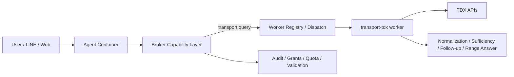
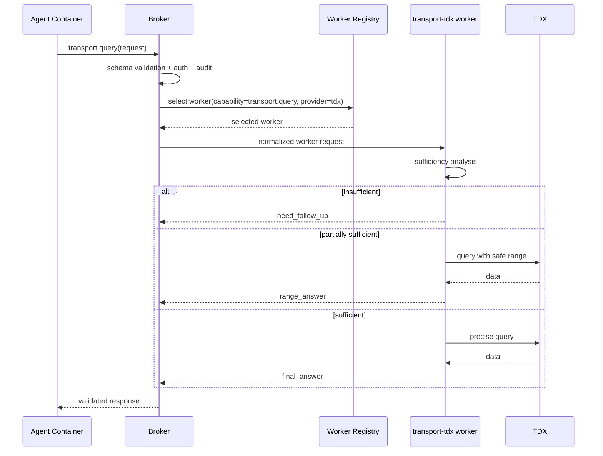

# Transport-TDX Worker 設計規格

日期：2026-04-09  
狀態：draft-approved-for-spec-review  
語言：繁體中文

## 1. 目標

本規格定義 `transport-tdx worker` 的架構邊界、broker contract、查詢充分性判定、缺資訊追問、範圍回答、以及第一階段導入方式。

本規格的核心修正是：

- `TDX` 能力不應整合為 broker 內建業務邏輯。
- `broker` 只負責能力管理、派工、權限、審計、request/response schema。
- `transport-tdx worker` 才是可選、可抽換的 transport provider worker。
- `agent container` 永遠只調用 broker 公布的統一能力，不直接碰 TDX。

## 2. 問題定義

目前 transport 查詢路徑雖然已收斂成 TDX-only，但 provider-specific 邏輯仍殘留在 broker 內：

- broker 仍直接理解 `travel_rail_search`、`travel_hsr_search`、`travel_bus_search`、`travel_flight_search`
- broker 仍直接承載部分交通查詢語意與 TDX 結果格式化
- 自然語言查詢常缺少必要資訊，但現行路徑對 `缺資訊 -> 追問 -> 範圍回答` 的規則還不完整

這些現況的問題是：

- provider 與 broker 耦合
- 未來難以替換成其他 transport provider
- agent container 容易被 provider-specific route 與 schema 汙染
- 對一般使用者的自然語言入口，在資訊不完整時容易表現僵硬

## 3. 設計原則

### 3.1 單一能力邊界

對代理容器與高階協調器而言，交通查詢是一個 broker 能力族，而不是多個 provider-specific route。

- 對外能力：`transport.query`
- 內部 provider：`tdx`
- 未來可替換 provider：其他 transport worker

### 3.2 Worker 可抽換

`transport-tdx worker` 必須是獨立 worker，而不是 broker 內建模組。

- broker 只認 capability，不認 TDX 細節
- provider-specific query parsing、follow-up、TDX adapter 都在 worker 內
- 未來若新增 `transport-other-provider worker`，broker contract 不需重寫

### 3.3 自然語言不足資訊是常態

交通查詢不應假設使用者會一次提供所有必要欄位。

系統必須支援：

- sufficiency analysis
- 缺資訊追問
- 範圍回答
- 假設明示
- 使用者不知道時的引導

### 3.4 同步回覆優先

第一版 worker 先做單次同步查詢：

- 直接答案 `final_answer`
- 追問 `need_follow_up`
- 範圍答案 `range_answer`

第一版不引入長生命週期 transport session orchestration。

## 4. 系統邊界

### 4.1 Broker 責任

broker 只負責：

- 公布能力與 request/response schema
- capability routing / worker selection
- grant / auth / quota / audit
- request validation
- response validation
- 將 worker 結果交回 agent container / LINE / web console

broker 不負責：

- TDX API mapping
- TDX token 流程
- 缺資訊追問策略
- provider-specific entity resolution
- provider-specific range-answer 策略

### 4.2 Transport-TDX Worker 責任

`transport-tdx worker` 負責：

- transport query sufficiency analysis
- missing-info follow-up policy
- range-answer policy
- assumption disclosure policy
- TDX OAuth token 取得與快取
- 站名 / 城市 / 機場 / 路線 normalization
- TDX API call orchestration
- provider-specific 結果整形

### 4.3 Agent Container 責任

agent container 只負責：

- 呼叫 broker 的 `transport.query`
- 接收 broker 回傳的標準回覆
- 若結果為追問，顯示 worker 提供的追問選項
- 若結果為範圍回答，向使用者清楚說明目前假設

agent container 不應理解：

- TDX endpoint
- TDX path
- provider-specific query parameter
- provider-specific result schema

## 5. 架構圖



## 6. Broker 對外能力模型

第一版 broker 對外只公布：

- `transport.query`

後續可擴：

- `transport.resolve`
- `transport.route_plan`
- `transport.nearby`
- `transport.status`

### 6.1 為何不再使用 travel_rail_search 等 route

現有：

- `travel_rail_search`
- `travel_hsr_search`
- `travel_bus_search`
- `travel_flight_search`

在新模型下應逐步退場，原因是：

- route 名稱把 transport mode 與 provider-specific 行為綁死
- 對 agent container 來說，mode 應該是 request 欄位，不是 route identity
- 對 broker 而言，dispatch 應以 capability 為單位，而不是 provider-specific route

第一版可採漸進遷移：

- broker 對外新增 `transport.query`
- 舊 route 保留為 compatibility path
- 實際邏輯逐步轉移到 `transport-tdx worker`

## 7. Request / Response Contract

### 7.1 Request

```json
{
  "capability": "transport.query",
  "transport_mode": "auto",
  "user_query": "明天上午的火車從板橋到高雄的班次",
  "locale": "zh-TW",
  "channel": "line",
  "context": {
    "origin": null,
    "destination": null,
    "date": null,
    "time_range": null,
    "city": null,
    "route": null,
    "station": null
  },
  "interaction": {
    "conversation_id": "optional",
    "follow_up_token": null,
    "selected_option_id": null
  }
}
```

欄位說明：

- `transport_mode`
  - `auto | rail | hsr | bus | flight | ship | bike`
- `user_query`
  - 原始自然語言輸入
- `context`
  - broker 或上游目前已知欄位
- `interaction`
  - 若本輪是回覆上一輪追問，用來承接 follow-up

### 7.2 Response

```json
{
  "result_type": "need_follow_up",
  "answer": "目前還缺少日期，我可以先幫你查今天，或你也可以指定明天。",
  "normalized_query": {
    "transport_mode": "rail",
    "origin": "板橋",
    "destination": "高雄",
    "date": null,
    "time_range": "morning"
  },
  "missing_fields": ["date"],
  "follow_up": {
    "question": "請問你要查哪一天？",
    "options": [
      { "id": "today", "label": "今天" },
      { "id": "tomorrow", "label": "明天" },
      { "id": "custom_date", "label": "指定日期" },
      { "id": "nearest_available", "label": "先看最近可用班次" }
    ],
    "follow_up_token": "opaque-token"
  },
  "range_context": null,
  "records": [],
  "evidence": [
    { "source": "TDX", "kind": "transport.provider" }
  ],
  "provider_metadata": {
    "provider": "tdx"
  }
}
```

### 7.3 三種回覆型態

- `final_answer`
  - 資訊足夠，直接查並回精確結果
- `need_follow_up`
  - 缺少關鍵欄位，不能安全查
- `range_answer`
  - 可查，但必須基於較寬假設或較大範圍

## 8. Sufficiency Analysis

`transport-tdx worker` 每次收到請求後，必須先做 `query sufficiency analysis`。

### 8.1 欄位分層

#### 必要欄位

不足就不能做精確查詢。

- `rail / hsr`
  - `origin`
  - `destination`
- `bus`
  - `city`
  - `route`
- `flight`
  - `origin`
  - `destination`
- `ship`
  - `origin`
  - `destination`
- `bike`
  - `city` 或 `geo_point`

#### 重要欄位

缺少時，可能只能給範圍答案或先追問。

- `date`
- `time_range`
- `direction`
- `station`
- `departure_or_arrival`

#### 偏好欄位

只影響排序與展示，不影響能不能查。

- 最早班
- 最快到達
- 直達優先
- 特定車種

### 8.2 判定結果

worker 只產生三種 sufficiency verdict：

- `sufficient`
- `partially_sufficient`
- `insufficient`

對應：

- `sufficient -> final_answer`
- `partially_sufficient -> range_answer`
- `insufficient -> need_follow_up`

## 9. 缺資訊追問策略

追問必須：

- 短
- 明確
- 選項化
- 不要求使用者理解 schema

### 9.1 追問原則

- 先補最關鍵、最能縮小查詢範圍的欄位
- 一次只問一個主問題
- 永遠提供保守出口

### 9.2 追問範例

#### 模式不明確

```text
你要查的是哪一種？
1. 台鐵
2. 高鐵
3. 兩者都看
4. 我不確定，先給我最快的選項
```

#### 日期缺失

```text
請問你要查哪一天？
1. 今天
2. 明天
3. 指定日期
4. 先看最近可用班次
```

#### 公車城市缺失

```text
目前還缺少公車所在城市。
1. 台北市
2. 新北市
3. 桃園市
4. 其他，我重述
```

## 10. 範圍回答策略

若資訊不足但可在安全範圍內先查，worker 應回 `range_answer`。

### 10.1 範圍回答條件

可以先回範圍答案的情況：

- 缺的是 `重要欄位`，不是 `必要欄位`
- 以較寬時間窗或合理預設可獲得有價值結果
- 不會誤導使用者以為這是唯一正確答案

### 10.2 範圍回答要求

範圍回答必須：

- 明講目前假設
- 明講查詢範圍
- 告知可如何繼續縮小

範例：

```text
我先用今天可查到的班次幫你整理前幾班。
如果你要明天上午、下午或指定時段，我可以再幫你縮小範圍。
```

### 10.3 不可做的事

- 不得默默腦補關鍵欄位
- 不得把範圍結果包裝成精確結果
- 不得在缺少必要欄位時硬查

## 11. Worker 註冊與宣告

`transport-tdx worker` 註冊時應宣告：

```json
{
  "worker_type": "transport-tdx",
  "provider": "tdx",
  "capabilities": ["transport.query", "transport.resolve"],
  "supported_modes": ["rail", "hsr", "bus", "flight", "ship", "bike"]
}
```

broker registry 需能記錄：

- worker type
- provider
- capabilities
- supported modes
- health
- availability

## 12. Capability / Dispatch 圖



## 13. Phase Plan

### Phase 1

建立最小可運作版本：

- 新增 `transport.query` contract
- 新增 `transport-tdx worker`
- 將現有 `rail / hsr / bus / flight` 移入 worker
- 實作：
  - sufficiency analysis
  - need_follow_up
  - range_answer
  - final_answer
- broker 僅保留 capability schema / dispatch / audit

### Phase 2

擴充 TDX domain：

- `ship`
- `bike`
- `transport.resolve`
- 模式判定與更完整的 entity normalization

### Phase 3

擴充進階能力：

- MaaS routing
- 停車 / 充電樁 / 路況
- 歷史與進階資料
- provider policy 與多 provider 選擇

## 14. 第一批實作切片

第一批只做：

1. broker 新增 `transport.query` capability 與 schema
2. 新增 `transport-tdx worker` 專案骨架
3. 將現有 rail / hsr / bus / flight 查詢從 broker 遷至 worker
4. worker 內實作：
   - 模式判定
   - 必要欄位分析
   - 缺資訊追問
   - 範圍回答
   - TDX API 查詢
5. broker 改由 capability dispatch 調用 worker

不在第一批做：

- MaaS routing
- 停車/道路/POI 全量整合
- 長生命週期 transport session orchestration
- 多 provider 自動切換

## 15. 測試策略

### Unit

- sufficiency analysis
- follow-up question selection
- range-answer assumption disclosure
- request/response validation

### Integration

- broker `transport.query` dispatch
- worker registration / selection
- `need_follow_up` round-trip
- `range_answer` round-trip
- `final_answer` round-trip

### Verify

至少覆蓋：

- `?rail 板橋到高雄`
  - 缺日期時可回範圍或追問
- `?rail 明天上午板橋到高雄`
  - 精確回覆
- `?bus 307`
  - 缺城市時追問
- `?bus 台北市 307`
  - 精確回覆

## 16. 風險與緩解

### 風險 1：broker 與 worker contract 漂移

緩解：

- capability schema versioning
- broker response validation
- integration tests 固定 contract

### 風險 2：自然語言模式判定誤差

緩解：

- `transport_mode=auto` 但 worker 必須可回 `need_follow_up`
- 不確定時不要強行查錯 provider path

### 風險 3：範圍回答造成誤解

緩解：

- 明示假設
- 明示範圍
- 提供縮小選項

### 風險 4：第一批遷移期間舊 route 與新 capability 並存

緩解：

- 明確 compatibility layer
- 分階段移除 `travel_*` route
- 保持 verify 覆蓋舊新兩路

## 17. 結論

本規格確立：

- transport 查詢能力由 `broker-managed` 改成 `worker-implemented`
- broker 只做能力與派工，不承載 TDX 業務語意
- `transport-tdx worker` 是獨立、可抽換的 provider worker
- 自然語言交通查詢必須先做 sufficiency analysis，並支援追問與範圍回答

這個模型比目前把 transport provider 細節放在 broker 內更符合長期擴充性，也與 worker-centered 執行邊界一致。
